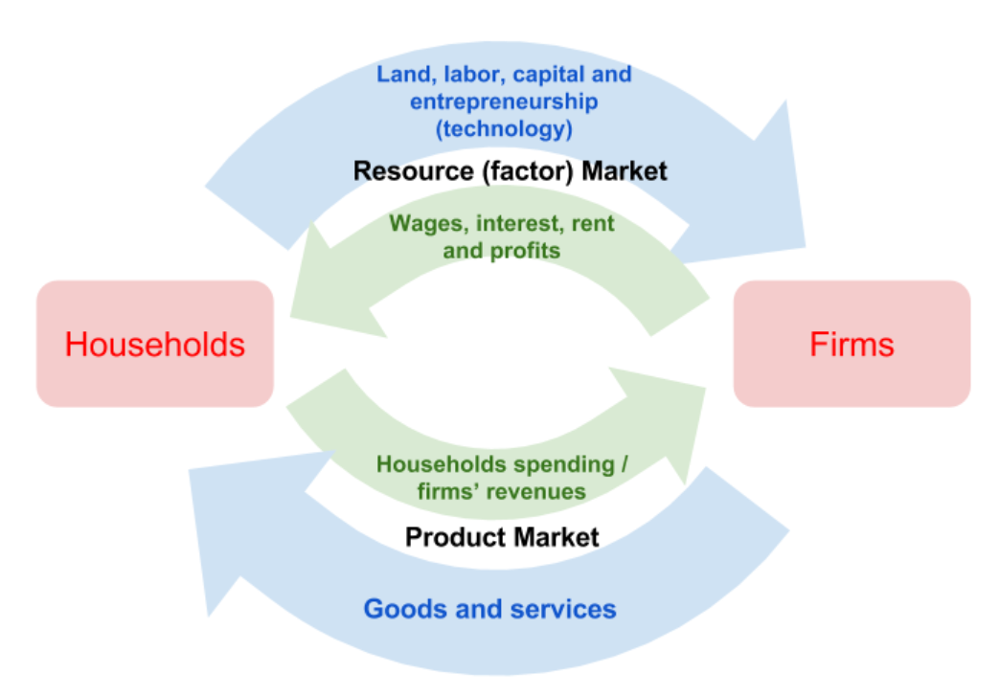

# <u>Chapter 1</u>: MICROECONOMICS

## **Topic – 1: Introduction To Economics**

### <u>Scarcity</u>

- **<u>Scarce resources</u>:** Resources which aren’t abundant &
  might be gotten in exchange of something.
- **<u>Free resources</u>:** Resources which are abundant, might
  not be free & can be gotten without any competition.
- **<u>Rival goods</u>:** Resources which when consumed by someone,
  affects how much others get of it.

### <u>Factors Of Production</u>

- **Land or natural resources**
- **Labour**
- **<u>Capital</u>:** Something used in production.
- **<u>Entrepreneurship</u>:** Putting all the other factors together.

> **<u>NOTE</u>!**
> - Financial capital is a different thing.
> - Entrepreneurship is also known as technology.

### <u>Types Of Production</u>

- **<u>Capital goods</u>:** Producing goods which can be used in
  producing something else.
- **Consumption goods**

### <u>Normative & Positive Statement</u>

- **<u>Normative statement</u>:** Statements which can be termed as
  ethical statements & are thus subjective.
- **<u>Positive statement</u>:** Statements which can be tested &
  might have results.

### <u>Other Key Terms</u>

- **<u>Occam’s razor</u>:** Making minimum assumptions when
  performing analysis.
- **<u>Ceteris paribus</u>:** Means "all else equal". It is the idea
  of considering changes which are clearly seen & not other factors.
- For example, how someone reacts to a price mustn’t be assuming
  anything about their income, preference etc.
- **<u>Model</u>:** Simplification of a system or a process.

> **<u>NOTE</u>!**
> - Normative information are indeed considered when studying
economics.

## **Topic – 2: Economic Systems**

### <u>Property Rights</u>

- **<u>Household</u>:** The buyers & seller parties of a firm.

### <u>Features Of Property</u>

- **Exclusive**
- **<u>Enforceable</u>:** Protected by law for its owner.
- **Transferable**

### <u>Key Terms</u>

- **<u>Resource/factor market</u>:** Market where sellers supply
  land, labour, capital etc to firm.
- **<u>Product market</u>:** Market where firms supply the final
  product or services to buyers.
- **<u>Wage</u>:** What firms get paid for their labour.
- **<u>Rent</u>:** What firms get paid for their land.
- **<u>Interest</u>:** What firms get paid for their capital.
- **<u>Profit</u>:** What entrepreneurs get paid.
- **<u>Market economy</u>:** Economic resources are privately owned
  by individuals.
- **<u>Command economy</u>:** Economic decisions are taken by the
  government.

### <u>Circular Flow Model</u>

- Most economies lie between **market economy** & **command economy**.

### <u>3 Basic Economic Questions</u>

- What should be produced?
- How should it be produced?
- Who will get the goods & services produced?

## **Topic - 3: Production Possibilities Frontier (PPF)**

### <u>Introduction</u>

- PPF is a graph showing combination of two goods in varying quantity, which can be produced with available resources.
- It heavily depends on concepts of scarcity, choice & tradeoffs.
- **<u>Productively efficient output</u>s:** Points lying on the curve of graph.
- Slope of PPF shows the opportunity cost for producing one good over other.
- **<u>Opportunity cost</u>:** Cost for gaining a good, which is often losing some from the other good.
