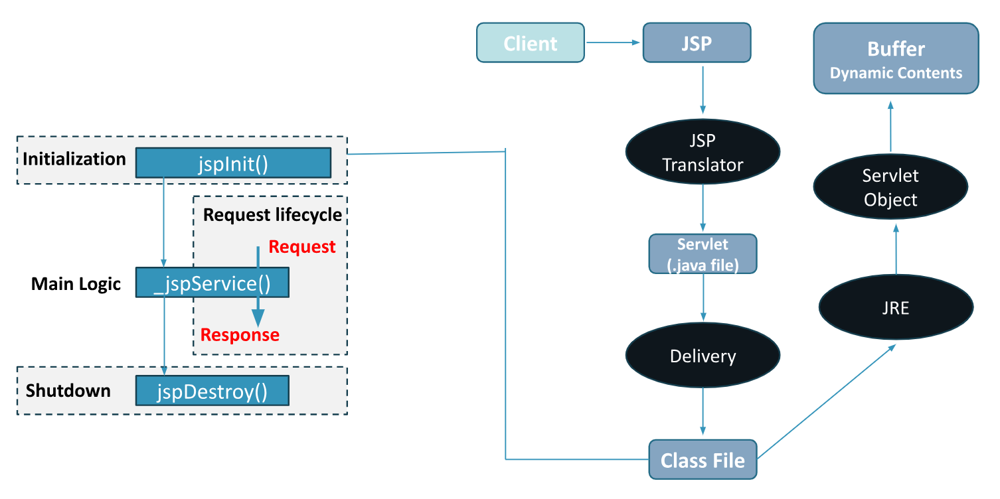

# Chapter 3: JAVA SERVER PAGE


## **Topic – 1: Need Of JSP**

### <u>Java Server Page (JSP)</u>

- **<u>JSP</u>:** Provides template to create dynamic HTML websites using Java.
- **<u>JSP containers</u>:** Converts JSP codes into equivalent Servlet codes.
- We can say that JSP provides GUI to users for interactions.
- JSP has ability to embed HTML, XHTML, XML, JSTL etc.
- And it is more flexible than Servlet.


### <u>JSP Processing</u>

- JSP is processed on server only.


## **Topic – 2: Advantages Of JSP**

- **Easy maintenance**, as it separates codes for business logic & way to
  present website.
- **Servlet’s extension**.
- **Requires less coding**, as custom tags can be embedded.
- **Fast development**, as modifying a JSP page has immediate effects, we
  don’t need to re-deploy.
- **Easy integration**, as we can embed many codes.


## **Topic – 3: Difference Between JSP & Servlet**

| JSP | Servlet |
|----|----|
| Server-side technology. | Java class program. |
| Easy maintenance, separating codes for business & web presentation. | Difficult to maintain having no separation among codes. |
| Change in code doesn’t require re-deployment. | Change in code requires re-deployment. |
| Can use custom tags. | Can’t use custom tags. |
| Accepts only HTTP requests. | Accepts any kind of requests. |
| Can import packages anywhere in the code. | Packages need to imported at top of Servlet codes. |
| Automatic session management. | Manual session management. |
| Model view controller gives viewer/user experience. | Model view controller gives controller experience. |


## **Topic – 4: JSP Lifecycle**




### <u>Steps Involved In Lifecycle</u>

- Translation
- Compilation
- Servlet class loading
- Servlet instance creation
- Servlet initialization
- Servicing client requests
- Servlet destruction


## **Topic – 5: JSP Scripting Elements**

### <u>JSP Tags</u>

- JSP scriptlet tag
- JSP declarations tag
- JSP directives tag
- JSP expression tag


### <u>Scriptlet Tags</u>

- **<u>Scriptlet</u>:** Java statements embedded in a HTML page.
- But we use it to just declare variables.
- Enclosed between `<%` and `%>`.
- JSP transfers these to `jspService()` method for generating Servlet.

```
<% int count = 0; %>

<body>
  Page count is <% out.println(++count); %>
</body>
```


### <u>JSP Declarations</u>

- Used to declare method or variables in HTML pages.
- Enclosed between `<!% and %>`.
- Is not passed to `_jspService()` method.

```
<%! String name = "Gourav"; %>
```


### <u>JSP Directives</u>

- Written at top of JSP files.
- Used for global definition like importing packages or declaring
  errors.
- Contains special processing information for JSP container.
- Enclosed between `<@% and %>`.
- Usable attributes for directives - `import`, `language`, `extends`, `session`,
  `isThreadSafe`, `isErrorPage`, `errorPage`, `contentType`, `autoFlush`, `Buffer`
  etc.

```
<%@ include file="myfile.jsp" %>
<%@ taglib uri="<http://someWebsite>" prefix="demotag" %>
```


### <u>Types Of Tags</u>

- Core tags
- Formatting tags
- SQL tags
- XML tags
- JSTL functions


### <u>JSP Expressions</u>

- Evaluates the expression stored in it.
- Required when user makes HTTP request.

```
<%= new String("Hello World").toUpperCase() %>  
<%= num1 + num2 + num3 %>
```


### <u>JSP Comments</u>

```
<%-- JSP comment %>
<% /** comment **/%>
<!-- HTML comment -->
```
