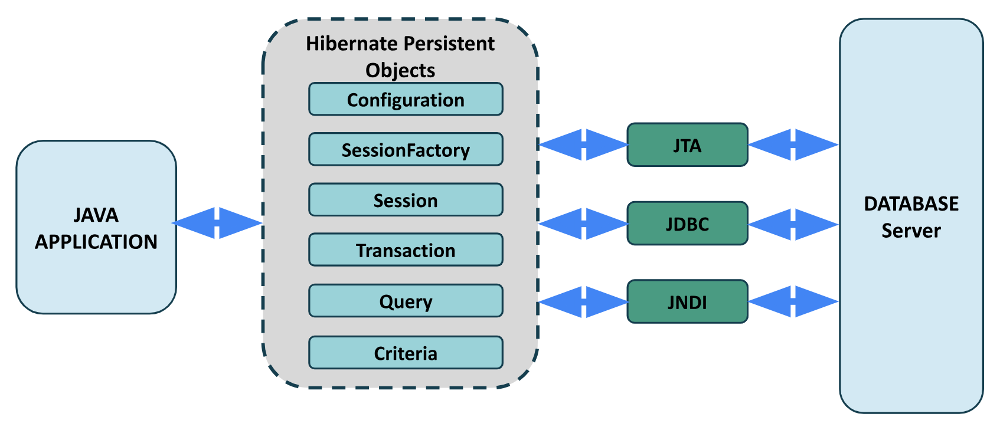

# <u>Chapter 4</u>: HIBERNATE


## **Topic - 1: Significance Of Hibernate**

### <u>Brief Working</u>

- **Hibernate** is used for mapping & storing data of an OOP object directly to RDBMS tables.
- The members of this object imitates the attributes of that table, that's why it is able to store them.


### <u>More Introduction</u>

- Hibernate for it features, is also known as an ORM (object relational mapping) tool.
- It's also an open-source, lightweight software under **LGPL license**.
- It uses JPA (Java persistence API) for ensuring data persistency.
- **<u>Data persistency</u>:** Ability to store backup of data in order to retain data, incase session meets a failure or interruption.
- One thing to note here is that Hibernate maps Java data types to SQL data types for storing data.


## **Topic - 2: Advantages Of Hibernate**

- Hibernate uses XML files for the mapping.
- So, one has to change configuration in XML files only to change something in its mapping behavior.
- It uses two-level cache (1st level by default) & thus performs very fast.
- HQL is the object-oriented version of SQL.
- Hibernate automatically creates tables in database, seeing the object members.
- It can also fetch data from databases, without requiring any separate application for server.


## **Topic - 3: Object Relational Mapping (ORM)**

- **<u>Metadata descriptor</u>:** Maps object codes to RDBMS in ORM tools.
- ORM gets job done with less code than the embedded SQL.


## **Topic - 4: Hibernate v/s EJB**

| Hibernate                                                                       | EJB                                                                                       |
| ------------------------------------------------------------------------------- | ----------------------------------------------------------------------------------------- |
| Open-source software.                                                           | Close-source by Java E.                                                                   |
| Transparent data persistency.                                                   | No transparency in data processing.                                                       |
| Easy switching from one database to another.                                    | Difficult switching from one database to another.                                         |
| In-built module for ensuring data persistency.                                  | Dependent on EJB container for data persistency.                                          |
| Provides data persistency with its own classes, interfaces & methods.           | Uses JPA for providing data persistency.                                                  |
| Uses HQL to manage objects mapped to RDBMS.                                     | Uses JPQL to pass queries to the chosen database.                                         |
| Uses POJO (plain old Java objects) which are conventional object types in Java. | Uses EB (entity beans) which has its own naming conventions, making compatibility issues. |


## **Topic - 5: Hibernate Architecture**

### <u>Introduction</u>

- In Hibernate, there are multiple things which contribute to its attribute of data consistency.
- Uses both JPA & its own classes, interfaces and methods.

> **<u>NOTE</u>:**
> EJB uses JPA alone for data consistency, whereas Hibernate uses both JPA & its own configurations.




### <u>Configuration Class</u>

- Found in `org.hibernate.cfg` package.
- Used for activating Hibernate.
- It is also responsible for checking syntax of configuration file.
- If the syntax grammar is found correct, it creates metadata & returns that to the object.

```
Configuration cfg = new Configuration();
cfg.configure();
```


### <u>SessionFactory Interface</u>

- Found in `org.hibernate` package.
- Used for creating a session object.
- It is both immutable & thread-safe.
- **<u>Thread-safe code</u>:** A piece of code that can be accessed by multiple threads concurrently, safely.

```
SessionFactory factory = cfg.buildSessionFactory();
```
