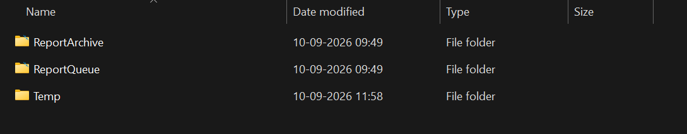
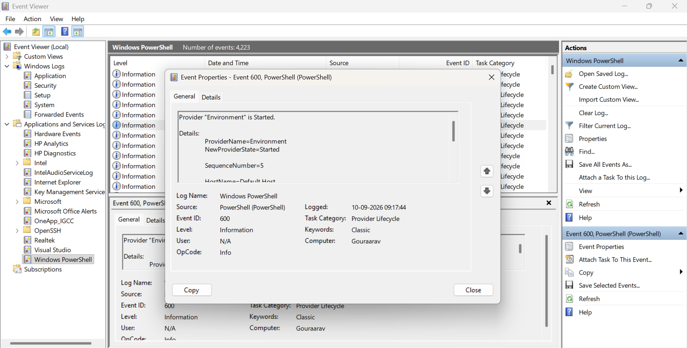
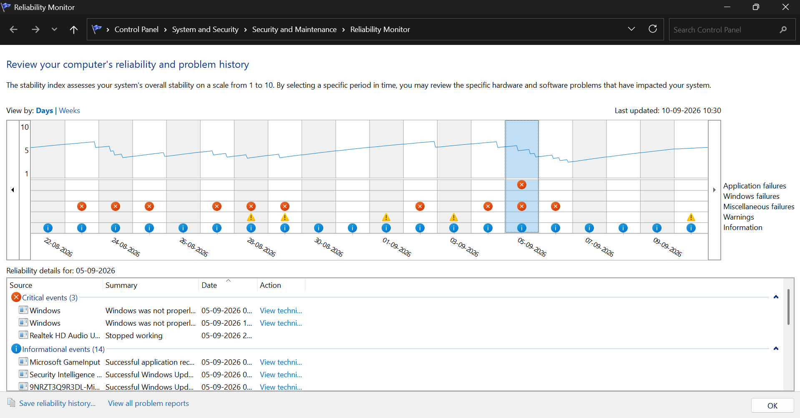

# $\fbox{Chapter 1: CRASH \& ERROR LOGGING APPLICATIONS}$


## **Topic - 1: Windows Error Reporting (WER)**

### <u>About</u>

- Records crash information
- Creates diagnostic data
- May create a dump
- May send report to *Microsoft*


### <u>Recorded Information</u>

- Application name
- `.exe` version
- Faulting module
- Exception code
- Faulting instruction/address
- Process ID
- Crash timestamps
- Windows version


### <u>Report Directory</u>

```cmd
C:\ProgramData\Microsoft\Windows\WER\
```


### <u>Key Folders</u>




## **Topic - 2: Event Viewer**

### <u>Command</u>

```cmd
eventvwr.msc
```


### <u>Contained Logs</u>

- Windows logs
- Applications & services logs


### <u>App Screenshot</u>




## **Topic - 3: Reliability Monitor**

### <u>Command</u>

```cmd
permon /rel
```


### <u>Features</u>

- Provides crash/error report in form of a timeline.
- GUI-like, easier to understand errors.


### <u>Information Tracked</u>

- Application crashes
- Windows failures
- Hardware error
- Driver failures
- Failed updates
- Installation tracking


### <u>App Screenshot</u>




## **Topic - 4: Windows Crash Dumps**

### <u>About</u>

- Creates *dump files*, which are basically snapshot of a process's state when it crashed.


### <u>Recorded Information</u>

- Thread information
- CPU registers
- Stack traces
- Loaded DLLs
- Portion of process memory
- Exception information

>**<u>NOTE</u>:**
>Use tools like ***WinDbg*** to inspect these information.


### <u>Storage Location</u>

```
C:\Windows\Minidump\
```


## **Topic - 5: Blue Screen / BugCheck Logging**

### <u>About</u>

- Used specifically to handle system-level crashes.
- *BugCheck* is an application that records these system-level loggings.
- Recorded in *System Event Log*.


### <u>Accessing BugCheck</u>

- In `eventvwr.msc`, go to `System` in `Windows Logs`.
- Check information from source `BugCheck`.


## **Topic - 6: Event Tracing For Windows (ETW)**

### <u>About</u>

- Used for more advanced diagnostics.
- More high-performant, and not primarily a crash logger.
- Captures with low overhead, despite capturing a lot of data.


### <u>Running ETW</u>

```
C:\Windows\MEMORY.DMP
```


## **Topic - 7: Summary**

| Which               | When                  |
| :------------------ | :-------------------- |
| WER                 | Error reports         |
| Event Viewer        | Event records         |
| Reliability monitor | GUI-like overview     |
| Crash Dumps         | Dump inspection       |
| BugCheck            | Kernel/system crashes |
| ETW                 | Advanced debugging    |

---
