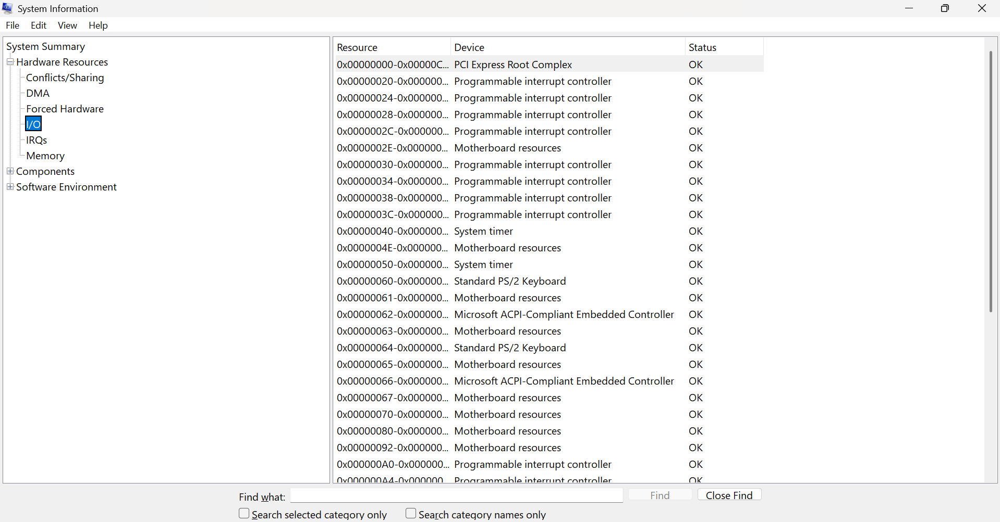
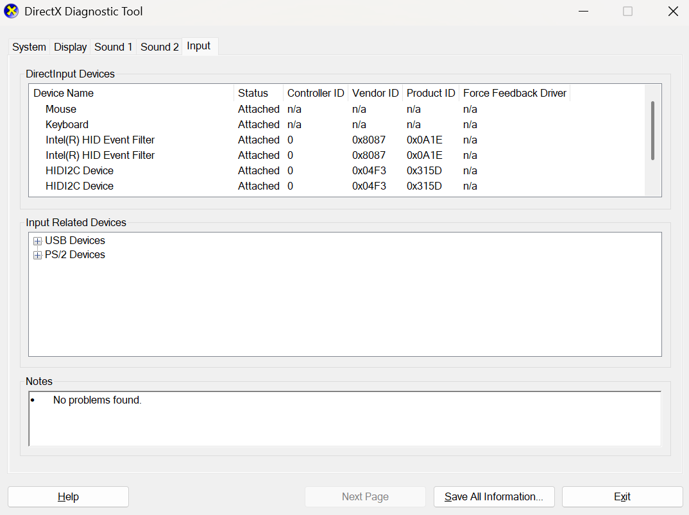
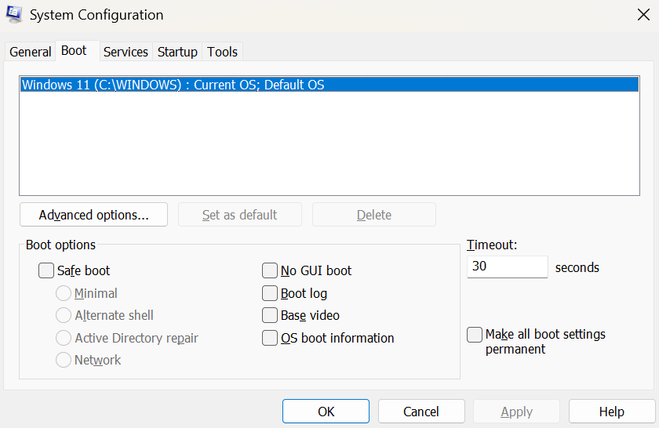

# $\fbox{Chapter 3: DIAGNOSTIC TOOL APPLICATIONS}$


## **Topic - 1: General System**

### <u>System Information</u>

- Can inspect hardware, drivers, system configurations, etc.

```cmd
msinfo
```




### <u>DirectX Diagnostic Tool</u>

- Mainly used for driver information like GPU, audio driver, DirectX, display driver, etc.

```cmd
dxdiag
```




## **Topic - 2: Boot & Services**

### <u>System Configuration</u>

- Used for configuring boot & services.

```cmd
sysconfig
```



---
