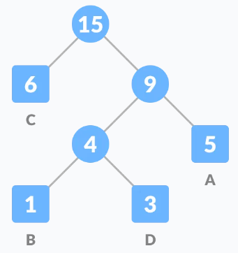
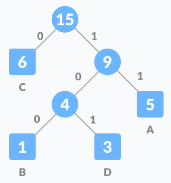

# <u>Chapter 1</u>: INTRODUCTION


## **Topic – 1: Summary**



- Characteristics of Algorithm
- Analysis of Algorithm
- Performance Measurements of Algorithm
- Time & Space Trade-Offs
- Recursive Algorithm Analysis


## **Topic – 2: Computational Problem**

- **<u>Computational problem</u>:** Sets a relationship between input & output of a problem.
- For example, an input $n$ gives an output saying it is even or not.
- **<u>Algorithm</u>:** Step-by-step approach for solving a given problem.


## **Topic – 3: Characteristics of an Algorithm**

- There maybe no input at all.
- At least one output is produced.
- The steps must be clear (definiteness).
- Output should not be uncertain etc.


## **Topic – 4: Algorithm Analysis**

### <u>Order Of Growth</u>

- Number of inputs are directly proportional to **execution speed**.
- **<u>Order of growth</u>:** Change in behavior of an algorithm as the number of inputs change.


### <u>Algorithm Categories</u>

- **<u>Best case</u>:** Also known as lower bound.
- **<u>Average case</u>:** Also known as tight bound.
- **<u>Worst case</u>:** Also known as upper bound.


### <u>Asymptotic Complexity</u>

- Asymptotic means approaching a curve arbitrarily.


## **Topic – 5: Various Asymptotic Notations**

### <u>Big O Problem</u>

- Its all about the upper bound, the worst case.
- Big O problem comes into play when the time complexity grows proportional to the input size.
- For example, a loop finding a particular element from an array having $n$ elements.
- In this case, the time complexity increases as the number of elements increase.


### <u>Ω Problem</u>
 
- Its all about the lower bound, the best case.
- This depends on the minimum number of search or operations to be performed.


### <u>Θ Problem</u>

- Its all about the path between worst case & **best case** i.e. the average case.
- Constants $c1$ and $c2$ represent intrinsic factors of algorithm, affecting it.
- These intrinsic factors are the **type of operations** performed in the program.


## **Topic – 6: Algorithm Performance Measurement**

### <u>Introduction</u>

- Measurement of the amount of **time** & **space** required by the algorithm.


### <u>Parameters Affecting Performance</u>

- Hardware being used.
- Abstract data type (any kind of data structure).
- Compiler’s efficiency.
- Programmer’s way of implementation.
- Algorithm’s complexity.
- **Size** of the input (like **'n'** elements in an array).


## **Topic – 7: Calculating Time Complexity**

### <u>Example (Recurrence)</u>

```
int fib (int n)
{
	if (n<=1)
		return n;

	else
		return fib(n-1) + fib(n-2);
}
```


### <u>Solution</u>

For $n>1$,
$$ T(n) \; = \; c $$
$$ T(n) \; = \; T(n-1) \; + \; T(n-2) $$


## **Topic – 8: Solving Recurrence Method**

### <u>Methods</u>

- Substitution method
- Iterative method
- Recurrence tree method
- Master’s method


## **Topic – 9: Substitution Method**

Let's say,
$$ T(n) \; = \; T(n-k) \; + \; k \;\;\; \fbox{(n-k)=0, so n=k} $$
This was for $(n-k)=0$, so $n=k$.

And for $n=0$,
$$ T(n) \; = \; 1$$
$$ T(n) \; = \; T(n-n) \; + \; n $$
$$ T(n) \; = \; T(1) \; + \; n $$
$$ T(n) \; = \; 1 \; + \; n $$
$$ T(n) \; = \; O(n) $$


## **Topic – 10: Recurrence Tree Method**

### <u>Introduction</u>

- Used for finding time complexity of recurrent equations.
- Uses divide & conquer approach.
- Root of tree is indicated by second term of the equation.


### <u>Steps Involved</u>

1. Identifying **root** & **sub-problems**.
2. Confirm all level cost sums to be same.
3. Sum up all **pre-level costs**.
4. Find the **height** for the tree.
5. Find **upper bound** (max cost) as per height.


### <u>Example (Root & Sub-Problems)</u>

For root $n^{2}$,
$$ T(n) \; = \; 2T(\frac{n}{2}) \; + \; n^{2} $$

Problems are divided into sub-problems,
$$ 2T(\frac{n}{2}) \; = \; T(\frac{n}{2}) \; + \; T(\frac{n}{2}) $$


### <u>Example (Full)</u>

#### Equation:
$$ T(n) \; = \; T(\frac{n}{3}) \; + \; T(\frac{2n}{3}) \; + \; n $$

#### Root:
$$ n $$

#### Sub-problem:
$$ T(\frac{n}{3}) \; and \; T(\frac{2n}{3}) $$




Notice that summing cost at each level gives $cn$.

The longest root to leaf path is (until $(\frac{2}{3})^kn$):
$$ n \; \rightarrow \; \frac{2n}{3} \; \rightarrow \; \frac{4n}{9} \; \rightarrow \; \frac{8n}{27} \; \rightarrow \; ... \; \rightarrow 1 $$
$$ = \; n \; \rightarrow \; \frac{2}{3}n \; \rightarrow \; (\frac{2}{3})^{2}n \; \rightarrow \; (\frac{2}{3})^{3}n \; \rightarrow \; ... \; \rightarrow \; 1 $$
Longest because it decomposes to $1$ very late.

Height of the tree is $k$, so:
$$ (\frac{2}{3})^{k}n \; = \; 1 $$
$$ k \; = \; log(\frac{3}{2n}) $$

Total cost is sum of {total sum of each level}:
$$ O(cn \; log(\frac{3}{2n})) \; = \; O(n \; log(n)) $$

Lower bound:
$$ \omega(n \; log(n)) $$
This is because in best case, $c$ is $1$ which makes $(cn\;log(cn))$ as $(n\;log(n))$.

Verification with substitution method:
$$ T(n)\;=\;T(\frac{n}{3})\;+\;T(\frac{2n}{3})\;+\;cn $$
$$ =\;d((\frac{n}{3})\;log(\frac{n}{3}))\;+\;d((\frac{2n}{3})\;log(\frac{2n}{3}))\;+\;cn $$
$$ =\;dn\;log(n) $$


## **Topic – 11: Master’s Theorem**

### <u>Introduction</u>

- Alternative way to solve recurrence equations.
- The equation must be in the following given form.

$$ T(n)\;=\;aT(\frac{n}{b})\;+\;f(n)\;\;\;\fbox{a>=1, b>2} $$

Size of problem:
$$ \frac{n}{b}\;\;\;\fbox{both floor \& ceiling} $$


### <u>Possible Cases</u>

#### Case 1:

If:
$$ f(n)\;=\;\theta(n^{c})\;\;\;\fbox{c < log b a} $$

Then:
$$ T(n)\;=\;\theta(n^{log_{b}a}) $$

#### Case 2:

If:
$$ f(n)\;=\;\theta(n^{c})\;\;\;\fbox{c = log b a} $$

Then:
$$ T(n)\;=\;\theta(n^{c}log(n)) $$

#### Case 3:

For:
$$ f(n)\;=\;\theta(n^{c})\;\;\;\fbox{c > log b a} $$

Then:
$$ T(n)\;=\;\theta(f(n)) $$


>**<u>NOTE</u>:**
>$a$ and $b$ are being referred from the equation $T(n)\;=\;aT(\frac{n}{b}\;+\;f(n)$.


### <u>Example</u>

Let's take our problem as merge sort.

#### Equation:

$$ T(n)\;=\;2T(\frac{n}{2})\;+\;\theta(n) $$

This comes under **case 2**.

#### Solution:

$$ \theta(n\;log(n)) $$


### <u>Example – II</u>

Now let's take our problem as binary search problem.

**<u>Equation</u>: T(n) = T(n/2) + θ(1)**

#### Equation:

$$ T(n)\;=\;T(\frac{n}{2})\;+\;\theta(1) $$

This problem too falls under **case 2**.

#### Solution:

$$ \theta(log(n)) $$


### <u>How Cases Affect Result?</u>

**<u>Case 1</u>:**

**Work done at leaves \> Work done at nodes**

**Result = Work done at leaves**

**<u>Case 2</u>:**

**Work done at leaves = Work done at nodes**

**Result = (Height) \* (Work done at any level)**

**<u>Case 3</u>:**

**Work done at leaves \< Work done at nodes**

**Result = Work done at root**

**"Work done" here means sum of all nodes at a particular level.**

**<u>Example – III</u>**

**<u>Equation</u>: T(n) = 9T(n/3) + n**

**<u>Variables</u>: a=9, b=3, f(n)=n**

**θ(n<sup>log</sup><sub>b</sub><sup>a</sup>) = θ(n<sup>2</sup>) \[f(n) =
n and c = 1\]**

**<u>Case</u>: 1**

**<u>Solution</u>: T(n) = θ(n<sup>2</sup>)**

**<u>Limitations</u>**

- Some problems might fall **between** two cases.

- Such problems **can’t** be solved using **master’s theorem**.
