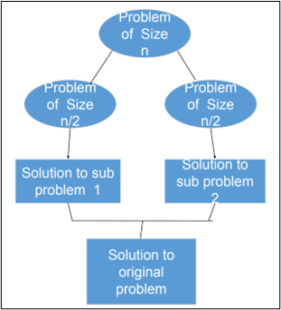

# $\fbox{Chapter 2: DIVIDE \& CONQUER}$

## **Topic – 1: Overview**

- Introduction
- Recurrence relation
- Multiplying large integers problem
- Binary search
- Merge sort
- Quick sort
- Matrix multiplication
- Exponentiation

## **Topic – 2: Introduction**

### <u>Steps Involved</u>

- **Divide**
- **<u>Recur</u>:** Solve the sub-problems recursively.
- **Conquer** (not done in all algorithms)

### <u>General Philosophy</u>

- General algorithm philosophy for divide & conquer is to keep dividing the problem until the sub-problems is optimal enough to be solve.

### <u>Parts Of Solving</u>

- Partitioning of problem
- Reaching the indivisible part of the problem.
- When problems are small enough to be solved optimally.
- **Piecing** the solved sub-problems together.
- Height in these will be $log_{2}(n)$ because their branches end together.

## **Topic – 3: Recurrence Relations**

- It can be used in solving multiplication problems by breaking them into smaller parts.
- Their analysis can be done using methods we discussed in 1st chapter.

## **Topic – 4: Multiplying Large Integers Problem**

### <u>Introduction</u>

- It is solving multiplication problems through expansion of terms.
- Sub-problems get **halved** at each level.

### <u>Formula – I (Example)</u>

#### Problem:

$$ 1234\;*\;981 $$
$$ 0981\;=\;(10^{2}\;*\;9)\;+\;81 $$
$$ 1234\;=\;(10^{2}\;*\;12)\;+\;34 $$
$$ $$
$$ 1234\;*\;0981 $$
$$ =\;0981\;*\;1234 $$
$$ =\;((10^{2}\;*\;9)\;+\;81)\;*\;((10^{2}\;*\;12)\;+\;34) $$
$$ =\;10^{4}\;(9\;+\;12)\;10^{2}\;(9\;*\;34)\;+\;10^{2}\;(12\;*\;81)\;+\;(81\;*\;34) $$
$$ =\;10^{4}\;(9\;+\;12)\;10^{2}\;((9\;*\;34)\;+\;(12\;*\;81))\;+\;(81\;*\;34) $$
$$ =\;1210554 $$

### <u>Formula – II (Same Example)</u>

#### Problem:

$$ 1234\;*\;981 $$
$$ w\;=\;09\;*\;10^{2} $$
$$ x\;=\;81\;*\;10^{2} $$
$$ y\;=\;12\;*\;10^{2} $$
$$ z\;=\;34\;*\;10^{2} $$

#### Formula:

$$ (wz\;+\;xy)\;=\;(w\;+\;x)\;*\;(y\;+\;z)\;-\;wy\;-\;xz $$
$$ $$

- $f(n)$ is time taken for multiplication.
- $g(n)$ is time taken for additions & overhead operations.

$$ T(n)\;=\;f(n)\;+\;cg(n) $$
$$ T(n)\;=\;n\;+\;3T(\frac{n}{2}) $$

### <u>Structural Insights</u>

$$ Height\;=\;k\;=\;log_{2}(n) $$
- Total sub-problems are $3^{k}$.

#### Total time spent:

$$ 3^{k}\;*\;(\frac{n}{2^{k}}) $$
$$ =\;(\frac{3}{2})^{k}\;*\;n $$
$$ =\;(\frac{3}{2})^{log_{2}(n)}\;*\;n $$
$$ =\;n^{log_{2}(\frac{3}{2})}\;*\;n $$
$$ =\;n^{1.59} $$
$$ =\;O(n^{1.59}) $$
$$ =\;O(n^{c}) $$

## **Topic – 5: Time Complexities Of Algorithms**

### <u>Binary Search</u>

$$ T(n)\;=\;T(\frac{n}{2})\;+\;1\;=\;O(log(n)) $$

- $\frac{n}{2}$ because we discard searching one of the current halves of array.
- $1$ because it checks the middle element in the current half.

> **<u>NOTE</u>:**
> There is no sub-problem in binary search as another half is not considered when other half is being searched.

### <u>Merge Sort</u>

$$ T(n)\;=\;2T(\frac{n}{2})\;=\;O(n\;log(n)) $$

- $2$ because it is divided into two sub-problems.

### <u>Quick Sort</u>

$$ T(n)\;=\;2T(\frac{n}{2})\;+\;n\;=\;O(log(n)) $$

- This was the best case.
- In worst case, it goes up to $O(n^{2})$.

## **Topic – 6: Matrix Multiplication**

### <u>Introduction</u>

$$ Z_{ij}\;=\;\sum^{n}_{k=1}{X_{ik}Y_{yj}} $$

- $Z$ is the product matrix of another two matrices $X$ and $Y$.

### <u>Types Of Matrix Multiplications</u>

- Iterative matrix multiplication
- Recursive matrix multiplication
- Strassen matrix multiplication

### <u>Iterative Matrix Multiplication</u>

- Solved with two nested loops.

### <u>Recursive Matrix Multiplication</u>

- Matrix is broken into smaller parts which will be multiplied in order to get various cells of product matrix.
- Now we can use divide & conquer algorithm here.
- Worst case complexity goes up to $O(n^{3})$.

### <u>Strassen Matrix Multiplication</u>

$$ X\;=\;[\;\matrix{A&B\\C&D}\;] $$
$$ Y\;=\;[\;\matrix{E&F\\G&H}\;] $$
$$ $$
$$ XY\;=\;[\;\matrix{A&B\\C&D}\;]\;[\;\matrix{E&F\\G&H}\;]\;=\;[\;\matrix{AE\;+\;BG&AF\;+\;BH\\CE\;+\;DG&CF\;+\;DH}\;] $$

- There are eight multiplications to perform which are $AE$, $BG$, $AF$, $BH$, $CE$, $DG$, $CF$, $DH$.
- But German mathematician **Volker Strassen** gave formula to compute it in only 7 multiplications!

$$ P\;=\;A_{11}\;*\;(B_{12}\;-\;B_{22}) $$
$$ Q\;=\;(A_{11}\;+\;A_{12})\;*\;B_{22} $$
$$ R\;=\;(A_{11}\;+\;A_{12})\;*\;B_{22} $$
$$ S\;=\;A_{22}\;*\;(B_{21}\;-\;{B_{11}}) $$
$$ T\;=\;(A_{11}\;+\;A_{22})\;*\;(B_{11}\;+\;B_{22}) $$
$$ U\;=\;(A_{12}\;-\;A_{22})\;*\;(B_{21}\;+\;B_{22}) $$
$$ V\;=\;(A_{11}\;-\;A_{21})\;*\;(B_{11}\;+\;B_{12}) $$
$$ $$
$$ C_{11}\;=\;T\;+\;S\;-\;Q\;+\;U $$
$$ C_{12}\;=\;P\;+\;Q $$
$$ C_{21}\;=\;R\;+\;S $$
$$ C_{22}\;=\;P\;+\;T\;-\;R\;-\;V $$

>**<u>NOTE</u>:**
>$C_{ij}$ are cells of the product matrix.

$$ T(n)\;=\;8T(\frac{n}{2})\;+\;O(n^{2})\;=\;O(n^{1.59}) $$

## **Topic – 7: Exponentiation**

### <u>Regular Method</u>

- Here, exponent of a given number is calculated using a loop.

$$ T(n)\;=\;O(n) $$

### <u>Divided Exponent Method</u>

- Lessens the number of steps to get the answer.
- If value of exponent is currently even, then it is written in form of power to $2$.
- For odd, we make the exponent even (one less than current exponent) by expanding the term.
- Refer to example comparison below.

#### Regular method:

$$ a^{29} $$

- We will get the answer in 28 steps.

#### Division exponent method:

$$ a^{29} $$
$$=\;a*a^{28} $$
$$ =\;a*(a^{14})^{2} $$
$$ =\;a*((a^{7})^{2})^{2} $$
$$ =\;a*((a*a^{6})^{2})^{2} $$
$$ =\;a*((a*(a^{3})^{2})^{2})^{2} $$
$$ =\;a*((a*(a*a^{2})^{2})^{2})^{2} $$

- We will get the answer in just 7 steps!

$$ T(n)\;=\;T(n-1)\;+\;1\;=\;O(log(n)) $$

- $(n-1)$ because the problem is expanded to smaller, calculative parts but in irregular manner.
- $1$ because we check if the exponent is odd or even.

> **<u>NOTE</u>:**
> Having a recursive function doesn’t always mean reduction in time complexity.

---
