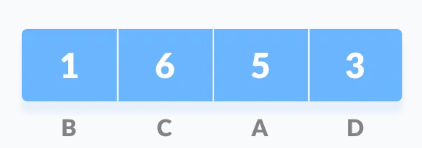
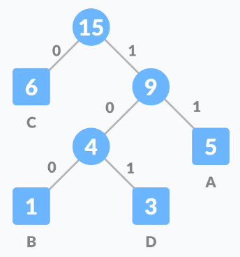
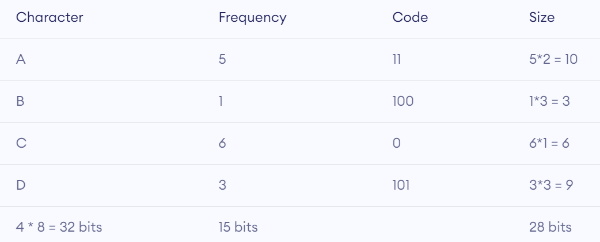

# $\fbox{Chapter 3: GREEDY ALGORITHM}$

## **Topic – 1: Overview**

- General characteristics of greedy algorithms
- Activity selection problem
- Elements of greedy strategy
- Minimum spanning trees
- Kruskal’s algorithm
- Prim’s algorithm
- Shortest paths – Dijkstra’s algorithm
- The knapsack problem

## **Topic – 2: Characteristics Of Greedy Algorithms**

### <u>Most Straightforward Design Technique</u>

- Takes $n$ number of inputs & output is subset of the given group of inputs.
- Objective is to find the most optimal solution.

### <u>Determines Feasible Solutions</u>

- Chooses the most optimal solution at each step, which we hope will lead to globally most optimal solution.

### <u>Greedy v/s Dynamic Programming</u>

| Greedy Algorithm                                                             | Dynamic Programming                                |
| ---------------------------------------------------------------------------- | -------------------------------------------------- |
| Makes best local choice at a given step.                                     | Used for searching all possibilities.              |
| If evidence for reaching globally most optimal point is less, it might fail. | Will guaranteed work as it sees all possibilities. |
| Doesn’t store any computing data.                                            | Stores computing data to not recompute again.      |
| Choice is made before solving sub-problem.                                   | Sub-problems are solved first.                     |
| Top-down approach.                                                           | Bottom-up approach.                                |
| Fast                                                                         | Slow                                               |
| Straightforward                                                              | Complex                                            |

### <u>General Greedy Algorithm</u>

1. We start moving from the **initial node** (value).
2. We discover many possible choices (nodes) we have at each level to move.
3. We choose the **most optimal choice** (node), or the choice which will lead us to our desired solution most optimally.
4. Then we move to the **chosen node**.

### <u>Example</u>

#### Given:

We live in a country with currency having coins of $\$1$, $\$0.25$, $\$0.10$, $\$0.01$.

#### Problem:

Find a way to pay $\$2.89$ with minimum number of coins.

#### Solution:
$$ \$2.89 = (\$1\times2) + (\$0.25\times3) + (\$0.10\times1) + (\$0.01\times4) $$

>**<u>Note</u>:**
>We were finding the most optimal solution in the example above.

## **Topic – 3: Activity Selection Problem**

### <u>Introduction</u>

- This problem refers to problem where we have to organize activities/task at such a time that the shared resources can’t be used concurrently.

### <u>Example</u>

- Let’s say that various activities have to be done inside a **common hall**, such that one activity’s time **doesn’t** clash with any other activity’s time.
- Meaning no two activities are performed at the **same time**, though the hall shared is common among them.

### <u>Recursive Activity Selector</u>

- So, if we are given data about various activities & find out that some of the timings clash, then we pick up only the compatible activities & discard the others.
- Our goal is to let most activities occur in the hall.
- Sorting these data can help us achieve this goal.

### <u>Elements Of Greedy Strategy</u>

- Works on recursion when making choice.
- We have to prove that the optimal choice we are making at any level is the greedy choice.
- **<u>Greedy choice</u>:** The safe choice which leads to desired solution.
- Show that one of the all of sub-problems created when making greedy
  choice is empty.

### <u>Greedy Choice Property</u>

- Actually, we can’t know if a choice will lead us to solution or not.
- But the points discussed above if satisfied, then we may likely develop a greedy algorithm.

## **Topic – 4: Minimum Spanning Tree**

### <u>Introduction</u>

- Max edges possible among a given number of vertices is $\frac{n(n-1)}{2}$.
- **<u>Spanning tree</u>:** A tree with $(n-1)$ edges where $n$ is number of vertices.
- There can be weight/cost on the edges.

### <u>Greedy Minimum Spanning Tree</u>

- The edge to be chosen next is as per some optimal criteria.
- It is usually the edge which had minimum weight from the available options.

### <u>Kruskal’s Algorithm</u>

- Lowest to highest weighted edges are chosen one-by-one, without creating a cycle.
- We repeat it until all the vertices are done.

### <u>Prim’s Algorithm</u>

1. A random vertex is chosen.
2. Then most optimal edge is chosen from that vertex.
3. Then we chose the most optimal edge from the vertices we have included so far.
4. We repeat these without forming any cycle.

### <u>Dijkstra’s Algorithm</u>

1. We choose a vertex/node as per our choice.
2. Then we find shortest path from that node to other nodes & track them in tables.
3. When we find a shorter path to already visited node, we update the distance in table.

>**<u>NOTE</u>:**
>This all works on basic recursion model.

## **Topic – 5: Knapsack Problem**

- Remember the bag & weight problem.
- Each block has a value & weight.
- We have to gain max value without reaching the max weight.

## **Topic – 6: Huffman Coding**

### <u>Introduction</u>

- It’s a data compression technique without losing any details.
- Data are treated as strings when being compressed.

### <u>Example</u>

1. Write the string

2. Make an array with frequencies of each character’s
appearance.

3. Put them in ascending order.

3. Merge the first two nodes, adding their frequencies. Arrange
again if required.

4. Make a tree with merged value as parent node, smaller one of the two merged nodes being at its left & larger one at its right.

5. (Repeat) - Again, merge the next two nodes & rearrange if
required.

6. Modify the tree with same rules.

5. (Repeat-2) - Merge & rearrange if required.

6. (Repeat-2) - Modify the tree, again.

7. Assign all left edges as 0 & right edges as 1.

8. Set up the calculation table.

$$ T(n) = O(nlog(n)) $$

### <u>Applications</u>

- File compression formats.
- Text & fax transmissions.

---
