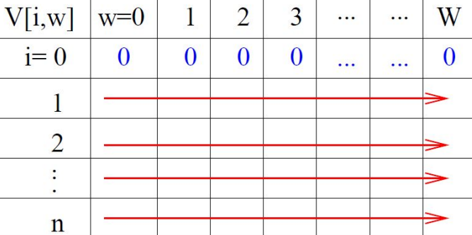
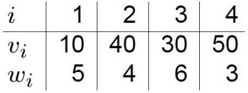
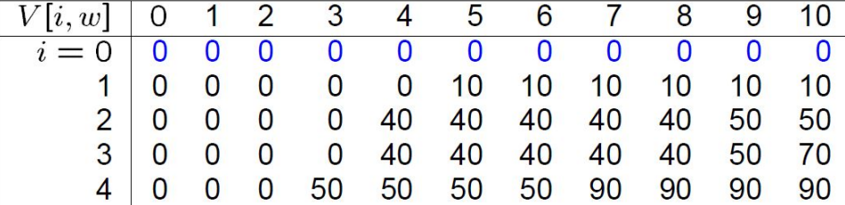
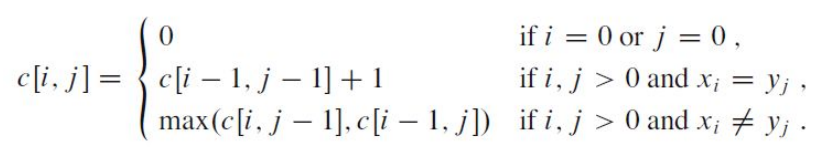
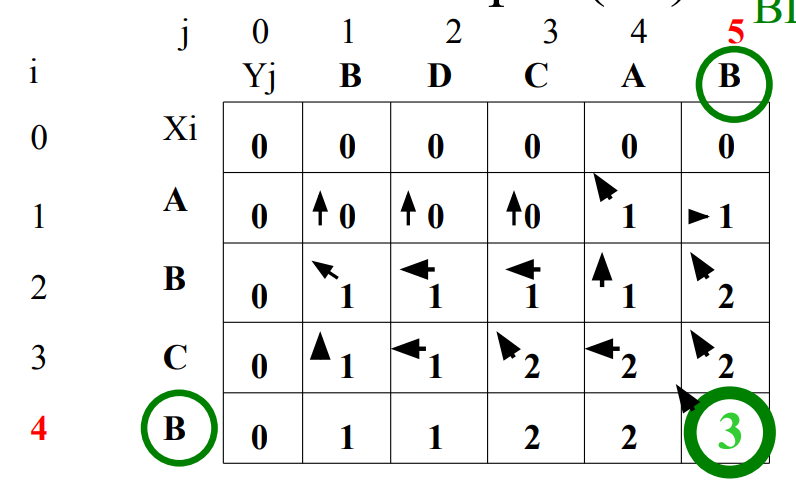

# $\fbox{Chapter 4: DYNAMIC PROGRAMMING}$

## **Topic – 1: Summary**

- Introduction
- The principle of optimality
- Making change problem
- The 0-1 knapsack problem
- Shortest path Floyd’s algorithm
- Matrix chain multiplication
- Longest common subsequence

## **Topic – 2: Introduction**

### <u>Definition</u>

- **<u>Dynamic programming (DP)</u>:** Stage-wise search method for problems using a series of decisions.
- We keep a table of known solutions to avoid solving same problem twice.
- So, DP is same as greedy algorithm but avoids calculating same thing more than once.

### <u>Bottom-Up Approach</u>

- In bottom-up approach, first we solve the smallest sub-problem.
- Then after solving & combining that sub-problem, we again check the smallest problem from available sub-problems.
- We continue this loop until all the sub-problems have been solved.

### <u>Divide & Conquer v/s Dynamic Programming</u>

| Divide & Conquer                                       | Dynamic Programming                                                               |
| ------------------------------------------------------ | --------------------------------------------------------------------------------- |
| Recursively solves & combines sub-problems.            | Recursively solves & combines sub-problems but avoids solving same problem twice. |
| Works best when sub-problems are mutually independent. | Works best when sub-problems might be mutually dependent.                         |
| Less complex.                                          | More complex.                                                                     |
| Top-down approach.                                     | Bottom-up approach.                                                               |
| For example, merge sort & binary search etc.           | For example, Fibonacci series & 0-1 knapsack problem.                             |

### <u>Dynamic Programming v/s Greedy Algorithm</u>

| Dynamic Programming                                       | Greedy Algorithm                                       |
| --------------------------------------------------------- | ------------------------------------------------------ |
| Each step is determined by which sub-problem is smallest. | We make the most optimal (greedy) choice at each step. |
| Bottom-up approach.                                       | Top-down approach.                                     |
| Can be slower.                                            | Usually fast.                                          |
| More complex.                                             | Mostly simple.                                         |

## **Topic – 3: The Principle Of Optimality**

### <u>Introduction</u>

- It’s a law which when **not** applied to a problem, we can’t solve it using DP.
- For example, when we have limited resources, then DP might **not** help us.
- However, principle of optimality can be applied on most problems.
- These will be most optimal solutions obtained from combining many optimal solutions.
- But the issue is that this principle is unreliable.

### <u>Make A Change Problem</u>

- Suppose the example from previous chapter about the currencies.
- We have coins for **1-unit**, **4-units** & **6-units**.
- Now we need to provide change of **8 units** to a customer.
- Greedy algorithm will result in payment of one **6-unit** coin & two **1-unit** coins.
- While, DP will do so with **two 4-unit** coins, which is clearly more optimal.

#### Goal:

To find minimum number of coins required.

#### Algorithm:

1. Make various combinations of coins like $(1)$, $(4)$, $(6)$, $(1,4)$, $(4,6)$, $(1,6)$, $(1,4,6)$.
2. When taking each combination, keep coins with higher values ahead.
3. See how many large coins cover the target value or little less than it.
4. Then try fixing the immediate smaller value in gap.
5. Then lower it by one unit & try again fixing the immediate smaller value in gap.
6. Repeat step 4 & 5 recursively.
7. Keep the number of coins involved in a list.
8. Search for the shortest value & return it.

#### Simulation:

$$ 1\;\rightarrow\;\{1,1,1,1,1,1,1,1\} $$
$$ 1,4\;\rightarrow\;\{4,4\},\;\{4,1,1,1,1\},\;\{1,1,1,1,1,1,1,1\} $$
$$ 4,6\;\rightarrow\;\{6\},\;\{4,4\} $$
$$ 1,6\;\rightarrow\;\{6,1,1\},\;\{1,1,1,1,1,1,1,1\} $$
$$ 1,4,6\;\rightarrow\;\{6\}, \{6,1,1\}, \{4,4\}, \{4,1,1,1,1\}, \{1,1,1,1,1,1,1,1\} $$

- We see that {6} alone doesn’t fulfil the need for 8.
- And we also see that {4,4} fulfils our need with least number of coins.
- We also have choice to represent the same in from of table for better visualization.

## **Topic – 4: Knapsack Problem**

### <u>Introduction</u>

- In knapsack problem, we have some items with weight & value.
- We have to find the combination of items such that they stay within the weight limit but provide the highest value.

### <u>Types Of Knapsack Problem</u>

 - **<u>0-1 knapsack problem</u>:** When choosing an item, it has to be picked up as a whole & not some part of it. It can be solved using dynamic programming.
- **<u>Fractional knapsack problem</u>:** We can also choose a fraction of an item. It can be solved using greedy algorithm.

### <u>Contrary Greedy Behaviour</u>

- Greedy algorithm will start picking the largest value first & other values might not be able fill the weight gap.
- So, the total value might not be the max value possible.

>**<u>NOTE</u>:**
>Weight is just a limit, no need to reach the limit if we get the highest value beforehand.

### <u>Knapsack Table</u>

- We can solve knapsack problem & find the combination with max value within a weight limit, using knapsack table.
- In it, rows represent max weight & column represent the index of our elements (starting from $1$, not $0$).

- We can compute it row-by-row or even column-by-column.

### <u>Steps Involved</u>

1. We check one-by-one each element by their weight.
2. Then add value of next element if they don’t cross the weight limit.
3. If we see possibility of getting more value from discarding an element & adding another, then we do so. But in a set of large number of elements, how do we do so? We will use a formula for that!

#### Formula:

$$ V[i,w]\;=\;max(V[i–1,w],\;v_{i}\;+\;V[i–1,w–w_{i}]) $$

>**<u>NOTE</u>:**
>Notice that this formula is actually recursive.

### <u>Example</u>

#### Question:

Weight limit (W) = 10 for:

#### Answer:

### <u>Computational Complexity</u>

- Time complexity – $O(nW)$
- Space complexity – $O(W)$

## **Topic – 5: Chain Matrix Multiplication**

### <u>Concept</u>

- A chain of matrix $(A_{1},\;A_{2},\;A_{3},\;...,\;A_{n})$ which have to be multiplied.

### <u>Possibilities</u>

- Suppose there are four matrices $A_{1}$, $A_{2}$, $A_{3}$ & $A_{4}$.
- There are five ways to compute the product.

$$ (A_{1}(A_{2}(A_{3}A_{4}))) $$
$$ (A_{1}((A_{2}A_{3})A_{4})) $$
$$ ((A_{1}A_{2})(A_{3}A_{4})) $$
$$ ((A_{1}(A_{2}A_{3}))A_{4}) $$
$$ (((A_{1}A_{2})A_{3})A_{4}) $$

### <u>Necessary Parameters</u>

- To multiply two matrices, we need some necessary parameters.
- These parameters are the algorithm & matrix dimensions.

### <u>Algorithm Rules</u>

1. Number of columns in first matrix must be equal to number of rows in another.
2. Third matrix’s each element must be initialized to $0$.
3. There are three loops involved – Outermost having $[1, r_{1}]$, middle one having $[1, c_{2}]$ & innermost having $[1, c_{1}]$.
4. Line for calculation is: $m_{3}\;+=\;m_{1}[r_{1}][c_{1}]*m_{2}[r_{1}][c_{2}]$
5. Return the two-dimensional array now.

### <u>Brute Force Method</u>

- **<u>Scalar multiplications</u>:** All the multiplications involved between two matrices.
- Parenthesizing the chain of matrices properly can help us reduce the total number of scalar multiplications.

### <u>Dynamic Programming Approach</u>

 1. We make an optimal parenthesizing by finding two such matrices from the given matrices, which give smallest number of scalar multiplications.
 2. It will be where $(r_{1}*c_{1}*c_{2})$ is smallest.
 3. We will repeat step $1$ & $2$ until all matrices has been calculated.

>**<u>NOTE</u>:**
>1. Note how we are solving the matrix problem by taking one sub-problem at a time.
>2. So, that’s how it comes under category of dynamic programming.

### <u>Computation Cost</u>

- Let cost of computing be called $CC$.

$$ Total\;cost\;=\;CC(A_{1})\;+\;CC(A_{2})\;+\;CC(Scalar \;multiplications) $$
$$ m[i,j]\;=\;m[i,k]\;+\;m[k+1,j]\;+
\;p_{i-1}p_{k}p_{j} $$

- Here, $(i-1) < j < k$.

### <u>Example</u>

#### Question:

Given a chain of four matrices $A_{1}$, $A_{2}$, $A_{3}$, $A_{4}$, with $p_{0}\;=\;5$, $p_{1}\;=\;4$, $p_{2}\;=\;6$, $p_{3}\;=\;5$, $p_{4}\;=\;2$, $p_{5}\;=\;7$. Find $m[i,j]$.

#### Answer:

- Dimensions are as listed below.

$$ A_{1}\;\rightarrow\;p_{0}\;*\;p_{1} $$
$$ A_{2}\;\rightarrow\;p_{1}\;*\;p_{2} $$
$$ A_{3}\;\rightarrow\;p_{2}\;*\;p_{3} $$
$$ A_{4}\;\rightarrow\;p_{3}\;*\;p_{4} $$

## **Topic – 6: Subsequence**

### <u>Introduction</u>

- Deriving a string from another string after deleting certain elements.

#### Common subsequence:

$$ ABCDH,\;AEDFHR\;\rightarrow\;ADH $$

### <u>Longest Common Subsequence Problem (LCS)</u>

- Suppose $i$ to be the pointer pointing to string $X$.
- And $j$ is doing so with $Y$.

### <u>Example</u>

- Drawing a line, following arrow directions from the last element leads us to non-zero & cornered arrow boxes of $B$, $C$ & $B$.
- So, $BCB$ is our answer.
- $X$ values (vertical) are called **president**.
- $Y$ values (horizontal) are called **providence**.

#### Algorithm:

1. For $i=0$ or $j=0$, the box will be $0$.
2. By default, a cell’s value is $0$.
3. We check which one of $\{matching\;symbol\}$, $\{immediate\;upper\;cell\}$ &$\{preceding\;character\}$ is largest. Preference for writing arrow is in same order.
4. We write the largest one of the three in the box.
5. But whenever a character matches, we increment the cell’s value.

### <u>LCS Algorithm Runtime</u>

- Time complexity – $O(m*n)$
- $m$ is number of elements in first array while $n$ is in another.

## **Topic – 7: Principle Of Optimality**

### <u>Floyd’s Algorithm</u>

- For a given graph, we can find the shortest path from one node to another easily through matrix.
- This matrix contains shortest distance from one node to another.
- Unknown distance from any one node to another is put as infinity initially.

---
