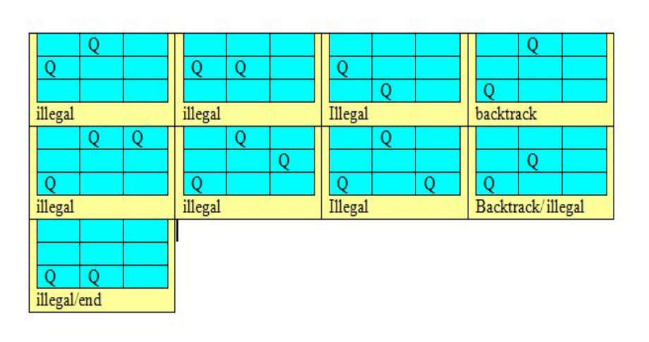

# $\fbox{Chapter 5: EXPLORING GRAPHS}$

## **Topic – 1: Summary**

- Introduction using graphs
- **Traversing tress –** Preconditioning
- **Depth first search –** Undirected graph
- **Depth first search –** Directed graph
- Topological sorting
- Breadth first search
- Backtracking
- General template
- Knapsack problem using backtracking
- Eight queens problem

## **Topic – 2: Introduction Using Graphs**

### <u>Representation</u>

$$ G\;=\;(V,E) $$

- Graphs can be represented in form of adjacency list & adjacency matrix.
- **<u>Adjacency matrix</u>:** Tells which nodes are connected in form of $0s$ & $1s$.

### <u>Adjacency List Representation (ALR)</u>

- We make linked lists from each possible node.

### <u>ALR Example</u>

#### Given:

#### ALR:

## **Topic – 3: Traversing Trees**

### <u>Traversing Methods</u>

- **<u>Preorder</u>:** Root $\rightarrow$ Left $\rightarrow$ Right
- **<u>Inorder</u>:** Left $\rightarrow$ Root $\rightarrow$ Right
- **<u>Postorder</u>:** Left $\rightarrow$ Right $\rightarrow$ Root

### <u>Preconditioning</u>

- Auxiliary (intermediate) results can be used to sometimes speed up the solution calculation.
- **<u>Preconditioning</u>:** This whole process of calculating auxiliary result for future use.

#### Calculation:

- Let $a$ be the time it takes to solve one instance of a problem without auxiliary info.
- Let $b$ be the time it takes to solve one instance of a problem with auxiliary info.
- Let $p$ be the time it takes to calculate extra information.
- Time taken to solve problems is as follows.

$$ With\;auxiliary\;info\;=\;p\;+\;nb $$
$$ Without\;auxiliary\;info\;=\;na $$

- Using preconditioning is helpful only when $n\;>\;\frac{p}{(a-b)}$.
- This is again a kind of dynamic programming algorithm.

### <u>Preconditioning Example</u>

- Finding if a node $A$ is parent node of another node $B$ or not will take us $O(n)$.
- But if we solve another problem where we traverse from root node $R$ to node $B$, we can note the nodes coming between them, which includes $A$.
- This will take us $O(n)$ when doing so.
- So, if we require to solve the first problem, we can find it in $O(1)$ time.
- We can do it in two ways, using preorder or post-order.
- We number the **root R** in order first using preorder & at last using post-order.

## **Topic – 4: Breadth-First Search (BFS)**

### <u>Introduction</u>

- In BFS, we explore graphs in form of trees.
- We pick up a node & treat it as root node $R$.
- Then we proceed to explore its children.
- We start from the nearest nodes & then proceed toward nodes further away.

### <u>Example</u>

- See the way of traversal in diagram below.

### <u>Colour Guided Traversal</u>

- We can represent nodes in colour white, grey & black.
- **White –** Unexplored nodes
- **Grey –** Partially explored nodes
- **Black –** Fully explored nodes

### <u>Colour Traversal Queue</u>

- We visit each node one-by-one, children of each node at a time.
- We enqueue grey nodes to a queue & dequeue black ones.
- After all is done, we dequeue them one-by-one.
- We initially draw the graph as shown below.

>**<u>NOTE</u>:**
>Mind directions if it’s a directional graph.

## **Topic – 5: Depth First Traversal (DFS)**

### <u>Introduction</u>

- As the name says, our way of traversal will be to get as deep in the tree (from graph) as possible.
- When we sense the end of the tree, we keep returning until an unvisited path is found.
- Finding an unvisited path this way is known as ***backtracking***.

### <u>Example</u>

- It is traversed in the way shown in example below.

### <u>DFS Stack</u>

- By traversing through a tree using DFS, we keep a stack with us.
- This stack contains the nodes connected to current path.
- These elements are too popped one-by-one.

### <u>Colouring Method</u>

- DFS uses the same colouring method as BFS.
- The colouring is done step-by-step as shown in example below.

### <u>Directed Acyclic Graph</u>

- DAG is a form of graph which doesn’t form any cycle.

### <u>Topological Sorting</u>

- We construct or modify a graph in such a way that certain nodes are given higher priority than others.
- We use DAG to construct this type of graph.
- The directed graph must be set up this way so that say an item $A$ must finish before item $B$.
- And there can be multiple ways to arrange the graph for same setting.

### <u>Topological Sorting Example</u>

#### Diagram:

#### Possible representations:

$$ s1\;=\;\{a,\;b,\;c,\;d,\;e,\;f,\;g,\;h,\;i\} $$
$$ s2\;=\;\{a,\;c,\;b,\;f,\;e,\;d,\;h,\;g,\;i\} $$
$$ s3\;=\;\{a,\;b,\;d,\;c,\;e,\;g,\;f,\;h,\;i\} $$
$$ s4\;=\;\{a,\;b,\;c,\;d,\;e,\;f,\;g,\;h,\;i\} $$

### <u>Topological Sorting & DFS</u>

- We try to make the graph as linear as possible, giving priority to one node at a time.
- But it is not very much necessary.
- We can do so by reverse ordering the DFS of the graph.

### <u>Example</u>

#### Possible topological orders:

$$ T_{0}\;=\;a,\;b,\;c,\;h,\;d,\;g,\;i,\;f,\;e $$
$$ T_{1}\;=\;h,\;a,\;b,\;c,\;d,\;g,\;i,\;f,\;e $$

### <u>Backtracking</u>

- We come to know about some of the possible choices & choose one.
- Then we come to know about various other possible choices after that choice.

### <u>Knapsack Using Backtracking</u>

|  Weight  |  2  |  3  |  4  |  5  |
| :------: | :-: | :-: | :-: | :-: |
|  Profit  |  3  |  5  |  6  | 10  |
| Capacity |  8  |  8  |  8  |  8  |

- Tree above shows nodes in format $(w_{1},\;w_{2},\;...,\;w_{n}\;;\;profit)$.
- **<u>Memoization</u>:** Constructing/storing solutions while also solving the problem.

>**<u>NOTE</u>:**
>Profit mustn’t cross the capacity.

### <u>N-Queen Problem</u>

- This problem discusses how to arrange $N$ queens on an $N*N$ chess board.
- Suppose this 3-queen problem given below.

- As we saw some of the steps in solving a 3-queen problem, we start with two queens.
- Then we check at what position they can’t attack each other.
- And then we add another, then check with it.
- In case the last added queen fits no such place, we backtrack & place the last queen in another position invulnerable to attack.
- If then that fails, we backtrack to even its previous queen etc.

### <u>State Space Tree</u>

- **<u>State space tree:</u>** Representation of various possibilities of a problem.
- Let’s take a look at how it will look for a 4-queen problem.

## **Topic – 7: Other Types Of Graphs**

### <u>Articulation Graph</u>

- A graph which has some nodes/vertices (articulation points) which are crucial in maintaining connectivity & structure of the graph.
- Removing articulation points will result in total demolition in graph’s structure or connectivity.
- It is applicable on undirected graphs only.

### <u>Dense Graph</u>

- A graph in which the total number of edges are close to the maximum number of edges possible.
- But as anyone will notice, this definition is very informal as there is no fixed value for **close to maximum**.
- More formal definition will be a graph whose number of edges $E$ grows with rate of $O(n^{2})$ when vertices are added.

### <u>Sparsh Graph</u>

- Complete **opposite** of dense graphs.
- In these graphs, the number of edges are very less than the maximum possible number of edges.
- More formal definition will be a graph whose number of edges $E$ grows with rate of $O(n)$ when vertices are added.

---
