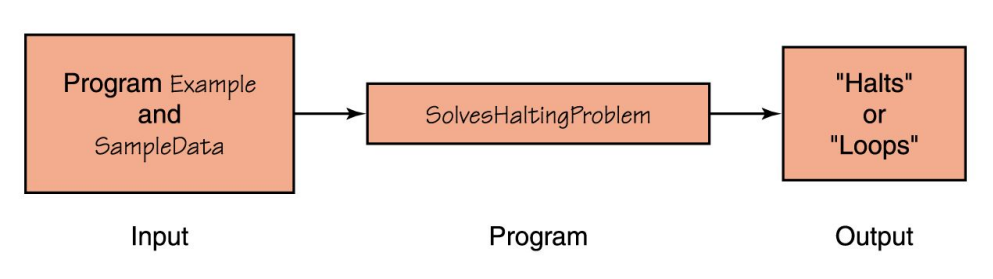
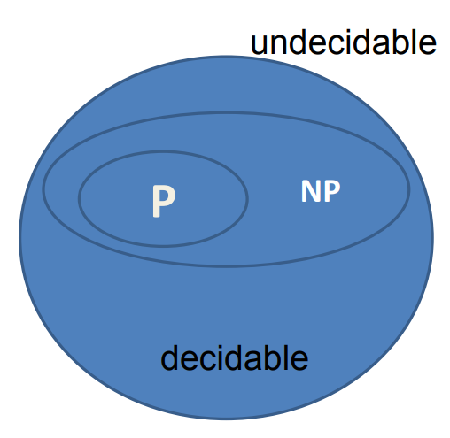
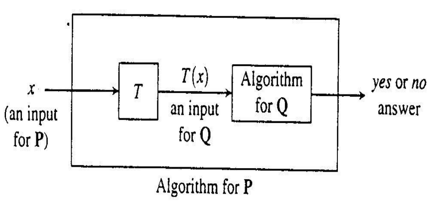
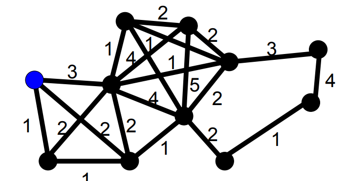

# $\fbox{Chapter 6: COMPUTATIONAL COMPLEXITY}$

## **Topic – 1: Summary**

- Decision & Optimization Problems
- Polynomial Time Algorithms (Tractable)
- Decidable v/s Undecidable Problems
- Class P and NP
- Polynomial-Time Reducibility
- NP-Hardness & NP-Completeness
- Proving NP-Completeness


## **Topic – 2: Decision & Optimization Problems**

- **<u>Solvable problem</u>:** We see if a theoretically solvable problem is solvable in practical sense or not.
- **<u>Decision problems</u>:** These are problems with their answer in form of $Yes$ or $No$.
- **<u>Optimization problems</u>:** Problems where we try to maximize or minimize a value.
- We introduce a parameter $k$ & use it as a benchmark to compare optimizations.


## **Topic – 3: Polynomial Time Algorithms (Tractable)**

### <u>P-Class Algorithms</u>

- Most searching, sorting & path finding algorithms we have studies so far take $O(n^{k})$ time to be done.
- We call these as polynomial-time algorithms.
- These are generalized under P-class.


## **Topic – 3: Decidable v/s Undecidable Problems**

### <u>Undecidable Problems</u>

- Undecidable problems can’t be solved at all.
- For example, the halting problem.


### <u>Halting Problem</u>

- This problem is about determining in advance if an algorithm will terminate in future or not.




### <u>NP-Class Algorithms</u>



- NP stands for non-deterministic polynomial problem.
- NP-class of problems are the ones which take **more** than polynomial time to be solved.
- Are non-deterministic by algorithms.
- No one has yet proven if N is equal to NP.

```c
// Deterministic algorithm

if (x<5) {
	/* Statements */
}


// Non-deterministic algorithm

if (*) {
	/* Statements */
}
```


### <u>Certificate</u>

- We take input $x$ and $y$ is called certificate.
- Certificate $y$ is used to store some relevant values to input $x$.
- Also, certificate is used to verify the input.


### <u>Hamiltonian Cycle Problem</u>

- Is an NP-class problem.
- Finding a cycle in graph which covers all vertices.
- Certificate here contains the whole path with it.
- We can verify it in $O(n^{k})$.

>**<u>NOTE</u>:**
>A problem solvable in polynomial time must also verifiable in polynomial time $(P \subseteq NP)$.


### <u>NPC Class</u>

- NPC stands for NP-complete class.

$$ P \subseteq NP \subseteq NPC $$


### <u>NP Hard Algorithms</u>

- NP-hard is always an NP problem.
- $P$ problems are reducible to another form $Q$.
- This transformation occurs through a function, refer to the example below.



- $T$ above can be computed in polynomial bounded time.
- We basically transform inputs of $P$ into inputs of $Q$.


## **Topic – 4: Travelling Salesman Problem (TSP)**

- We are given a graph with each edge having a value.
- We have to find a way which sums up to least travelling cost.
- Travelling cost is calculated by summing the cost of each edge salesman travels through.
- Our goal is to cover all vertices with least travelling cost.



---
