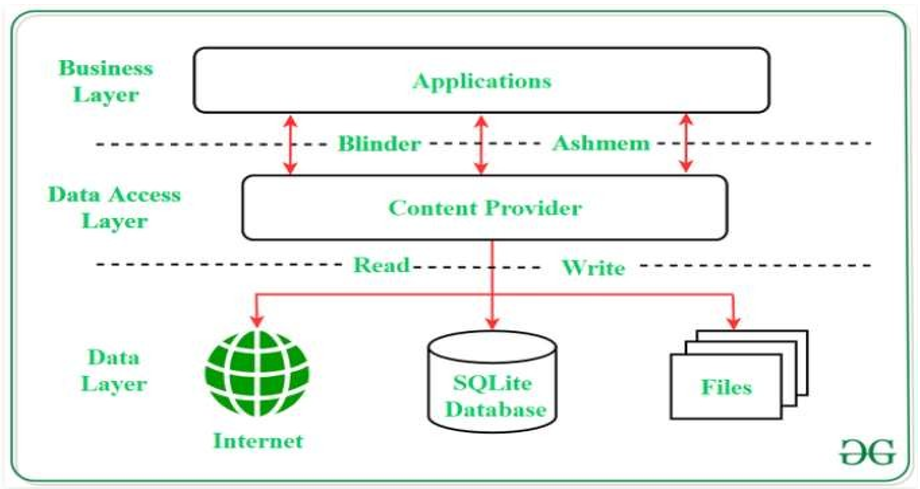

# $\fbox{Chapter 5: DATA STORAGE TECHNIQUE}$

## **Topic - 1: Storages In Android**

### <u>Types Of Storages</u>

- **<u>Data storage</u>:** Metadata using database.
- **<u>File storage</u>:** Physical storage on card/memory.

### <u>App Data Storage Options</u>

1. **<u>App-specific storage</u>:** App's own data, stored in directories whether internal or external.
2. **<u>Shared storage</u>:** Data which might be shared among applications, like media, photos etc.
3. **<u>Preferences</u>:** XML files with key-value pairs.
4. **<u>Database</u>:** Also specific to application.

### <u>Shared Preferences</u>

- Shared preferences are of form XML.
- Has a low storage capacity.
- Can store `string`, `int`, `float`, `boolean`.
- To access shared preference, `getSharedPreferences()` method.
- After making changes, one must `commit()` & `apply()`.

#### Modes:

- `MODE_PRIVATE` - Private but overwrites data.
- `MODE_PUBLIC` - Public but overwrites data.
- `MODE_APPEND` - Doesn't overwrite data.

## **Topic - 2: Android Internal Storage**

### <u>Introduction</u>

- Data stored in memory are encrypted in bit format.
- They need to be converted before being read.
- We use `FileOutputStream` method for writing data to memory.

### <u>Storage Methods</u>

- `getExternalStorageAccess()` - Deprecated method used in API version less than 7.
- `getExternalFilesDir(string type)` - Newer one to store private ones, recommended.
- `getExternalStoragePublicDirectory()` - For private ones.

## **Topic - 3: SQLite**

### <u>Introduction</u>

- For storing larger volume of data, SQLite is recommended instead of shared preferences.

### <u>Instant Methods</u>

- Uses `SQLiteOpenHelper()` for creating an instance to manage database.
- Other methods are `onCreate()`, `onRead()` & `onUpgrade()` etc.

### <u>Operational Methods</u>

- `execSQL()` - Execute the statement.
- `insert()`
- `update()`
- `query()`

### <u>Cursor</u>

- **<u>Cursor</u>:** Buffer containing query results to be fetched.
- Method `moveToFirst()` moves the cursor to the first query result.
- `query()` method reads data from a table.

## **Topic - 4: Content Providers**

### <u>Introduction</u>

- **<u>URI</u>:** Something used to access data from content provider.
- Its format is `content://authority/optionalPath/optionalId`.
- URI supports CRUD operations on itself.
- Call logs are accessed using `android.providerCallLog` class.

### <u>Content Types</u>

- Consists of media type & subtype.
- Represented in format `media_type/subtype`.
- For example, `image/png`.

---
