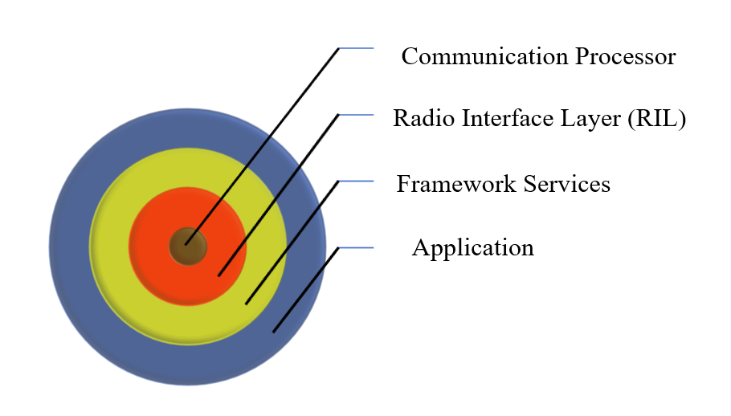

# $\fbox{Chapter 6: WEB APPLICATION INTEGRATION}$

## **Topic - 1: `AsyncTasks`**

### <u>Introduction</u>

- `AsyncTasks` is an abstract class.
- It is used for running background process.
- Keeps UI in foreground smooth even when heavy background process is running.

### <u> Methods In It</u>

- `doInBackground()`
- `publishProgress()` - For continuously rendering UI content.
- `onPreExecute()`
- `onPostExecute()`
- `onProgressUpdate()`

### <u>Types Of APIs</u>

- **Web APIs -** RESTful APIs, SOAP APIs, GraphQL APIs, WebSockets APIs etc.
- **OS APIs -** Android API, Windows API etc.
- **Library APIs -** OpenGL, TensorFlow etc.
- **Hardware APIs -** Camera API, Bluetooth API etc.

### <u>Web APIs</u>

- Uses XML or JSON format for storage.
- Has HTTP protocol applied.

## **Topic - 2: Android Telephony**

### <u>Telephony API</u>

- Provides all functionalities related to communication in Android.

### <u>Communication Processor</u>

- **<u>Communication processor</u>:** Component responsible for handling communication related tasks.
- Uses devices such as sensors, GPS, bluetooth, Wi-Fi etc.

### <u>Radio Interface Layer (RIL)</u>

- Configures the system to be compatible with communication processor.
- A check system for bridging applications with it too.

---