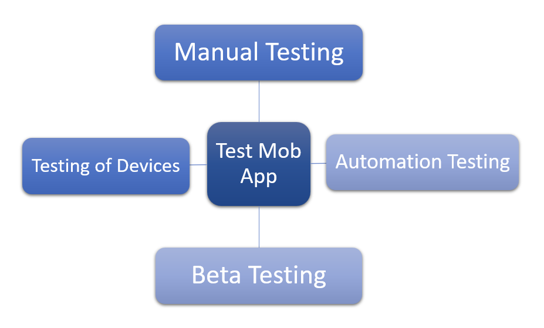

# $\fbox{Chapter 7: PUBLISHING APPS}$

## **Topic - 1: Publishing Android Application**

### <u>Financial Models</u>

- In-app advertisement
- In-app purchases
- Subscription model
- Paid apps
- Freemium model
- Affiliate marketing
- Sponsorships & partnerships

## **Topic - 2: Testing**

### <u>Types Of Testing</u>

### <u>Manual Testing Types</u>

- **<u>Exploratory testing</u>:** Testing without any predefined testcases.
- **<u>Ad Hoc testing</u>:** Fast testing in limited time.
- **<u>Usability testing</u>:** Tests to UI from user point of view.

### <u>Automation Testing Types</u>

- **Functional testing**
- **<u>Regression testing</u>:** Checking for backward-compatibility issues in new version.
- **<u>Testing for compatibility</u>:** UI-based compatibility checking.

### <u>Beta Testing Types</u>

- **<u>Traditional beta testing</u>:** Collecting reviews from target audience.
- **<u>Public beta testing</u>:** Collecting reviews from whole public userbase.
- **<u>Technical beta testing</u>:** Alpha testing.
- **<u>Focused beta testing</u>:** Reviews are taken from multiple targeted groups.
- **Post-release beta testing**

---
