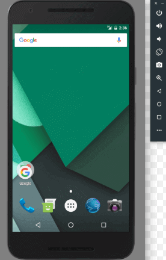

# <u>Chapter 1</u>: ANDROID TUTORIAL


## **Topic - 1: About Android**

### <u>Introduction</u>

- Linux based operating system.
- Developed by Google at first & later by whole OHA.
- **<u>OHA</u>:** Open Handset Alliance
- Java is the most used language for Android development.


### <u>Open Handset Alliance (OHA)</u>

- OHA is an alliance of 84 companies.
- Established by Google on **5th November 2007**.

#### Companies under it:

- Google
- Samsung
- AKM
- Synaptics
- KDDI
- Garmin
- Teleca
- Ebay
- Intel etc.


### <u>Features Of Android</u>

- An open-source software.
- Highly customizable.
- Availability of many mobile applications.
- Aesthetic features like opening screen animation, weather details etc.


## **Topic - 2: History Of Android**

### <u>Introduction</u>

- Android Incorporation was founded initially by Andy Rubin in 2003.
- He started it at Palo Alto, California.
- First two android versions by him were known as Aestro & Blender.
- Later it was acquired by Google.
- Focused on camera at first but shifted to developing smartphones due to low demand for cameras.
- Android was Andy Rubin's nickname by his coworkers for being a robot lover.
- First Android mobile was launched on 2008 by HTC.


### <u>Android Versions</u>

|    Version     | Code Name           |  API Level  |
| :------------: | :------------------ | :---------: |
|      1.5       | Cupcake             |      3      |
|      1.6       | Donut               |      4      |
|      2.1       | Eclair              |      7      |
|      2.2       | Froyo               |      8      |
|      2.3       | Gingerbread         |   9 & 10    |
|   3.1 & 3.3    | Honeycomb           |   12 & 13   |
|      4.0       | Ice Cream Sandwitch |     15      |
| 4.1, 4.2 & 4.3 | Jelly Bean          | 16, 17 & 18 |
|      4.4       | KitKat              |     19      |
|      5.0       | Lollipop            |     21      |
|      6.0       | Marshmallow         |     23      |
|      7.0       | Nougat              |   24 & 25   |
|      8.0       | Oreo                |   26 & 27   |


## **Topic - 3: Android Architecture**

### <u>Android Software Stack</u>

- Linux kernel
- Native libraries (middleware)
- Android runtime
- Application framework
- Applications


### <u>Android Runtime</u>

- Android uses DVM which is similar to JVM.
- **<u>DVM</u>:** Dalvik's Virtual Machine
- DVM however uses less memory & is much faster.


## **Topic - 4: Core Building Blocks**

### <u>Introduction</u>


#### Core blocks of Android are:

- Activities
- Views
- Intents
- Services
- Content providers
- Fragments
- AndroidManifest.xml


### <u>Activity</u>

- **<u>Activity</u>:** Represents the applications running parallelly.
- Like playing **Subway Surfers** in one screen while **Kaspersky** anti-virus is running in background.

#nostalgic_games, #heroic_software


### <u>View</u>

- Any kind of visible element on screen (UI).
- Might be interactive.
- For example, button, labels & text fields.


### <u>Intent</u>

- **<u>Intent</u>:** Triggers certain process.
- For example, display a web page, send a message, dial a number etc.


### <u>Service</u>

- **<u>Service</u>:** A process.
- **<u>Local service</u>:** Process which is requested using current activity.
- **<u>Remote service</u>:** Process which is requested using background activity.


### <u>Content Provider</u>

- **<u>Content providers</u>:** Channels used for communication & transfer of data among applications.


### <u>Fragment</u>

- **<u>Fragment</u>:** Sub-activity
- Multiple fragments can be displayed simultaneously on screen for an activity.


### <u>AndroidManifest.xml</u>

- `AndroidManifest.xml` contains various information about various things.
- It is like a database which stores user configurations, settings & permissions etc in it.


### <u>Android Virtual Device (AVD)</u>

- AVD is an emulator for Android devices.
- It is a virtual machine which can be used on other devices to simulate Android device.


## **Topic - 5: Android Emulator**

### <u>Introduction</u>



#smartphone_era

- By Android emulator, we are referring to AVD we just discussed.
- It provides almost all functionalities of an Android device, including phone calls & GPS tracking.
- Android emulators are better in performance in certain areas, including data transfer.
- They are faster there more than the devices connected through USB.
- Not only mobiles, the emulator comes with configuration for other Android devices too.


### <u>Requirement & Recommendations</u>

- SDK Tools 26.1.1 or higher
- 64-bit processor
- For Windows, CPU with unrestricted guest (UG) support
- HAXM 6.2.1 or later


### <u>Installing AVD</u>

- AVD comes installed with the Android Studio.
- Some components of it however might not be installed.
- If not installed, select **SDK Manager > SDK Tools > Android Emulator**.


### <u>Running Apps On AVD</u>

1. First create an AVD.
2. Go to **Tools > AVD Manger **.
3. Click on **Create Virtual Device** below, which is below.
4. Now select the hardware configuration & click **Next**. 

>**<u>NOTE</u>:**
>If you can't find a particular configuration, it can be imported too.

5. Select your preferred system image & click **Next*.
6. Set the properties for AVD & click on **Finish** to confirm changes.
7. From the dropdown menu in toolbar, select an AVD.
8. Click **Run**.


### <u>Using Command Line</u>

- We can also use command line for running AVD Manager.
- First navigate to the location of emulator, then write the following command.

```
$ emulator -avd avd_name [{-option[value]}...]
```

$$ OR $$

```
$ emulator @avd_name [{-option[value]}...]
```

#### To display all AVD names:

```
$ emulator -list-avds
```


### <u>Making Actions On Emulator</u>


- To run, you can simply launch or double-click.
- To stop, either choose **Stop** from menu, or right-click & select **Stop**.
- To factory reset, choose **Wipe Data** from menu, or right-click & select **Wipe Data**.
