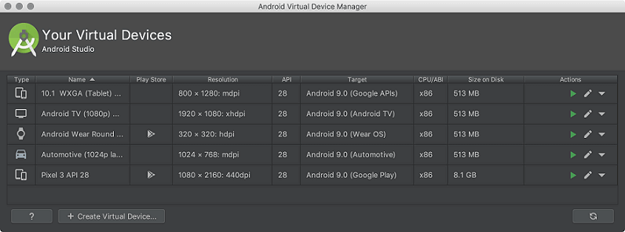

# $\fbox{Chapter 1: BASIC CONCEPTS \& SETUP}$


## **Topic - 1: About Android**

### <u>Introduction</u>

- Linux based operating system.
- Developed by Google at first & later by whole OHA.
- **<u>OHA</u>:** Open Handset Alliance
- Java is the most used language for Android development.


### <u>Open Handset Alliance (OHA)</u>

- OHA is an alliance of 84 companies.
- Established by Google on **5th November 2007**.

#### Companies under it:

- Google
- Samsung
- AKM
- Synaptics
- KDDI
- Garmin
- Teleca
- Ebay
- Intel etc.


### <u>Features Of Android</u>

- An open-source software.
- Highly customizable.
- Availability of many mobile applications.
- Aesthetic features like opening screen animation, weather details etc.


## **Topic - 2: History Of Android**

### <u>Introduction</u>

- Android Incorporation was founded initially by Andy Rubin in 2003.
- He started it at Palo Alto, California.
- First two android versions by him were known as Aestro & Blender.
- Later it was acquired by Google.
- Focused on camera at first but shifted to developing smartphones due to low demand for cameras.
- Android was Andy Rubin's nickname by his coworkers for being a robot lover.
- First Android mobile was launched on 2008 by HTC.


### <u>Android Versions</u>

|    Version     | Code Name           |  API Level  |
| :------------: | :------------------ | :---------: |
|      1.5       | Cupcake             |      3      |
|      1.6       | Donut               |      4      |
|      2.1       | Eclair              |      7      |
|      2.2       | Froyo               |      8      |
|      2.3       | Gingerbread         |   9 & 10    |
|   3.1 & 3.3    | Honeycomb           |   12 & 13   |
|      4.0       | Ice Cream Sandwitch |     15      |
| 4.1, 4.2 & 4.3 | Jelly Bean          | 16, 17 & 18 |
|      4.4       | KitKat              |     19      |
|      5.0       | Lollipop            |     21      |
|      6.0       | Marshmallow         |     23      |
|      7.0       | Nougat              |   24 & 25   |
|      8.0       | Oreo                |   26 & 27   |


## **Topic - 3: Android Architecture**

### <u>Android Software Stack</u>

- Linux kernel
- Native libraries (middleware)
- Android runtime
- Application framework
- Applications


### <u>Android Runtime</u>

- Android uses DVM which is similar to JVM.
- **<u>DVM</u>:** Dalvik's Virtual Machine
- DVM however uses less memory & is much faster.


## **Topic - 4: Core Building Blocks**

### <u>Introduction</u>


#### Core blocks of Android are:

- Activities
- Views
- Intents
- Services
- Content providers
- Fragments
- AndroidManifest.xml


### <u>Activity</u>

- **<u>Activity</u>:** A screen/page of an Android application.
- Like home screen of **Subway Surfers** is one screen & scoreboard is another.

#nostalgic_games


### <u>View</u>

- Any kind of visible element on screen (UI).
- Might be interactive.
- For example, button, labels & text fields.


### <u>Intent</u>

- **<u>Intent</u>:** Triggers certain process.
- For example, display a web page, send a message, dial a number etc.


### <u>Service</u>

- **<u>Service</u>:** A process.
- **<u>Local service</u>:** Process which is requested using current activity.
- **<u>Remote service</u>:** Process which is requested using background activity.


### <u>Content Provider</u>

- **<u>Content providers</u>:** Channels used for communication & transfer of data among applications.


### <u>Fragment</u>

- **<u>Fragment</u>:** Sub-activity
- Multiple fragments can be displayed simultaneously on screen for an activity.


### <u>AndroidManifest.xml</u>

- `AndroidManifest.xml` contains various information about various things.
- It is like a database which stores user configurations, settings & permissions etc in it.


### <u>Android Virtual Device (AVD)</u>

- AVD is an emulator for Android devices.
- It is a virtual machine which can be used on other devices to simulate Android device.


## **Topic - 5: Android Emulator**

### <u>Introduction</u>


#smartphone_era

- By Android emulator, we are referring to AVD we just discussed.
- It provides almost all functionalities of an Android device, including phone calls & GPS tracking.
- Android emulators are better in performance in certain areas, including data transfer.
- They are faster there more than the devices connected through USB.
- Not only mobiles, the emulator comes with configuration for other Android devices too.


### <u>Requirement & Recommendations</u>

- SDK Tools 26.1.1 or higher
- 64-bit processor
- For Windows, CPU with unrestricted guest (UG) support
- HAXM 6.2.1 or later


### <u>Installing AVD</u>

- AVD comes installed with the Android Studio.
- Some components of it however might not be installed.
- If not installed, select **SDK Manager > SDK Tools > Android Emulator**.


### <u>Running Apps On AVD</u>

1. First create an AVD.
2. Go to **Tools > AVD Manger **.
3. Click on **Create Virtual Device** below, which is below.
4. Now select the hardware configuration & click **Next**. 

>**<u>NOTE</u>:**
>If you can't find a particular configuration, it can be imported too.

5. Select your preferred system image & click **Next*.
6. Set the properties for AVD & click on **Finish** to confirm changes.
7. From the dropdown menu in toolbar, select an AVD.
8. Click **Run**.


### <u>Using Command Line</u>

- We can also use command line for running AVD Manager.
- First navigate to the location of emulator, then write the following command.

```sh
$ emulator -avd avd_name [{-option[value]}...]
```

$$ OR $$

```sh
$ emulator @avd_name [{-option[value]}...]
```

#### To display all AVD names:

```sh
$ emulator -list-avds
```


### <u>Making Actions On Emulator</u>



- To run, you can simply launch or double-click.
- To stop, either choose **Stop** from menu, or right-click & select **Stop**.
- To factory reset, choose **Wipe Data** from menu, or right-click & select **Wipe Data**.


## **Topic - 6: Android Installation**

### <u>Introduction</u>

- Android supports Java, C#, C++, Kotlin etc.
- Java is official language for Android Studio.

>**<u>NOTE</u>:**
>We can set up the environment using Android studio or manually on Eclipse.


### <u>Installation From Android Studio</u>

#### Includes:

- Eclipse IDE
- Android SDK
- Eclipse Plugin


>**<u>NOTE</u>:**
>1. If Android Studio is downloaded from official site, one doesn't need these components.
>2. Then we can directly open Eclipse IDE to work in it.
>3. If it doesn't start, then we have to paste the JRE directory inside the Eclipse directory.


## **Topic - 7: Eclipse Setup**

### <u>Steps</u>

1. Install JDK.
2. Install Eclipse IDE (classic or EE).
3. Download Android Studio.
4. Download ADT plugin in Eclipse.
5. Configure the ADT plugin.
6. Create an AVD.


### <u>Downloading ADT Plugin</u>

1. **Help** > **Install new software...**
2. Write `https://dl-ssl.google.com/android/eclipse/` in **Work with:** box.
3. Select the **Developer Tools** checkbox.
4. Keep clicking on **Next** & **Finish** until it ends.
5. Restart the IDE.


### <u>Configuring ADT Plugin</u>

1. **Window menu** > **preferences**
2. Select **Android** from left panel & proceed.
3. Locate your Android SDK directory.
4. Click **Apply** & then **OK**.


### <u>Creating AVD</u>

1. **Window menu** > **AVD manager**
2. Click on **new**.
3. Write AVD name & preferred device.
4. Click on **create AVD**.


## **Topic - 8: Hello Android Example**

### <u>Creating New Project</u>

1. Start a new Android Studio project.
2. Fill information & click on **Next**.
3. Select API level for project & click **Next**.
4. Select an **Empty Activity** from available options.
5. Name the Activity and its layout & then click **Finish**.


### <u>Writing Code</u>

- We can make changes to the given XML file if required.
- Now let's write the Java code in our source file.

```java
package first.javatpoint.com.welcome;

import android.support.v7.app.AppCompatActivity;
import android.os.Bundle;

public class MainActivity extends AppCompatActivity
{
	@Override
	protected void onCreate(Bundle savedInstanceState)
	{
		super.onCreate(saveInstanceState);
		setContentView(R.layout.activity_main);
	}
}
```


### <u>Running The Application</u>

- Click on the Run icon on top.


- It might take few minutes to boot up the AVD, wait for it to end.
- Then we can see an interface open up as shown below.


## **Topic - 9: Hello World Program Explanation**

### <u>Introduction</u>


### <u>MainActivity.java</u>

- ***MainActivity.java*** is the default source file created by Eclipse.

```java
package com.example.helloandroid;

import android.os.Bundle;
import android.app.Activity;
import android.view.Menu;
import android.widget.TextView;

public class MainActivity extends Activity //(1)
{
	@Override
	protected void onCreate(Bundle savedInstanceState) //(2)
	{
		super.onCreate(savedInstanceState);
		setContentView(R.layout.activity_main); //(3)
	}

	@Override
	public boolean onCreateOptionsMenu(Menu menu) //(4)
	{
		getMenuInflater().inflate(R.menu.activity_main, menu);
		return true;
	}
}
```

- `(1)` - `Activity` class of Java is used for programming different graphical elements on screen.
- `(2)` - `onCreate` method is compulsory the first thing to call in an `Activity` class.
- `(3)` - `setContentView(R.layout.activity_main)` gives us layout information which is defined in ***activity_main.xml*** file.


### <u>activity_main.xml</u>

```xml
<RelativeLayout 
	xmlns:androclass="http://schemas.android.com/apk/res/android"
	xmlns:tools="http://schemas.android.com/tools"  
	android:layout_width="match_parent"  
	android:layout_height="match_parent"  
	tools:context=".MainActivity"
>  
	
<TextView  
	android:layout_width="wrap_content"  
	android:layout_height="wrap_content"  
	android:layout_centerHorizontal="true"  
	android:layout_centerVertical="true"  
	android:text="@string/hello_world"
/>  
		
</RelativeLayout>
```


### <u>strings.xml</u>

- ***strings.xml*** contains the string values that has to be shown as output on screen.
- For example, the string `Hello Android!` we printed in our source file in last topic for printing.


### <u>R.java</u>

- ***R.java*** file is automatically generated.
- It contains IDs for all the used resources in ***res*** directory.
- It is generated by AAPT.
- **<u>AAPT</u>:** Android Asset Packaging Tool
- Whenever we create anything in ***activity_main.java*** file, corresponding IDs are generated in the ***R.java***.


### <u>Other Files & Directories</u>

- **<u>APK file</u>:** A file required in Android to test the application there.
- **<u>Resources</u>:** A directory containing resource files like ***activity_main***, ***strings***, ***styles*** etc.


## **Topic - 10: Dalvik Virtual Machine (DVM)**

### <u>Introduction</u>

- Name Dalvik came from a name of town in Iceland which its maker Dan Bornstein belongs to.


### <u>Dex Compiler</u>

- DVM uses ***.dex*** files which are compiled from Java classes.

$$ \xrightarrow{Source\;Code\;(.java)}\framebox[6cm][c]{Java Compiler (javac)}\xrightarrow{Class\;Files\;(.class)} $$
$$ \xrightarrow{Class\;Files\;(.class)}\framebox[6cm][c]{Dex Compiler (dx)}\xrightarrow{Dex\;File\;(.dex)} $$
$$ \xrightarrow{Dex\;File\;(.dex)}\framebox[6cm][c]{Packaging (aapt)}\xrightarrow{APK\;File\;(.apk)} $$


## **Topic - 11: AndroidManifest.xml**

### <u>Introduction</u>

- ***AndroidManifest.xml*** defines the level of access an application can have.
- It also declares the Android API.
- And it also contains the instrumentation classes.
- **<u>Instrumentation class</u>:** Class containing profiling information.


### <u>Elements Of AndroidManifest.xml</u>

#### `<manifest>`:

- It is the root element of ***AndroidManifest.xml***.
- Its attribute `package` defines the name of package used in activity class.

#### `<application>`:

- A sub-element of `<manifest>`.
- It contains its own sub-elements which contains information about activity.
- Some of its attributes are `icon`, `label` & `theme`.

#### `<activity>`:

- A sub-element of `<activity>`.
- It is compulsory to be defined in ***AndroidManifest.xml*** file.
- Some of its attributes are `label`, `name`, `theme` & `launchMode`.

#### `<intent-filter>`:

- A sub-element of `<activity>`.
- It defines the intent to which a service can respond to.

#### `<action>`:

- Action for the `<intent-filter>`.
- Intent filter must have at least one action element.

#### `<category>`:

- Describes the category to which an `intent-filter` belongs.


## **Topic - 12: R.java**

- ***R.java*** is an auto-generated file by aapt.
- Creating or deleting any kind of ID from ***activity_main.xml*** makes changes to ***R.java*** as well.
- If someone deletes ***R.java*** file, DVM creates it again.


## **Topic - 13: Hiding Title Bar**

### <u>Introduction</u>

- We will the title bar where the time, charge & network etc is seen.
- For this, we use `requestWindowFeature(Window.FEATURE_NO_TITLE)` method.
- It is coded before `setContentView()` method.


### <u>Hiding Title Bar</u>

```java
// Hides the title
requestWindowFeature(Window.FEATURE_NO_TITLE);

// Hides the title bar
getSupportActionBar().hide();
```


### <u>Enabling Full Screen</u>

- We pass a parameter for enabling full screen to `setFlags()` method.

```java
this.getWindow().setFlags(
	WindowManager.LayoutParams.FLAG_FULLSCREEN,
	WindowManager.LayoutParams.FLAG_FULLSCREEN
);
```


### <u>Complete Method Code</u>

```java
@Override
	protected void onCreate(Bundle savedInstanceState) //(2)
	{
		super.onCreate(savedInstanceState);
		
		// Hiding title bar
		requestWindowFeature(Window.FEATURE_NO_TITLE);
		getSupportActionBar().hide();
		
		// Enabling full screen
		this.getWindow().setFlags(
			WindowManager.LayoutParams.FLAG_FULLSCREEN,
			WindowManager.LayoutParams.FLAG_FULLSCREEN
		);
		
		setContentView(R.layout.activity_main); //(3)
	}
```


### <u>Changes Screenshots</u>

#### Before:


#### After:


## **Topic - 14: Screen Orientation**

### <u>Introduction</u>

- `screenOrientation` is an attribute of activity element.
- Screen orientation can be `portrait`, `landscape`, `sensor` & `unspecified` etc.
- We have to manually define it in ***AndroidManifest.xml*** file.

```xml
<activity android:name=".SecondActivity"  
	android:screenOrientation="landscape">  
</activity>
```

| Orientation Type | Description                                           |
| :--------------: | :---------------------------------------------------- |
|   Unspecified    | Default. Decided by the system.                       |
|      Sensor      | Orientation changes as per what device sensor senses. |


### <u>Multiple Orientations</u>

- For making multiple orientation, meaning different orientations for different activities, we have to create two activities.
- Let's say we created another activity file named ***activity_second.xml***.
- Then we have to make changes in ***AndroidManifest.xml*** file & create two Java files.

#### AndroidManifest.xml:

```xml
<?xml version="1.0" encoding="utf-8"?>  
<manifest
	xmlns:android="http://schemas.android.com/apk/res/android"  
	package="AnExample"
>  

	<application  
		android:allowBackup="true"  
		android:icon="@mipmap/ic_launcher"  
		android:label="@string/app_name"  
		android:roundIcon="@mipmap/ic_launcher_round"  
		android:supportsRtl="true"  
		android:theme="@style/AppTheme"
	>

		<activity
			android:name= ".MainActivity"
			android:screenOrientation="portrait"
		>  

<intent-filter>  
	<action android:name="android.intent.action.MAIN" />  
	<category android:name="android.intent.category.LAUNCHER" />  
</intent-filter>

		</activity>
		
		
		<activity
			android:name=".SecondActivity"  
			android:screenOrientation="landscape">  
		</activity>
		
	</application>
</manifest>
```

#### MainActivity.java:

```java
package example.javatpoint.com.screenorientation;  

import android.content.Intent;  
import android.support.v7.app.AppCompatActivity;  
import android.os.Bundle;  
import android.view.View;  
import android.widget.Button;  

public class MainActivity extends AppCompatActivity
{  
	Button button1; // Creating a button class.
	
	@Override  
	protected void onCreate(Bundle savedInstanceState)
	{
		super.onCreate(savedInstanceState);  
		setContentView(R.layout.activity_main);  
		
		button1=(Button)findViewById(R.id.button1);  
	}
	
	// When user clicks on the button.
	public void onClick(View v)
	{
		Intent intent =
		new Intent(MainActivity.this,SecondActivity.class);
		startActivity(intent);  
	}
}
```

#### SecondActivity.java:

```java
package example.javatpoint.com.screenorientation;  

import android.support.v7.app.AppCompatActivity;  
import android.os.Bundle;  

public class SecondActivity extends AppCompatActivity
{
	@Override  
	protected void onCreate(Bundle savedInstanceState)
	{
		super.onCreate(savedInstanceState);  
		setContentView(R.layout.activity_second);  
	}  
}
```


### <u>Result</u>

#### Before (portrait):


#### After (landscape):


---
