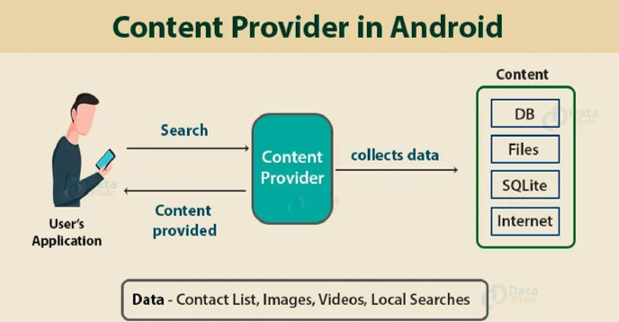
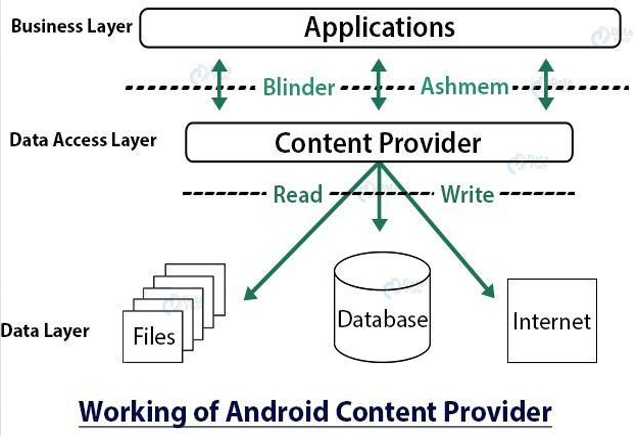

# $\fbox{Chapter 2: ANDROID COMPONENTS}$


## **Topic - 1: Basic Concepts**

### <u>Activity States</u>

1. `onCreate()`
2. `onStart()`
3. `onResume()`
4. `onPause()`
5. `onStop()`
6. `onRestart()`
7. `onDestroy()`


### <u>Public Services</u>

```java
public class MyService extends Services {
	/* Code */
}
```


### <u>Types Of Intents</u>

- **<u>Explicit intent</u>:** Manually specifying a target component.
- **<u>Implicit intent</u>:** System decides appropriate target component.


### <u>Content Provider Working</u>





- **<u>Content resolver</u>:** An application object used for communicating with content providers.
- **<u>Content loader</u>:** Runs query asynchronously, called using activity or fragment.

#### Content provider methods:

- `onCreate()`
- `query()`
- `insert()`
- `update()`
- `delete()`
- `getType()`


### <u>Broadcast Receiver</u>

- **<u>Broadcast receiver</u>:** Used for broadcasting system messages to all applications.

```java
public class Broadcast_Name extendsBroadcastReceiver {
	/* Code */
}
```


## **Topic - 2: File System**

### <u>Resource</u>

```
MyProject
	app/
		manifest/
			AndroidManifest.xml

	java/
		MyActivity.java
		res/
			drawable/
				icon.png
			layout/
				activity_main.xml
				info.xml
			values/
				strings.xml
```


### <u>strings.xml</u>

- `strings.xml` - Used for storing strings & arrays for modular use across the project.

```xml
<?xml version="1.0" encoding="utf-8"?>
<resources>
	<string name="Hello"> Hello, World! </string>
</resources>
```


### <u>Color</u>

- `colorPrimary`
- `colorPrimaryDark`
- `colorAccent`

```xml
<?xml version="1.0" encoding="utf-8"?>
<resources>
	<color name="purple_200"> #FFBB86FC </color>
	<color name="purple_500"> #FF6200EE </color>
	<color name="teal_200"> #FF03DAC5 </color>
</resources>
```


### <u>Drawables</u>

- Contains non-drawable elements.
- For example, images, XML layouts, UI strings etc.


### <u>Styles</u>

- `styles.xml` - Contains all project themes.
- Every theme depends on a parent theme.

```xml
<?xml version="1.0" encoding="utf-8"?>
<resources>
	<style name="CustomFontStyle">
		<item name="android:layout_width"> fill_parent </item>
		<item name="android:layout_height"> wrap_content </item>
		<item name="android:capitalize"> characters </item>
		<item name="android:typeface"> monospace </item>
		<item name="android:textSize"> 12pt </item>
		<item name="android:textColor"> #00FF00 </item> />
	</style>
</resources>
```


### <u>Theme</u>

- **<u>Theme</u>:** A style applied to an entire activity/application.
- Applying a style as a theme, it affects each view in application.


## **Topic - 3: Localization**

- **<u>Localization</u>:** Modifying an application to support multiple languages & regional properties.
- These properties include time, currency, text font etc.
- In Android particularly, it is achieved by organizing application resources into region-specific directories.
- Users can apply them using locale settings.

---