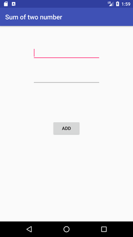
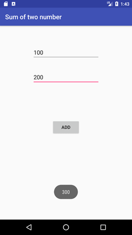

# $\fbox{Chapter 2: ANDROID WIDGETS}$


## **Topic - 1: Working With Button**

### <u>Introduction</u>

- `android.widget.Button` is subclass of `TextView` class.
- And `TextView` & `CompoundButton` are subclass of `Button` class.


### <u>Types Of Buttons</u>

- Radio button (`RadioButton`)
- Toggle button (`ToggleButton')
- Compound button (`CompoundButton`)


### <u>Example</u>

#### Objective:

- We will take two numbers as input & output their sum using button.
- For this, we will use two text fields & a button.

#### Java file:

```java
button.setOnClickListener(new View.OnClickListener())
{
	@Override
	public void onClick(View view)
	{
		//Code
	}
}
```

#### activity_main.xml:

- We have to add the following code to the ***acticity_main.xml*** file.

```xml
<Button android:onClick="methodName" />
```


### <u>UI Drag & Drop</u>

- Now we can drag & drop text fields elements from "Text Field Palettes", which is in "Widget Palette".



- Then we write the following code in the source file.

```java
package example.javatpoint.com.sumoftwonumber;  

import android.support.v7.app.AppCompatActivity;  
import android.os.Bundle;  
import android.view.View;  
import android.widget.Button;  
import android.widget.EditText;  
import android.widget.Toast;  

public class MainActivity extends AppCompatActivity
{  
	private EditText edittext1, edittext2;  
	private Button buttonSum;  
	
	@Override  
	protected void onCreate(Bundle savedInstanceState) {  
		super.onCreate(savedInstanceState);  
		setContentView(R.layout.activity_main);  
		
		addListenerOnButton();  
	}  

	public void addListenerOnButton()
	{  
		edittext1 = (EditText) findViewById(R.id.editText1);  
		edittext2 = (EditText) findViewById(R.id.editText2);  
		buttonSum = (Button) findViewById(R.id.button);  
		
		buttonSum.setOnClickListener(new View.OnClickListener()
		{  
			@Override  
			public void onClick(View view)
			{  
				String value1=edittext1.getText().toString();  
				String value2=edittext2.getText().toString();  
				int a=Integer.parseInt(value1);  
				int b=Integer.parseInt(value2);  
				int sum=a+b;  
				Toast.makeText(getApplicationContext(),String.valueOf(sum), Toast.LENGTH_LONG).show();  
			}  
		});  
	}  
}
```


