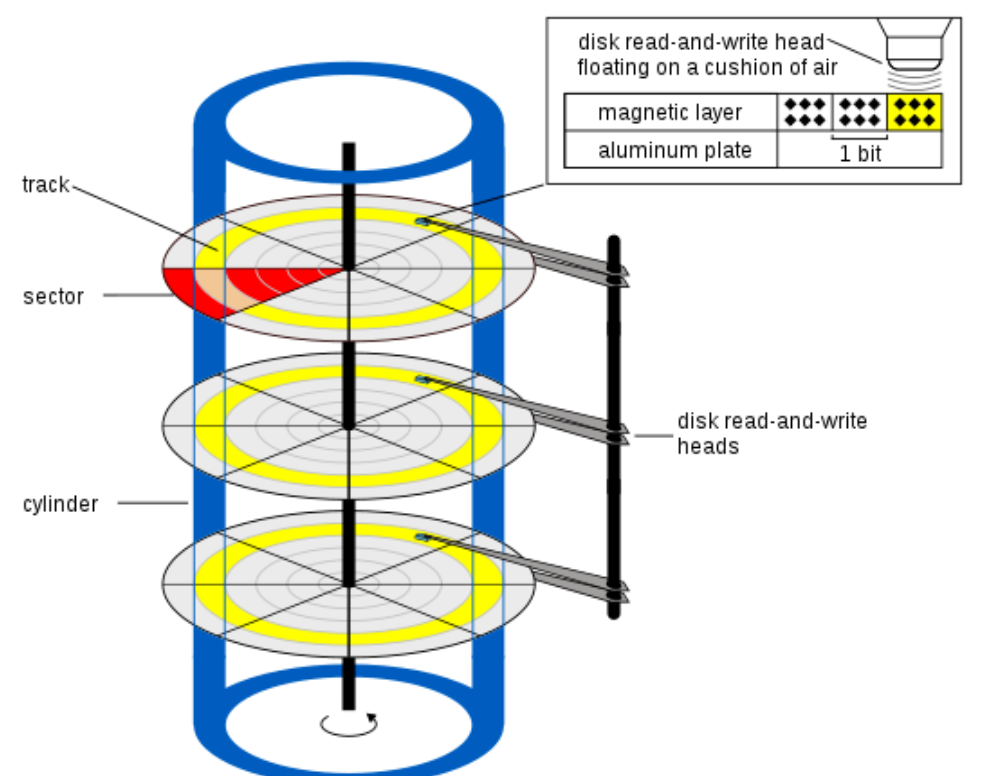

# $\fbox{Chapter 2: BIOS BOOT SECTOR}$


## **Topic - 1: x86 Memory Model & Segmentation**

### <u>CPU At Code Start</u>

- When BIOS jumps to boot sector, it starts using real-mode.
- Maximum addressable memory is of $1\;MiB$.
- There is still no paging, memory safety, or virtual memory.
- Addresses are computed on physical address instead.


### <u>Segmented Addressing Rule</u>

$$ \text{Physical address = (Segment << 4) + Offset} $$

- This rule is compulsory in real-mode computation.
- **Segment registers (16-bit):** `CS`, `DS`, `ES`, `SS`
- **Offset value (16-bit):** `IP`, `SP`, `BP`, `SI`, `DI`, etc


### <u>History Of Segmentation</u>

- Original 8086 had 16-bit registers, required to address more than $64\;KiB$.
- It had a 20-bit long address, where 16-bit is left shifted to 20-bits and then summed with 16-bit offset.
- So yes there is an overlap in addresses, where same address could be produced with different `CS`:`IP` values.


### <u>Usage Of Registers</u>

- `CS`:`IP` combine to tell from where the codes are fetched from.
- BIOS uses this combination to jumping into code.
- Typical boot state has: `CS`=`0x0000` and `IP`= `0x7C00`


### <u>Other Segment Registers</u>

| Segment Register | Name             | Usage                                    |
| :--------------: | :--------------- | :--------------------------------------- |
|       `DS`       | Data segment     | Stores data address.                     |
|       `ES`       | Extended segment | Often used for string operations.        |
|       `SS`       | Stack segment    | Combined with `SP`/`BP` to access stack. |


### <u>Segment Selection Rule</u>

| Instruction          |      Segment Used       |
| :------------------- | :---------------------: |
| Instruction fetching |          `CS`           |
| `mov al, [addr]`     |          `DS`           |
| `mov al, [bx]`       |          `DS`           |
| `mov al, [bp]`       |          `SS`           |
| Stack push/pop       |          `SS`           |
| String ops (`movsb`) | `DS` $\rightarrow$ `ES` |


### <u>Overlapping Segments</u>

#### Example:

- `CS`:`IP` = `0000`:`7C00`
- `IP`:`CS` = `7C00`:`0000`

#### Boot code:

```asm
mov ax, 0x7c00
mov ds, ax
```

- Now `DS` will contain the boot sector code address as offset.
- Everything else accessed will be relative to this address.
- `0x7C00` isn't directly moved to `AX` because earlier 8086 chips had no wire to transfer immediate to segment register directly.


### <u>Real-Mode Address Space</u>

- Starts from `0x00000` & ends at `0xFFFFF` which is equivalent to $1\;MiB$.
- But this address space is divided into 6 key regions.

| Address Range          | Purpose                         |
| ---------------------- | ------------------------------- |
| `0x00000` to `0x003FF` | Interrupt Vector Table (IVT)    |
| `0x00400` to `0x004FF` | BIOS Data Area (BDA)            |
| `0x00500` to `0x07BFF` | Free / scratch                  |
| `0x07C00` to `0x07DFF` | Boot sector                     |
| `0x07E00` to `0x9FFFF` | Free (typical loaders use this) |
| `0xA0000` to `0xFFFFF` | Video ROM, BIOS ROM, devices    |

- These are not strict enforcement, but industrial standards for division, used by hardware.
- Vendors like **Intel** just hardcoded the offset (`0x00000`) and base (`0xFFFFF`).
- It is not advised to overwrite IVT and BDA to avoid undefined machine behavior.


### <u>Boot Code Initialization Rules</u>

1. Disable interrupts (`cli`)
2. Set known segment values (`DS`, `ES`, `SS`)
3. Set a valid stack (`SS`:`SP`)
4. Then proceed with the objective.


## **Topic - 2: BIOS Services & Disk Interrupts**

### <u>BIOS Service</u>

- **<u>BIOS service</u>:** Software interrupt that transfers control to firmware using registers.

#### Steps:

1. Interrupt is called using a 16-bit register (`int xx`).
2. CPU pushes `FLAGS`, `CS`, `IP` & jumps to firmware handler.
3. BIOS code runs & control is later returned using `iret`.


### <u>Real-Mode Interrupts</u>

- IVT starts from `0x00000` with 256 entries of $4\;bytes$ each.

$$ 256 \times 4 \text\;byte = 1\;KiB $$

- So we load the `CS`:`IP` as per that to access IVT.
- Structure for any IVT entry is: `IVT[n] = { IP_low, IP_high, CS_low, CS_high }`.

```asm
int 0x10
```

- The code above when executed, the CPU looks for entry number `0x10` in IVT.
- Load the $4\;byte$ value stored there to `CS`:`IP` & jumps in it.


### <u>Calling Convention</u>

|      Register       | Work            |
| :-----------------: | :-------------- |
|        `AH`         | Function number |
| `AL`/`BX`/`CX`/`DX` | Parameters      |
|  Flags / registers  | Return status   |


### <u>BIOS Video Services</u>

- Accessed through interrupt `int 0x10`.
- We can get teletype (plain) output with `AH` as `0x0E`.
- This will include printing a character, advancing cursor, and scrolling.
- But its different from direct VGA access.

| Register | Meaning           | Work/Value          |
| :------: | ----------------- | ------------------- |
|   `AH`   | `0x0E` (function) | Function number     |
|   `AL`   | ASCII character   | Storing character   |
|   `BH`   | Page number       | Usually `0`         |
|   `BL`   | Text attribute    | Graphics modes only |

#### Example:

```asm
mov ah, 0x0e        ; Function: Teletype output
mov al, 'X'         ; Character to print
mov bh, 0x00        ; Page 0
```


### <u>BIOS Disk Services (CHS)</u>

- Disk read is done with `AH` as `0x02`.

| Register  | Meaning                    |
| --------- | -------------------------- |
| `AH`      | `0x02` (read sectors)      |
| `AL`      | Sector count               |
| `CH`      | Cylinder                   |
| `CL`      | Sector (bits 0–5)          |
| `DH`      | Head                       |
| `DL`      | Drive (`0x80` = first HDD) |
| `ES`:`BX` | Destination buffer         |

- `AH` returns the status code.
- If carry flag is set, an error occurred.
- CHS is avoided in industries for its limitations & non-standardization.


### <u>Disk I/O Problems</u>

- Disk services don't work after protected mode.
- They are also very slow, inconsistent, with difficulty debugging.
- It must be used to load something better only, like multiboot loader.


### <u>Interrupt Safety Rules</u>

1. Disable interrupts if not required.
2. Always cleanse registers before calling an interrupt.
3. Do not rely on stack state.
4. Never call BIOS from protected mode.


## **Topic - 3: Geometry & Signature**

### <u>Boot Sector</u>

- **<u>Boot sector</u>:** First $512\;bytes$ bytes from a bootable device that are read from BIOS & executed in real-mode.
- This region in bootable device is known as boot sector.
- But it should contain the boot signature.


### <u>Sector Size Justification</u>

- Each sector's size is $512\;bytes$, and BIOS disk I/O reads one sector at a time.
- So to maintain minimum reading area & backward compatibility, rule has never changed.
- This sector is loaded into memory and then executed.


### <u>Stepwise BIOS Working</u>

1. BIOS selects a booting device.
2. Reads first sector (LBA 0).
3. Copies it to physical address `0x7C00`.
4. Checks boot signature.
5. If valid, jumps to `CS:IP = 0000:7C00`
6. If invalid, tries next device.


### <u>Boot Signature</u>

| Offset | Required Value |
| :----: | :------------: |
| `510`  |     `0x55`     |
| `511`  |     `0xAA`     |

#### Little-endian emission:

```asm
.word 0xAA55        # 55 AA
```


### <u>Geometry</u>



- **<u>CHS</u>:** Cylinder Head Sector
- BIOS disk services were originally made to read CHS.
- But still same logic is used for backward compatibility.
- BIOS are very sensitive to alignment & padding.


### <u>Boot Sector Layout</u>

| Offset  |  Size  | Purpose                    |
| :-----: | :----: | :------------------------- |
| `0x000` | `~440` | Boot code                  |
| `0x1B8` |  `4`   | Disk signature             |
| `0x1BE` |  `64`  | Partition table (MBR only) |
| `0x1FE` |  `2`   | Boot signature (`55` `AA`) |


### <u>Industrial Standard</u>

|Stage|Responsibility|
|---|---|
|Boot sector|Minimal loader|
|Second stage|CPU setup|
|Kernel|Real system|
