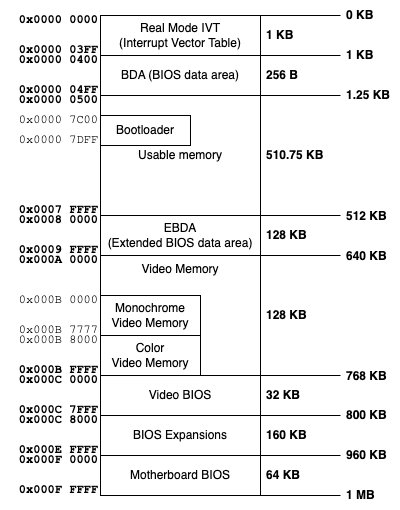
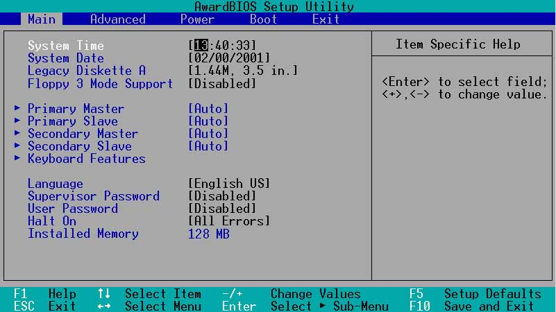

# $\fbox{Chapter 1: POWER ON PROCEDURE}$

## **Topic - 1: The CPU Reset State**

### <u>On Reset State</u>

1. CPU starts from a fixed configuration.
2. It fetches first instruction from a fixed address.
3. Avoids undefined behavior.

### <u>Point Of Execution</u>

- After reset, the instruction pointer is set to `CS` and `IP`.
- At start, `CS` is `0xF000` and `IP` is `0xFFF0`, which together form `0xFFFF0`.
- This starting address is called **reset vector**.
- And the reset vector lies in our firmware ROM space, not RAM or disk.

### <u>Top Of Memory</u>

- In the shown diagram, the base of whole region is `0x000FFFF`, while offset for reset vector is at `0x00FFFF0`.
- So, the reset vector is just $16\;bytes$ below the base of real-mode memory.

### <u>About This State</u>

- This is real-mode where only $16-bit$ instructions are valid.
- And interrupts & caches are disabled.
- This compatibility mode was created in 1978.

## **Topic - 2: Firmware BIOS vs UEFI**

### <u>BIOS</u>

- **Legacy BIOS** has historically owned the reset vector.
- It runs on 16-bit instructions only, uses software interrupts, loads first $512\;bytes$ from disk, and jumps there.

### <u>UEFI</u>

- UEFI can run in protected or long mode.
- It understands filesystems (FAT), could load executables, and more secured.
- Unlike BIOS which loaded raw sectors, UEFI loads structured programs.

## **Topic - 3: Memory Layout At Boot**

- There are specific memory regions reserved for various programs.
- Like for firmware, MMIO, ACPI table, framebuffer, usable RAM, etc.
- UEFI provides this via `GetMemoryMap()`.

## **Topic - 4: Experiment To Perform**

1. Launch QEMU with monitor enabled
2. Break at reset
3. Inspect registers
4. Disassemble at `0xFFFF0`
5. Look for `CS` and `IP` value
6. Then look for mode and first instruction

---
