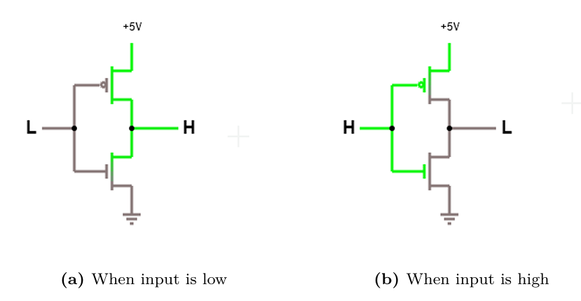
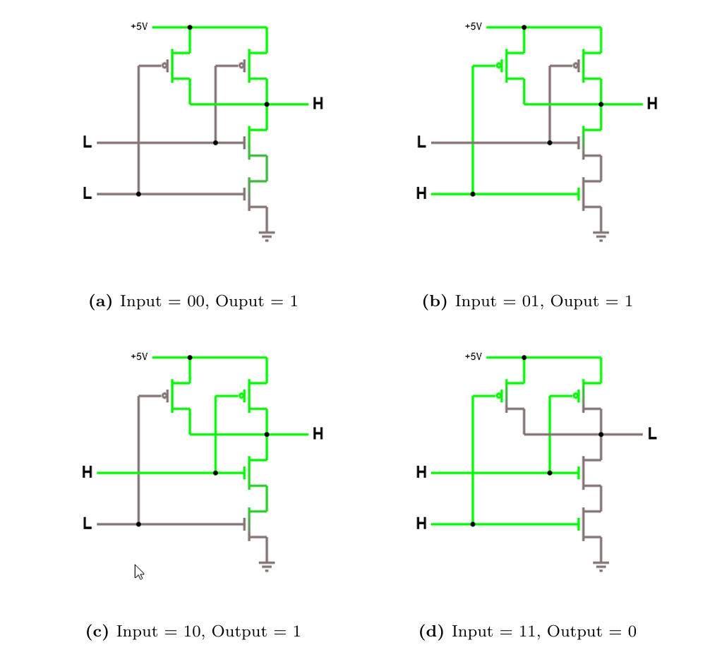
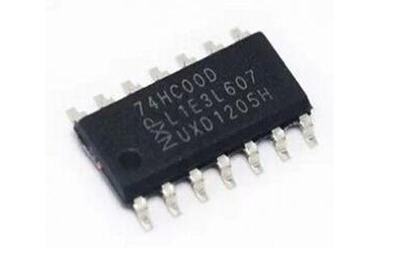
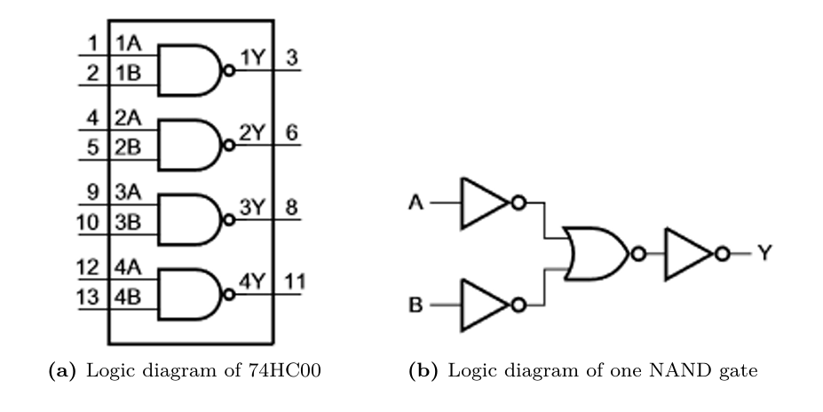
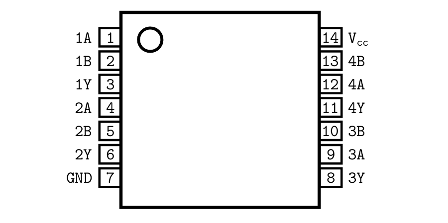

# $\fbox{Chapter 2: LAYERS OF ABSTRACTION}$

## **Topic - 1: Physical Implementation Of Bit**

### <u>Transistor</u>

- **<u>Transistor</u>:** An electrical device that can automatically switch based on threshold voltage.
- Was invented by *William Shockley*, *John Bardeen*, and *Walter Brattain*.
- Below the threshold ($+3.5v$ to $+5.0v$), the circuit acts as one with open switch.

### <u>MOSFET Transistor</u>

- Before transistors, vacuum tubes were used to represent bits, but manually switched.
- **<u>MOSFET</u>:** Metal-Oxide-Semiconductor Field-Effect-Transistor
- Invented in 1959 at *Bell Labs* by *Dawon Kahng* and *Martin M. (John) Atalla*.
- **Its more efficient -** Low switching delay, stable, low power consumption, and easier to produce.
- **Types -** *n-MOSFET* (NMOS) and *p-MOSFET* (PMOS)

## **Topic - 2: Digital Logic Gates**

### <u>Theory</u>

- **<u>Functionally complete</u>:** Boolean function from which other functions could be constructed.
- During 1880-1881, *Charles Sanders Pierce* proved that Boolean NOR and NAND are together functionally complete.
- So they can create other functions/gates.
- **<u>Inverters</u>:** NOT gates (easiest to implement using CMOS).

### <u>CMOS Circuit</u>

- **<u>CMOS</u>:** Complementary MOSFET
- It contains an NMOS and a PMOS.

### <u>NOT Gate</u>

- Upper part of NOT gate is PMOS, lower part of gate is NMOS.
- The power rails for voltage ($+5V$ here) & grounding are distributed to every gate.

| Gate Input |     PMOS      |     NMOS      |
| :--------: | :-----------: | :-----------: |
|    LOW     | ON / Conducts | OFF / Blocks  |
|    HIGH    | OFF / Blocks  | ON / Conducts |

### <u>NAND Gate</u>

### <u>Input Gates</u>

- For $k$-input gate, there would be $k$ PMOS & $k$ NMOS.
- **<u>Chip</u>:** Physical implementation of a circuit.

### <u>74HC00 Chip</u>

- 74HC00 has four 2-input NAND gates.
- It contains 14 pins $\rightarrow$ 8 input, 4 output, 1 voltage source, 1 ground

## **Topic - 3: Machine Language**

### <u>Introduction</u>

- **<u>Programmable device</u>:** A device with its own (machine) language.
- **`10100000`:** Add two numbers
- **`000000101`:** Halt the computer
- These are call to functions that CPU executes.

### <u>74HC00 Layout</u>

- **<u>Notch</u>:** Circle on top-left corner that tells where the *pin 1* is at.
- **$X$:** Don't care value (no fixed value)

| $nA$ | $nB$ | $nY$ |
| :--: | :--: | :--: |
| LOW  | LOW  | HIGH |
| LOW  | $X$  | HIGH |
| $X$  | LOW  | HIGH |
| HIGH | HIGH | LOW  |
