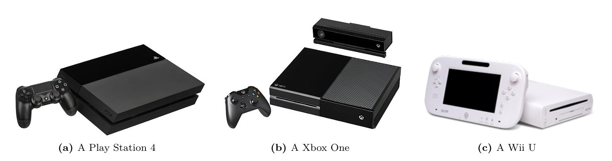
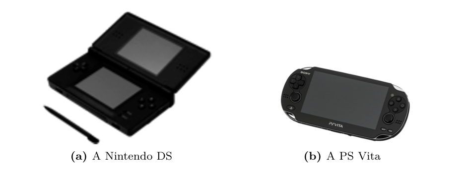
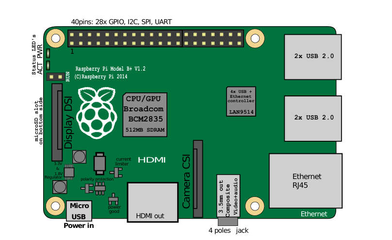
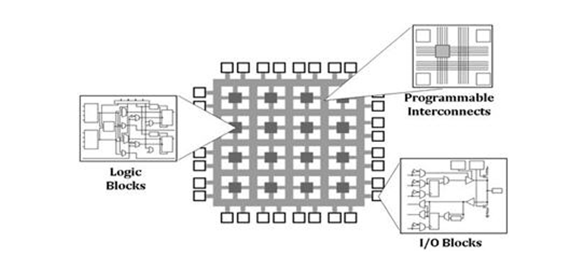
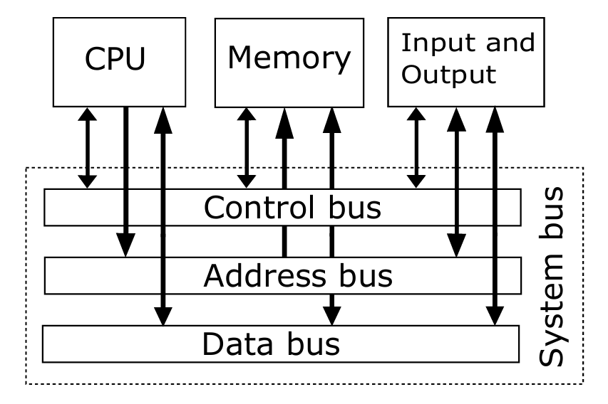
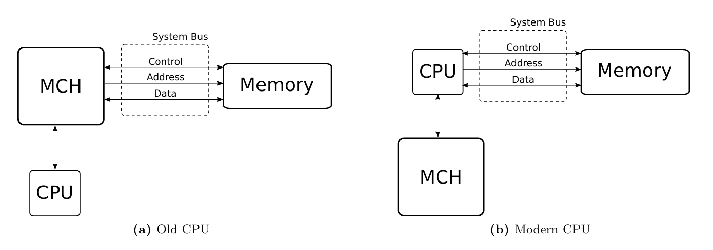

# $\fbox{Chapter 3: COMPUTER ARCHITECTURE}$

## **Topic - 1: Computer**

### <u>Introduction</u>

- **<u>Computer</u>:** A hardware device consisting at least one processor, one memory device, and I/O interfaces.

### <u>Types Of Computers</u>

- **<u>Single-purpose computers</u>:** Built at hardware level for specific tasks.
- **<u>General-purpose computers</u>:** Programmable computer without modifying underlying hardware.

### <u>Servers</u>

- **<u>Blade Server</u>:** A server having modular size, made by keeping physical space in mind.
- **<u>Chassis</u>:** Enclosing physical framework of a *blade server*.

### <u>General-Purpose Computers</u>

#### Desktop:

- Generally includes a mouse, a keyboard, and a monitor.
- Chassis encloses components like processor, motherboard, power supply, and hard drive.

#### Mobile Computer:

- Similar to desktop computers.
- Fewer resources for easy carrying.
- For example, laptop, tablet, smartphone, etc.

#### Game consoles:

- Highly optimized for gaming purpose.
- Accompanied by *game controller* for input purpose.
- And output device is available television.
- CPU and GPU are similar to desktop's, like *Intel Pentium III*.

- Handheld gaming consoles enclose input & output systems within the chassis.

#### Embedded computer:

- **<u>Embedded computer</u>:** Single chip, single board computer.
- **<u>Microcontroller</u>:** Embedded computer designed to control other hardware devices.
- It is still general-purpose even with few performable specialized tasks.
- **<u>System-on-chip</u>:** Whole powerful computer packed within a single chip.
- For example, *Apple A5 SoC*, *Qualcomm Snapdragon*, etc.
- **<u>PCB</u>:** *Printed circuit board*, a place where microcontrollers & system-on-chips are connected to form a larger system.

#### Field Programmable Gate Array (FPGA):

- **<u>FPGA</u>:** A hardware with array of re-configurable gates or reprogrammable circuit.
- Similar to 74HC00, FPGA contains complicated and lot more *logic blocks*.
- **<u>Logic blocks</u>:** Used to re-configure Boolean logic functions.

- **<u>Netlist</u>:** Compiled code from hardware description language, which writes how circuits will be interconnected.
- The program for FPGA is written at the level of logic gates.
- FPGA is used where speed is critical and thus a specialized circuit needs to be reprogrammed for that.

### <u>Application-Specific Integrated Circuit (ASIC)</u>

- ASIC is made to run a decided circuit path using logic gates.
- Before ASIC is produced, it is prototyped using FPGA.
- But its faster than FPGA for being optimized specifically for one job.

## **Topic - 2: Computer Architecture**

### <u>Introduction</u>

$$ \framebox[7cm]{Computer Architecture} $$
$$ = $$
$$ \framebox[7cm]{Instruction Set Architecture} $$
$$ \downarrow $$
$$ \framebox[7cm]{Computer Organization} $$
$$ \downarrow $$
$$ \framebox[7cm]{Hardware} $$

### <u>Instruction Set Architecture</u>

- *ISA* is design of an environment similar to interpreters of programming languages, to operate with instructions.
- **Includes -** Instructions, registers, interrupts, memory models, addressing modes, I/O, etc.
- More instructions mean more circuits to be added.

### <u>Computer Organization</u>

- *Computer organization* is design on how computer's hardware components are functionally connected.
- Two computers may have same ISA, but different organization.
- For example, **Intel** and **AMD**.
- All computer organization designs are derivative of *Von Neumann architecture*.

- **<u>Bus</u>:** Electrical wires to transport raw bits among components (CPU, memory, I/O) or computers.
- I/O devices provide input to computer, and receives its output.
- Instructions under execution are stored in primary memory, and the current instruction fetched & executing is stored in CPU's internal memory.
- This architecture completes the fetch-decode-execute cycle.
- Original Von Neumann architecture had just one bus, unlike today's computers having multiple buses to handle specialized traffics.
- CPU implements many OS concepts in hardware like task switching, paging, etc, boosting actual OS performance and developer productivity.
- **<u>Registers</u>:** High-speed data access containers hardware have in them.
- **<u>Ports</u>:** Specialized registers which instead of storing data, delegate the data to communicate with other devices.
- **<u>Memory controller</u>:** Device that controls RAM, embedded in modern CPUs.
- However, in older CPUs it was used as *MCH* separated as a middleman between CPU and memory.
- **<u>MCH</u>:** Memory Controller Hub

- RAM contains transistors and capacitors connected to each of the transistor.
- These capacitors are temporarily filled with charge when data are written to them.
- Transistor here provides access to those capacitors for reading or writing data/charges.
- **<u>Bus-width</u>:** Number of wires a bus has, depending of how many a CPU can support.
- For example, 16 wires mean ability to transport 16 single bits parallelly.

### <u>Hardware</u>

- Processors belonging to same family or series differ in hardware implementation.
- For example, the ***Core i7*** has a model for desktop which provides performance but consumes a lot of power.
- While another model of ***Core i7*** is made for laptops which consumes less power, but is less performant too.

## **Topic - 3: x86 Architecture**

- **<u>Chipset</u>:** Set of chips, where each has a different purpose or function.
- For example, memory controller, graphic controller, network controller, power controller, etc.
- Hardware devices on a desktop computer are connected through *motherboard* PCB.
- CPU and motherboard must be compatible with each other, where each motherboards is defined by its chipset model.
- 