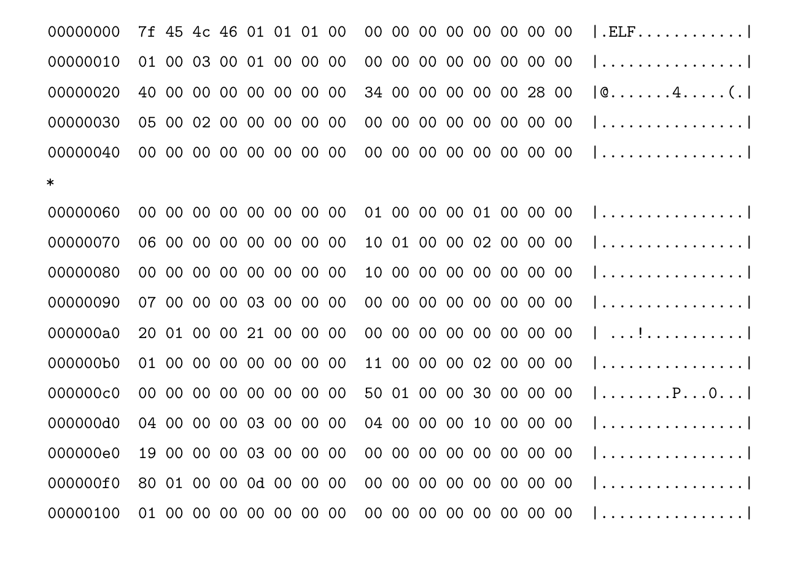
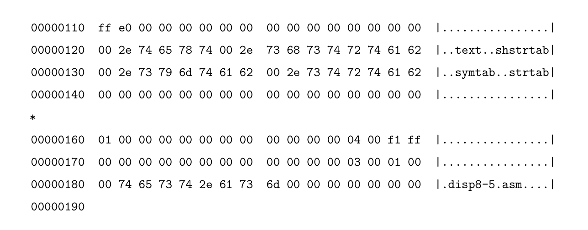

# $\fbox{Chapter 4: X86 ASSEMBLY AND C}$


## **Topic - 1: `objdump`**

### <u>Introduction</u>

- `objdump` displays info about object files.
- It could be used on executables, archive, and shared objects too.
- For demonstration, let's say we have an executable `hello`.


### <u>Using Command</u>

```sh
objdump -d hello               # '-d' disassembles only '.text' section
objdump hello                  # Defaults to use '-d'
objdump -D hello               # '-D' disassembles all the sections
objdump -d hello | less        # '| less' shows output on scrollable page

# Shows source code & disassembly both (if -g was used when compiling)
objdump -S hello

# '-M' is used to select disassembler option (making '-d' is compulsory)
objdump -M intel -d hello             # Usual 64-bit version
objdump -M i386,intel -d hello        # 32-bit layout version
```


## **Topic - 2: Reading The Output**

### <u>Output Dissection</u>

```nasm
4004d6:    55        push rbp
```

- 1st column (`4004d6`) is *virtual address* of instruction after being loaded.
- Multiple physical memory pages may have common virtual addresses in them.
- An optional 4th comment might appear sometimes.
- **<u>Label</u>:** A name given to a memory address which can be called from anywhere (like `_start`).


## **Topic - 3: Intel Manuals**

### <u>Combined Volumes</u>

- [Volumes Of Intel Manual](https://software.intel.com/en-us/articles/intel-sdm)
- **Chapter 1 -** Brief introduction & writing format
- **Chapter 2 -** Deep anatomy of assembly instructions
- **Chapter 3 to 5 -** Instructions details on *x86_64*
- **Chapter 6 -** Safer mode extensions


### <u>Volume 1</u>

- Describes basic architecture & programming environment of *Intel*
- **Chapter 5 -** Summary of *Intel* instructions (category-wise)
- **Chapter 5.1 -** General Purpose Registers (GPRs)
- **Chapter 7 -** Purpose of each category in *Chapter 5*


## **Topic - 4: Experiment With Assembly**

### <u>Using NASM</u>

```sh
nasm -f bin test.asm -o test        # Assembling with NASM
```

- `-f` is format flag, where `bin` is the chosen format.
- Here, `bin` is used to produce flat binary.
- We could write `elf` to produce ELF binary instead.


### <u>Hex Dump Review</u>

```sh
hd test        # 'hd' is short alternative for 'hexdump'
```

- For experimentation purpose, flat binaries are usually better.





### <u>Changing Mode</u>

- By default, flat binaries are produced in 16-bit mode.
- To change it to 32-bit mode, write the following line in the beginning of source file.

```nasm
bits 32
```
