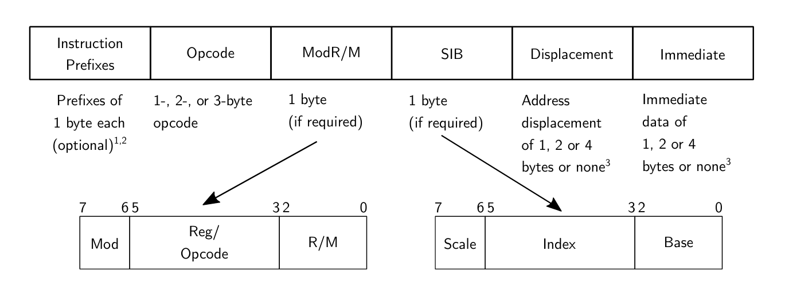
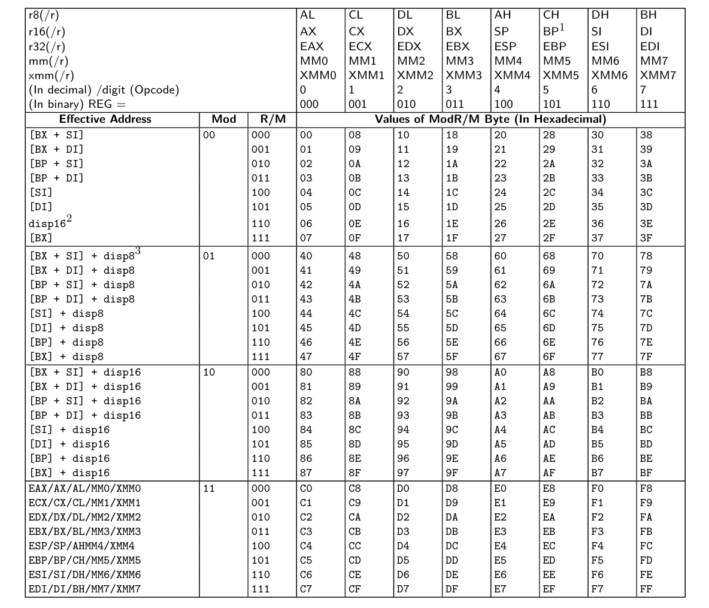
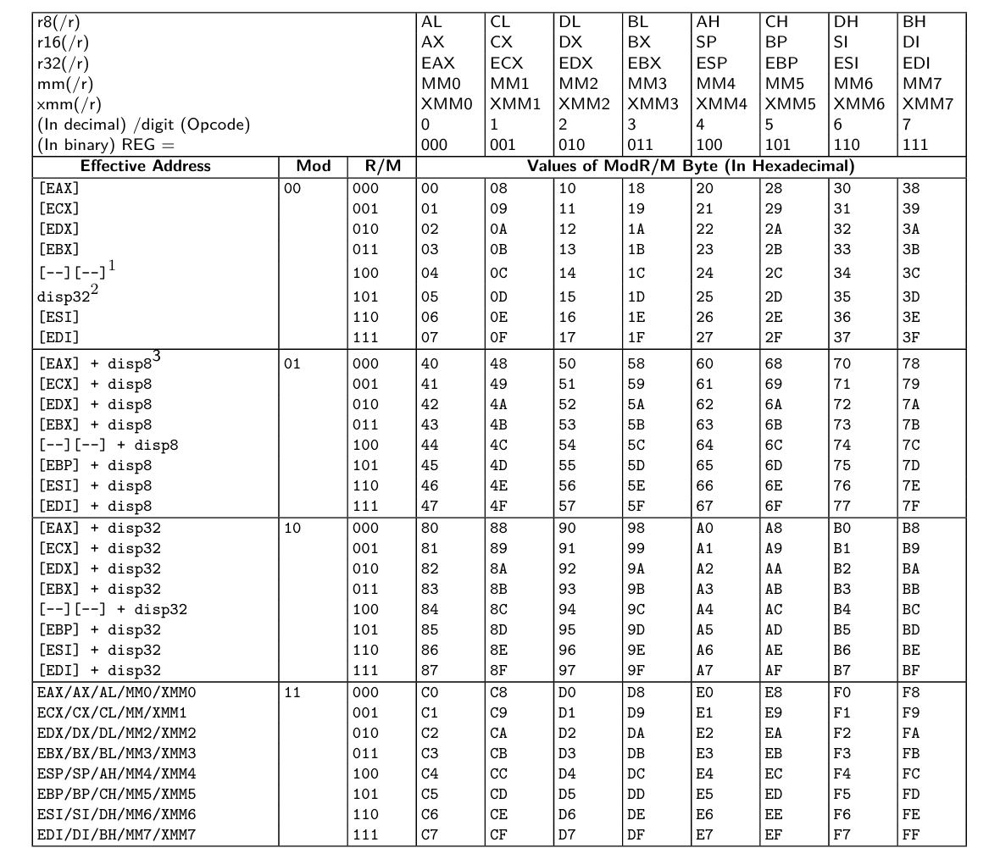
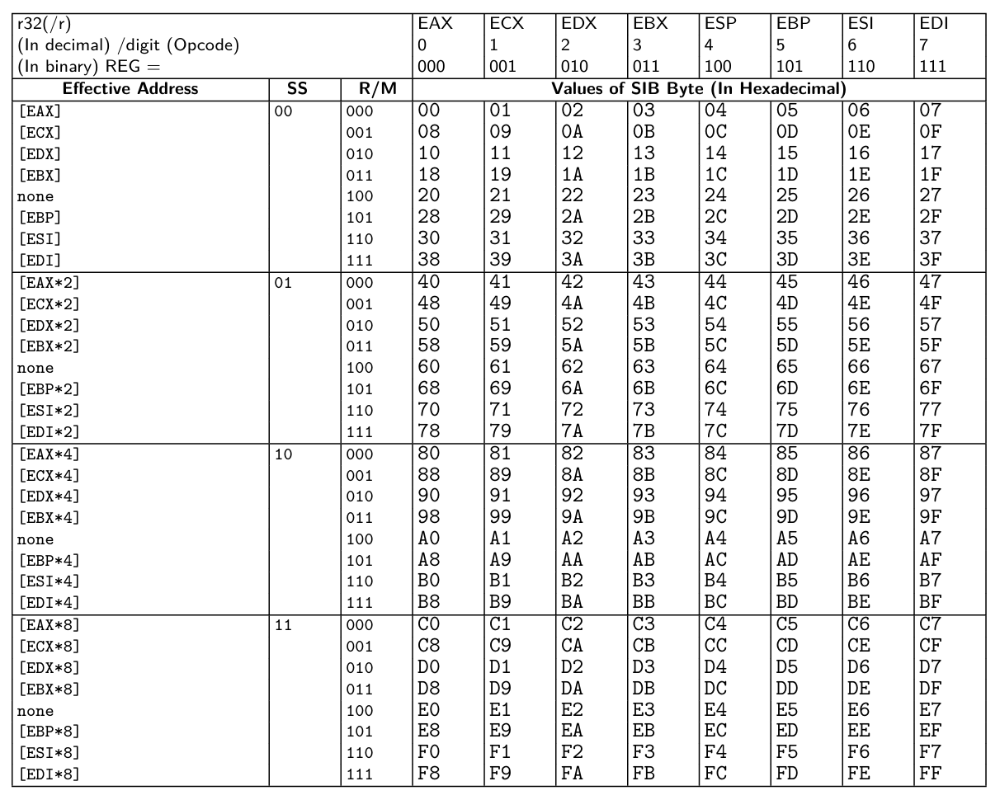
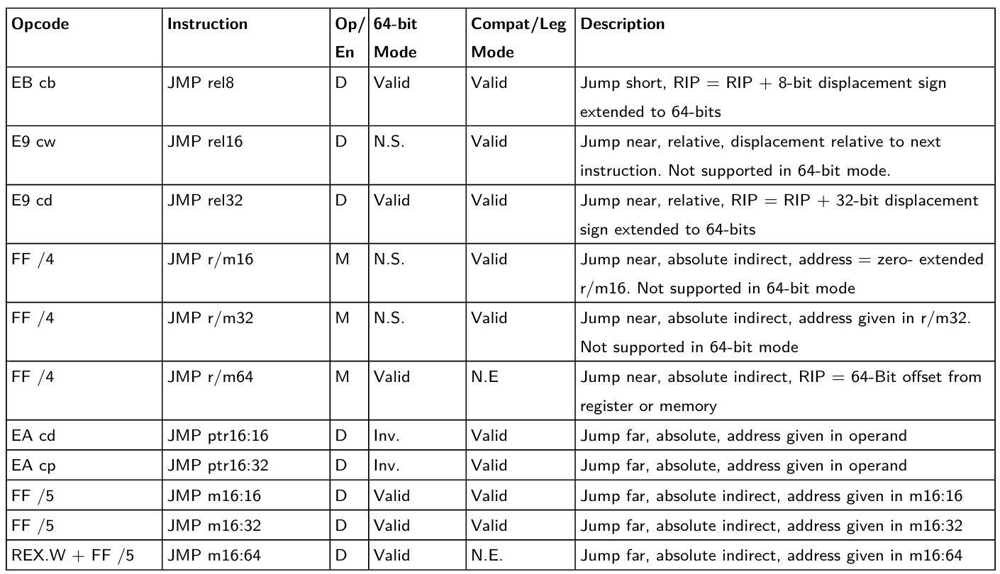
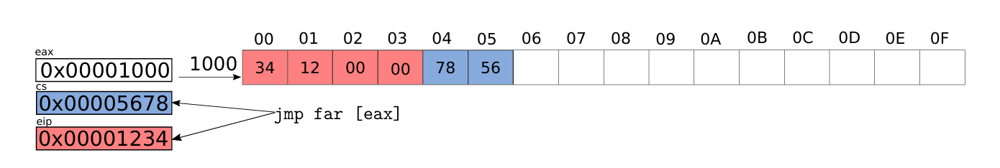

# $\fbox{Chapter 4: X86 ASSEMBLY AND C}$


## **Topic - 1: `objdump`**

### <u>Introduction</u>

- `objdump` displays info about object files.
- It could be used on executables, archive, and shared objects too.
- For demonstration, let's say we have an executable `hello`.


### <u>Using Command</u>

```sh
objdump -d hello               # '-d' disassembles only '.text' section
objdump hello                  # Defaults to use '-d'
objdump -D hello               # '-D' disassembles all the sections
objdump -d hello | less        # '| less' shows output on scrollable page

# Shows source code & disassembly both (if -g was used when compiling)
objdump -S hello

# '-M' is used to select disassembler option (making '-d' is compulsory)
objdump -M intel -d hello             # Usual 64-bit version
objdump -M i386,intel -d hello        # 32-bit layout version
```


## **Topic - 2: Reading The Output**

### <u>Output Dissection</u>

```nasm
4004d6:    55        push rbp
```

- 1st column (`4004d6`) is *virtual address* of instruction after being loaded.
- Multiple physical memory pages may have common virtual addresses in them.
- An optional 4th comment might appear sometimes.
- **<u>Label</u>:** A name given to a memory address which can be called from anywhere (like `_start`).


## **Topic - 3: Intel Manuals**

### <u>Combined Volumes</u>

- [Volumes Of Intel Manual](https://software.intel.com/en-us/articles/intel-sdm)
- **Chapter 1 -** Brief introduction & writing format
- **Chapter 2 -** Deep anatomy of assembly instructions
- **Chapter 3 to 5 -** Instructions details on *x86_64*
- **Chapter 6 -** Safer mode extensions


### <u>Volume 1</u>

- Describes basic architecture & programming environment of *Intel*
- **Chapter 5 -** Summary of *Intel* instructions (category-wise)
- **Chapter 5.1 -** General Purpose Registers (GPRs)
- **Chapter 7 -** Purpose of each category in *Chapter 5*


## **Topic - 4: Experiment With Assembly**

### <u>Using NASM</u>

```sh
nasm -f bin test.asm -o test        # Assembling with NASM
```

- `-f` is format flag, where `bin` is the chosen format.
- Here, `bin` is used to produce flat binary.
- We could write `elf` to produce ELF binary instead.


### <u>Hex Dump Review</u>

```sh
hd test        # 'hd' is short alternative for 'hexdump'
```

- For experimentation purpose, flat binaries are usually better.


### <u>Changing Mode</u>

- By default, flat binaries are produced in 16-bit mode.
- To change it to 32-bit mode, write the following line in the beginning of source file.

```nasm
bits 32
```


## **Topic - 5: Anatomy Of An Assembly Instruction**

### <u>Prefixes</u>

- *Prefixes* are optional for programmers to insert.
- They are basically another assembly instructions, added by default to instructions where *opcode* is of 2-3 bytes.




### <u>Opcode</u>

- *Opcode* is a unique number that identifies an instruction.
- For example, `04` is represented by `add`.
- An opcode could be **1-3 bytes** long & may have additional **3-bit** field from $\text{ModR/M}$.


### <u>ModR/M</u>

- $\text{ModR/M}$ specifies the operands (register/ address/ immediate).
- **Three parts -** $mod$, $reg/opcode$, $r/m$
- **<u>mod</u>:** Tells whether the operand is register or memory, and if there is a displacement.
- **<u>reg/opcode</u>:** Tells which register is the second operand.
- **<u>r/m</u>:** Depending on value of $mod$ field, it tells which register or addressing mode is used.


### <u>ModR/M Example</u>

- Consider `11011000` as the $ModR/M$ byte.

```
mov eax, [ebx]        ; ModR/M = (00 | 000 | 011)
```

- **$mod$ -** `00` (means memory operand without any displacement)
- **$reg$ -** `000` (use EAX as second operand)
- **$r/m$ -** `011` (use EBX as first operand)
- But because `00` says the instruction is about memory operand, `011` as first operand means memory address of EBX, not value at EBX.


### <u>Addressing Mode & Register</u>

#### 16-bit mode:



#### 32-bit mode:




### <u>Example - I</u>

```nasm
jmp [0x1234]        ; ff 26 34 12
```

- `0xff` is the opcode
- `0x26` is $ModR/M$ telling that opcode is `disp16` (16-bit offset)


### <u>Example - II</u>

```nasm
add eax, ecx        ; 66 01 c8
```

- `0x66` is the additional prefix (allows operand size switching)
- `0x01` is the opcode
- `0xc8` $ModR/M$ byte (row: 1st operand `ax` & column: 2nd operand `cx`)
- Column is ignored if only one operand is required.


### <u>Scale Index Base</u>

$$ \text{Effective address = scale * index + base} $$

#### Scale:

- Scale is the number of bytes an element in array takes.
- It can have values as $1$, $2$, $4$, or $8$.
- For elements with different size different from $2$, $4$, or $8$, its value must be set to $1$.
- And when scale's value is set to $1$, the $\text{index}$ must be manually set to reach the element in array.
- For instance, refer to example below:

$$ \text{Effective address = 1 * (12 * n) + base} $$

- $1$ is scale, $(12*n)$ is manually set index value.
- But doing this uses an extra `mul` instruction which is detrimental to performance, specially if accessed in loop.
- The possible values of $2$, $4$, and $8$ bytes map to 16-bit, 32-bit, and 64-bit numbers.

#### Base:

- *Base* is the starting address of an array.


### <u>32-Bit Addresses Forms</u>




### <u>Example - III</u>

```nasm
jmp [eax*2 + ebx]        ; 00000000 67 ff 24 43
```

- `0x67` is the prefix for overriding address size.
- `0xff` is the opcode for `jmp`.
- `0x24` is the $ModR/M$ value.
- `0x43` is the $SIB$ byte.
- As per the 32-bit address table, the $SIB$ byte `0x43` means that `eax` is scaled to `2` & added with `ebx`.


### <u>Example - IV</u>

```nasm
jump [0x1234]        ; ff 26 34 12
```

- `0x26` is the $ModR/M$ byte.


### <u>Immediate</u>

```nasm
mov eax, 0x1234        ; 66 b8 34 12 00 00
```

- `0x1234` is $Immediate$ value.


## **Topic - 6: Understanding Instructions In Detail**

### <u>Opcode Table</u>

- Lists all possible opcodes.
- **Fields -** Opcode, instruction, Op/En, 64/32-bit Mode, CPUID, Feature flag, Description, etc.


### <u>Operand Table Columns</u>

#### Opcode:

- Hex representation of opcode.
- There can be multiple opcodes variants to same instruction.
- **Reference -** Section 3.1.1.1 and 3.1.1.2 (Intel Volume 2).

#### Instruction:

- Includes the opcode and the operand.
- Operands can have relative addresses represented as $rel8$, $rel16$, or $rel32$.
- **<u>Relative addresses</u>:** Used in conditional statements to know where to jump/move.
- $rel8$ for instance means jump to instruction that is $[-127,128]$ bytes from next instruction.
- **Reference -** Section 3.1.1.3 (Intel Volume 2).

#### Op/En:

- Short for *operand/encoding*.
- Shows how operands are encoded in ModR/M byte.
- If any instruction requires multiple operands, then *Instruction Operand Encoding* table is referred.

| Op/En | Operand1 | Operand2 | Operand3 | Operand4 |
| :---- | :------: | :------: | :------: | :------: |

- An operand can be $r$ (readable), $w$ (writable) or both.
- For example, the $r/m$ operand (EBX) in `movl %ebx, %eax` is read-only.

#### 64/32-bit mode:

- Tells whether a class of opcode is available in 64-bit and 32-bit systems.

#### CPUID feature flag:

- Tells if any particular CPU feature is required to run the instruction.

#### Compat/Leg mode:

- *Compat/Leg* stands for compatibility/legacy mode.
- This field is not included by instructions usually.
- When present, it lets 64-bit variants of instructions to smoothly run on 32/16-bit ones.

#### Operation:

- Example pseudo-code implementation of an instruction.
- **Reference -** Section 3.1.1.9 (Intel Volume 2).

#### Exceptions:

- Possible errors that may arise from instruction not running correctly,
- **Exception types -**
	1. Protected-Mode Exception
	2. Real-Mode Exception
	3. Virtual-8086 Mode Exception
	4. Floating-Point Exception
	5. SIMD Floating-Point Exception
	6. Compatibility Mode Exception
	7. 64-bit Mode Exception


## **Topic - 7: Example `jmp` Instruction

### <u>Opcode Table</u>



- `ff` opcode represents those `jmp` instructions where jump is made on an absolute address.
- This is known as a *far jump*.
- And the value of address tells how far it is from DS (data segment).


### <u>Example - I</u>

```nasm
main:
	jmp main          ; 00: eb fe
	jmp main2         ; 02: eb 02
	jmp main          ; 04: eb fa

main2:
	jmp 0x1234        ; 06: e9 2b 12
```

- `fe` as a signed value translates to `-2`.
- So, `fe` here points `2` bytes before the next byte (`eb` at `02`), i.e. `main` again.


### <u>Example - II</u>

- A far jump instruction can be written with `far` keyword as shown below:

```nasm
jmp far [eax]        ; 67 ff 28
```

- In this instruction, we get CS:EIP combination pointing to an address.
- This address is what is stored at address pointed by EAX.
- To understand it better, refer to the diagram below:



- Blue part (`0x5678`) highlighted is the code segment address.
- While red part (`0x1234`) highlighted is a memory address lying in that segment, from where execution will continue.