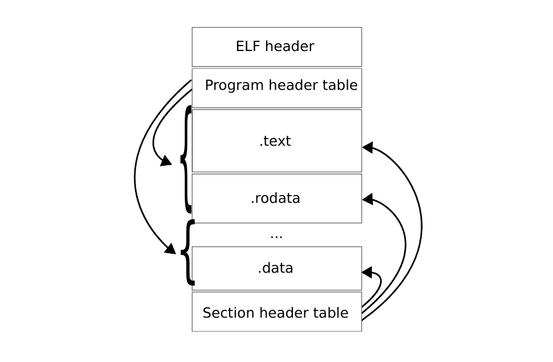

# $\fbox{Chapter 5: ANATOMY OF A PROGRAM}$


## **Topic - 1: Executable & Linkable Format**

### <u>Composition</u>

- **<u>ELF header</u>:** Describes file's organization
- **<u>Program header table</u>:** Array of fixed-size structures describing segments of executables.
- **<u>Section header table</u>:** Array of fixed-size structures describing sections of executables.


### <u>Segment & Sections</u>

- **<u>Segment</u>:** Combination of zero or more *sections*.
- **<u>Section</u>:** Contains code, data, or metadata.
- Linkers use sections to build segments.




### <u>Later Project</u>

- We will later write a kernel and compile it as ELF using GCC.
- Also we will specify how segments are created and where they are loaded.
- Those will be loaded using linker scripts.


## **Topic - 2: Reference Documents**

```sh
man elf        # ELF manual
```


## **Topic - 3: ELF Header**

### <u>Command</u>

```sh
readelf -h hello
```

```
ELF Header:
    Magic:             7f 45 4c 46 02 01 01 00 00 00 00 00 00 00 00 00
    Class:                             ELF64
    Data:                              2’s complement, little endian
    Version:                           1 (current)
    OS/ABI:                            UNIX - System V
    ABI Version:                       0
    Type:                              EXEC (Executable file)
    Machine:                           Advanced Micro Devices X86-64
    Version:                           0x1
    Entry point address:               0x400430
    Start of program headers:          64 (bytes into file)
    Start of section headers:          6648 (bytes into file)
    Flags:                             0x0
    Size of this header:               64 (bytes)
    Size of program headers:           56 (bytes)
    Number of program headers:         9
    Size of section headers:           64 (bytes)
    Number of section headers:         31
    Section header string table index: 28
```


### <u>Magic</u>

```
Magic: 7f 45 4c 46 02 01 01 00 00 00 00 00 00 00 00 00
```

| Bytes                     | Description                       |
| :------------------------ | :-------------------------------- |
| `7f 45 4c 46`             | Predefined values                 |
| `02`                      | Information about *Class* field   |
| `01`                      | Information about *Data* field    |
| `01`                      | Information about *Version* field |
| `00`                      | Information about *OS/ABI* field  |
| `00 00 00 00 00 00 00 00` | Unused bytes added for padding    |


### <u>Class</u>

- **<u>Class</u>:** Capacity of a file.

| Value | Description    |
| :---: | :------------- |
|  `0`  | Invalid class  |
|  `1`  | 32-bit objects |
|  `2`  | 64-bit objects |


### <u>Data</u>

- **<u>Data</u>:** Data encoding of the processor-specific data in the object file.

| Value | Description                   |
| :---: | :---------------------------- |
|  `0`  | Invalid data encoding         |
|  `1`  | Little endian, 2's complement |
|  `2`  | Big endian, 2's complement    |


### <u>Version</u>

- **<u>Version</u>:** ELF header version number.

|Value|Description|
|:-:|:-|
