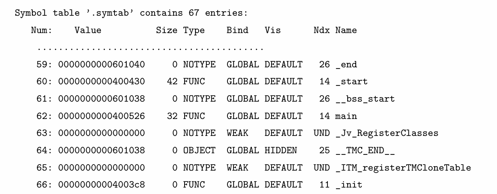

# $\fbox{Chapter 5: ANATOMY OF A PROGRAM}$


## **Topic - 1: Executable & Linkable Format**

### <u>Composition</u>

- **<u>ELF header</u>:** Describes file's organization
- **<u>Program header table</u>:** Array of fixed-size structures describing segments of executables.
- **<u>Section header table</u>:** Array of fixed-size structures describing sections of executables.


### <u>Segment & Sections</u>

- **<u>Segment</u>:** Combination of zero or more *sections*.
- **<u>Section</u>:** Contains code, data, or metadata.
- Linkers use sections to build segments.


### <u>Later Project</u>

- We will later write a kernel and compile it as ELF using GCC.
- Also we will specify how segments are created and where they are loaded.
- Those will be loaded using linker scripts.


## **Topic - 2: Reference Documents**

```sh
man elf        # ELF manual
```


## **Topic - 3: ELF Header**

### <u>Command</u>

```sh
readelf -h hello
```

```
ELF Header:
    Magic:             7f 45 4c 46 02 01 01 00 00 00 00 00 00 00 00 00
    Class:                             ELF64
    Data:                              2’s complement, little endian
    Version:                           1 (current)
    OS/ABI:                            UNIX - System V
    ABI Version:                       0
    Type:                              EXEC (Executable file)
    Machine:                           Advanced Micro Devices X86-64
    Version:                           0x1
    Entry point address:               0x400430
    Start of program headers:          64 (bytes into file)
    Start of section headers:          6648 (bytes into file)
    Flags:                             0x0
    Size of this header:               64 (bytes)
    Size of program headers:           56 (bytes)
    Number of program headers:         9
    Size of section headers:           64 (bytes)
    Number of section headers:         31
    Section header string table index: 28
```


### <u>Magic</u>

```
Magic: 7f 45 4c 46 02 01 01 00 00 00 00 00 00 00 00 00
```

| Bytes                     | Description                       |
| :------------------------ | :-------------------------------- |
| `7f 45 4c 46`             | Predefined values                 |
| `02`                      | Information about *Class* field   |
| `01`                      | Information about *Data* field    |
| `01`                      | Information about *Version* field |
| `00`                      | Information about *OS/ABI* field  |
| `00 00 00 00 00 00 00 00` | Unused bytes added for padding    |


### <u>Class</u>

- **<u>Class</u>:** Capacity of a file.

| Value | Description    |
| :---: | :------------- |
|  `0`  | Invalid class  |
|  `1`  | 32-bit objects |
|  `2`  | 64-bit objects |


### <u>Data</u>

- **<u>Data</u>:** Data encoding of the processor-specific data in the object file.

| Value | Description                   |
| :---: | :---------------------------- |
|  `0`  | Invalid data encoding         |
|  `1`  | Little endian, 2's complement |
|  `2`  | Big endian, 2's complement    |


### <u>Version (ELF)</u>

- **<u>Version (ELF)</u>:** ELF header version number.

| Value | Description     |
| :---: | :-------------- |
|  `0`  | Invalid version |
|  `1`  | Current version |


### <u>OS/ABI</u>

- **<u>OS/ABI</u>:** Target OS, was used as padding byte before.
- ABI document lists all the compatible OS.


### <u>Type</u>

- **<u>Type</u>:** Object file type

|  Value   | Description                     |
| :------: | :------------------------------ |
|   `0`    | No file type                    |
|   `1`    | Relocatable file                |
|   `2`    | Executable file                 |
|   `3`    | Shared object file              |
|   `4`    | Core file                       |
| `0xff00` | Processor specific, lower bound |
| `0xffff` | Processor specific, upper bound |

- Basically, values from `0xff00` to `0xffff` are reserved to define additional file types, if processor has such specific to it.


### <u>Version (Object File)</u>

- **<u>Version (object files)</u>:** Version number of current object file.


### <u>Entry Point Address</u>

- **<u>Entry point address</u>:** Address to the start of first instruction to be executed.
- By default, its `main` function where the first instruction is expected.
- But the default function could be configured by specifying it to GCC.


### <u>Start Of Program Header</u>

- **<u>Start of program header</u>:** Number of bytes in ELF before offset of *program header*.
- For example, the program header starts at 65th byte, then *start of program header* will be `64` as there are $64$ bytes before the offset.


### <u>Flags</u>

- **<u>Flags</u>:** The way processor flags need to be set when the program is loaded.
- `0x0` means EFLAG register is set to clear state.


### <u>Number Of Section Headers</u>

- In a section header, the first entry is always an empty section.


### <u>Section Header String Table Index</u>

- **<u>Section header string table index</u>:** The index or the sequence number of *string table* in *section header*.


## **Topic - 4: Section Header Table**

### <u>ELF Conditions To Satisfy</u>

- Every *section* can have just one *section header*.
- A *section header* can have no *section*.
- Every *section* has its contents arranged contiguously, not distributed.
- No content in file is stored at more than one *section*.


### <u>Getting All Headers</u>

```sh
readelf -S hello        # Gets all headers from a object file.
```


### <u>First Line In Output</u>

```
[Nr] Name        Type           Address            Offset
     Size        EntSize        Flags  Link  Info  Align
```

- **`Nr` -** Index of the section
- **`Type` -** Type of section (`PROGBITS`, `NOBITS`, `SYMTAB`, etc)
- **`Address` -** Starting virtual address of section, where the program loads
- **`Offset` -** Distance of first byte in section from start of file
- **`EntSize` -** Sizes of all fixed size tables in section (if any)
- **`Link` -** Contains only *index* of a section (if applicable)
- **`Info` -** Contains one of *index*, *symbol table*, or *hash table* entry of a section
- **`Align` -** Enforces alignment values ($0$ or $2^n$ where $n$ is whole nummber)


### <u>Last Line Output</u>

```
W (write), A (alloc), X (execute), M (merge), S (strings), l (large)
I (info), L (linkorder), G (group), T (TLS), E (exclude), x (unknown)
O (extra OS processing required) o (OS specific), p (processor specific)
```

- Attempt to execute code in `.data` will be denied by the OS.
- But this is not protected in bare-metal mode.

| Flag | Description                                                                             |
| :--: | :-------------------------------------------------------------------------------------- |
| `W`  | Bytes in these sections are *writable* during execution.                                |
| `A`  | Memory in this section is *allocated* during execution.                                 |
| `X`  | Section contains *executable* instructions.                                             |
| `M`  | Bytes in this section might be *merged* with others having similar name/type/etc.       |
| `S`  | Section contains *null-terminated strings*, their size is mentioned in `EntSize` field. |
| `l`  | *Large section* as per x86_64 architecture (defined in x86_64 ABI only).                |
| `I`  | `info` field of this section contains *index* of another section.                       |
| `L`  | Section *order* of this section is preserved when linking.                              |
| `G`  | *Member* of a section group.                                                            |
| `T`  | This section contains *Thread-Local Storage* to allow multithreading.                   |
| `E`  | These sections are excluded from executable and shared libraries.                       |
| `x`  | Unknown/custom ELF flag.                                                                |
| `O`  | OS-specific flags (have to be combined manually).                                       |
| `o`  | Contains bits which are reserved for OS-specific semantics.                             |
| `p`  | Contains bits which are reserved for processor-specific semantics.                      |


### <u>Example - I</u>

```
[Nr] Name             Type             Address            Offset
     Size             EntSize          Flags  Link  Info  Align

[ 1] .interp          PROGBITS         0000000000400238   00000238
     000000000000001c 0000000000000000     A     0     0      1
```

- `Type` is `PROGBITS`, which means this section is part of the program.
- `EntSize` is `0`, which means there are no fixed-size entries in this section.
- `Info` and `Link` are both `0`, which means this section doesn't link to any other section or entry in table.
- `Align` is `1`, which means there is no alignment.


### <u>Example - II</u>

```
[Nr] Name             Type             Address            Offset
     Size             EntSize          Flags  Link  Info  Align

[14] .text            PROGBITS         00000000004003e0   000003e0
     0000000000000192 0000000000000000     AX    0     0     16
```

- `Align` is `16`, meaning starting address of the section must be divisible by `16`.


## **Topic - 5: Understand Section In-Depth**

### <u>Hexdump Command</u>

```sh
readelf -x <section_name | section_number> <file>

# Examples
readelf -x 25 hello
readelf -x .data hello
```

- If a section contains string symbol tables, then `-x` can be replaced with `-p`.


### <u>NULL Section</u>

- A section of `NULL` type is inactive & has no relation with any other section.
- First entry in section header table is always `NULL` section.

```
[Nr] Name             Type             Address            Offset
     Size             EntSize          Flags  Link  Info  Align

[ 0]                  NULL             0000000000000000   00000000
     0000000000000000 0000000000000000           0     0      0
```

- Trying to examine data in `NULL` section, it says:

```
Section ” has no data to dump.
```


### <u>Other Section Types</u>

- **`NOTE` -** Read by vendors and programmers to understand about the executable.
- **`PROGBITS` -** Contains primary content of the code, either code or data.
- **`SYMTAB`**
- **`DYNSYM`**
- **`TLS`**
- **``**


### <u>PROGBITS Sections</u>

- **`.text`**
- **`.data` -** Memory for these data are initialized during assembling.
- **`.rodata`**
- **`.bss` -** *Block Started by Symbol*, memory for these aren't initialized during assembly.
- Other most sections are used for dynamic linking.


### <u>DYNSYM Section Output</u>



- **`Num` -** Index of entry
- **`Value` -** Virtual memory address of the symbol
- **`Type` -** Type of symbol
	- **`OBJECT` -** In C, all variables are of this type.
	- **`SECTION` -** Associated with a section & exists for relocation.
	- **`COMMON` -** Variables using `extern` keyword.
- **`Bind` -** Scope of the symbol
	- **`LOCAL` -** Variables using `static` keyword.
	- 