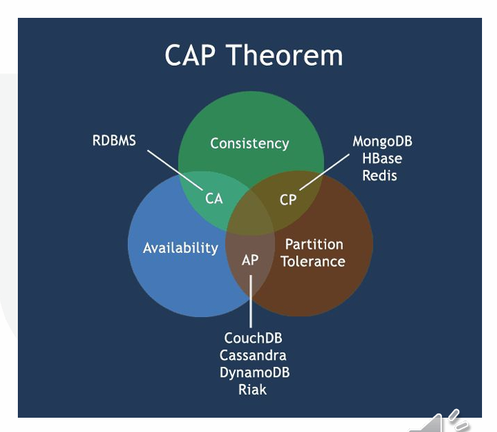
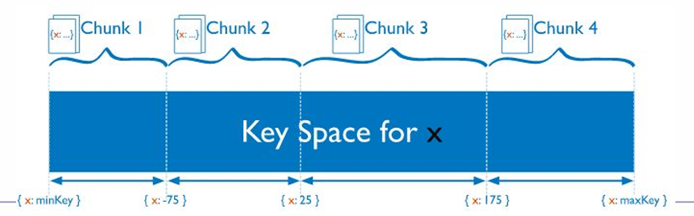

# $\fbox{Chapter 3: ADVANCED NOSQL CONCEPTS}$


## **Topic - 1: Introduction to NoSQL**

### <u>Concept</u>

- **NoSQL (Not Only SQL)** databases are designed for **unstructured and semi-structured** data.
- Developed to handle **large-scale**, **distributed**, and **high-velocity** data.
- Prioritize **scalability**, **availability**, and **flexible schema** over strict consistency.


### <u>Motivation</u>

- Traditional RDBMS systems fail to scale horizontally.
- Schema rigidity and complex joins limit performance in Big Data.
- Web-scale applications (Google, Amazon, Facebook) required new data models.


## **Topic - 2: Characteristics of NoSQL Databases**

| Feature | Description |
|----------|-------------|
| **Schema-free** | Flexible structure for unstructured data. |
| **Horizontal Scalability** | Data distributed across multiple nodes. |
| **High Availability** | Fault tolerance through replication. |
| **BASE Model** | Basically Available, Soft-state, Eventually consistent. |
| **Replication & Sharding** | Improves redundancy and performance. |


## **Topic - 3: Types of NoSQL Databases**

### <u>Key-Value Stores</u>

- Simplest form; stores data as **key–value pairs**.
- Optimized for **fast read/write** operations.
- No relationships or joins.
- **Examples:** Redis, Riak, Amazon DynamoDB.


### <u>Document Stores</u>

- Data stored in **JSON**, **BSON**, or **XML** format.
- Supports nested structures (arrays, objects).
- Indexed by document ID.
- **Examples:** MongoDB, CouchDB.

#### Advantages:

- Schema flexibility.
- Query via document attributes.
- Supports ACID operations within a single document.


### <u>Column-Family Stores</u>

- Stores data in **column families** rather than rows.
- Each row can have **variable columns**.
- Efficient for aggregation and analytics.
- Examples:** Apache Cassandra, HBase, ScyllaDB.

#### Architecture Highlights:

- Inspired by Google’s **BigTable**.
- Provides tunable consistency.
- Ideal for time-series and analytical workloads.


### <u>Graph Databases</u>

#### Introduction:

- Store data as **nodes (entities)** and **edges (relationships)**.
- Designed for relationship-heavy queries.
- **Examples:** Neo4j, OrientDB, Titan.

#### Use cases:

- Social networks, recommendation systems, fraud detection.
- **Query Language:** Cypher (for Neo4j).


## **Topic - 4: BASE vs ACID**

### <u>Introduction</u>

| Model    | Principle                                              | Description                                    |
| -------- | ------------------------------------------------------ | ---------------------------------------------- |
| **ACID** | Atomicity, Consistency, Isolation, Durability          | Ensures transaction reliability in RDBMS.      |
| **BASE** | Basically Available, Soft-state, Eventually Consistent | Sacrifices strict consistency for scalability. |


### <u>BASE Model Details</u>

- **Basically Available:** System guarantees availability.
- **Soft State:** State may change even without input (due to replication).
- **Eventual Consistency:** System achieves consistency over time.


## **Topic - 5: CAP Theorem**

> Proposed by Eric Brewer: In any distributed system, only **two** of the following can be guaranteed simultaneously:
> 
> 1. **Consistency (C)** – All nodes see same data at same time.
> 2. **Availability (A)** – Every request receives a response.
> 3. **Partition Tolerance (P)** – System functions despite network partition.


### <u>Implications</u>

- **CA systems:** RDBMS (require strong consistency).
- **CP systems:** MongoDB, HBase.
- **AP systems:** Cassandra, CouchDB.




## **Topic - 6: Data Modeling in NoSQL**

### <u>Principles</u>

- Data denormalization for performance.
- Design based on **query patterns**, not entity relationships.
- Optimize for **read-heavy** workloads.


### <u>Techniques</u>

- Embedding vs Referencing (Document DBs).
- Composite keys and clustering (Column DBs).


## **Topic - 7: Query Mechanisms**

### <u>Key–Value</u>

- `GET`, `PUT`, `DELETE` using key lookup.


### <u>Document Store</u>

- JSON-based queries using field conditions.

```javascript
db.students.find({ age: { $gt: 20 } })
```


### <u>Column-Family Store</u>

- Query via primary key + clustering column.


### <u>Graph Database</u>

#### Cypher example:

```cypher
MATCH (a:Person)-[:FRIEND]->(b) RETURN a.name, b.name
```


## **Topic - 8: Replication and Sharding**

### <u>Replication</u>

- Maintains multiple copies of data across nodes.
- Improves **fault tolerance** and **read performance**.


### <u>Sharding</u>

- Distributes data horizontally across servers.
- Enhances scalability.




## **Topic - 9: Advantages of NoSQL**

- High scalability and performance.
- Flexible data schema.
- Fault-tolerant and distributed architecture.
- Handles large, unstructured datasets.
- Supports rapid application development.


## **Topic - 10: Limitations of NoSQL**

- Weaker transactional consistency.
- Complex query support limited.
- Tooling and standardization still evolving.
- Requires developer expertise in distributed systems.


## **Topic - 11: When to Use NoSQL**

| Scenario                       | Suitable Type |
| ------------------------------ | ------------- |
| Caching                        | Key–Value     |
| User profiles / Content        | Document      |
| Event logs / Time-series       | Column-family |
| Social graph / Recommendations | Graph         |


## **Topic - 12: NoSQL in Big Data Ecosystem**

- Integrates with **Hadoop**, **Spark**, and **Kafka** for real-time analytics.
- Acts as **fast storage layer** in Big Data pipelines.


## **Topic - 13: Case Studies**

| Organization | NoSQL Used | Purpose |
|---------------|-------------|----------|
| **Facebook** | Cassandra | Messaging and analytics. |
| **Amazon** | DynamoDB | Product catalogs and sessions. |
| **Google** | BigTable | Web indexing and analytics. |
| **LinkedIn** | Voldemort | User feeds and caching. |


## **Topic - 14: Summary**

- NoSQL databases trade strong consistency for scalability and flexibility.
- Support diverse data models tailored to application needs.
- Key enablers for **Big Data** and **IoT** systems.

---
