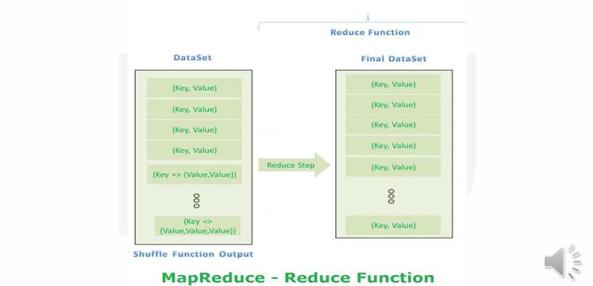
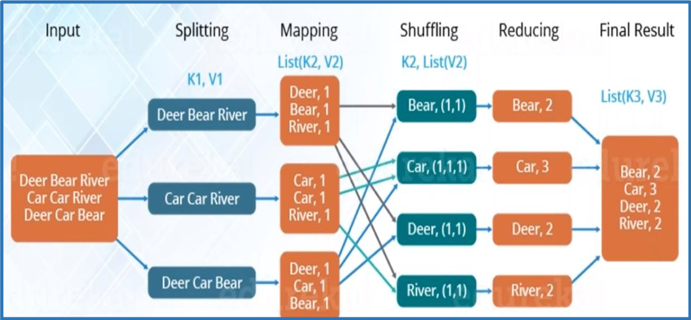

# $\fbox{Chapter 5: MAP REDUCE FRAMEWORK}$


## **Topic - 1: Introduction to MapReduce**

### <u>Definition</u>

- **MapReduce** is a **parallel programming framework** to process large volumes of distributed data.
- Processes Big Data stored in **HDFS** through user-defined **Map** and **Reduce** functions.
- Originally developed by **Google (2004)**.


### <u>Key Operations</u>

1. **Map:** Processes input data → emits intermediate key–value pairs.
2. **Reduce:** Aggregates intermediate results → outputs final key–value pairs.


## **Topic - 2: Working of MapReduce**

### <u>Architecture</u>

- Operates on a **Master–Slave** model.
- **Master (JobTracker)** coordinates jobs and assigns tasks.
- **Workers (TaskTrackers)** execute Map and Reduce tasks.


### <u>Execution Flow</u>

1. User submits job to **JobTracker**.
2. JobTracker splits input data → assigns to TaskTrackers.
3. Each TaskTracker runs **Mapper** and **Reducer** independently.
4. Results are aggregated and written back to **HDFS**.


## **Topic - 3: MapReduce Functions**

### <u>Functional Model</u>

```text
map(in_key, in_value) → list(out_key, intermediate_value)
reduce(out_key, list(intermediate_value)) → list(out_value)
```


### <u>Programming Influence</u>

- Derived from **functional programming** concepts.
- Abstracts parallelization, fault tolerance, and load balancing.


## **Topic - 4: Challenges Solved by MapReduce**

| Challenge                 | Description                               | MapReduce Solution                    |
| ------------------------- | ----------------------------------------- | ------------------------------------- |
| **Critical Path Problem** | Delay in one node affects job completion. | Parallel, independent task execution. |
| **Reliability**           | Node failure halts progress.              | Task re-execution on other nodes.     |
| **Equal Split**           | Uneven data load on nodes.                | Automatic data partitioning.          |
| **Single Split Failure**  | Failure in one chunk affects entire job.  | Fault-tolerant reprocessing.          |
| **Aggregation**           | Need to merge distributed results.        | Automatic shuffling & merging.        |


## **Topic - 5: Advantages of MapReduce**

- **Parallel Processing:** Divide and Conquer → faster data handling.
- **Data Locality:** Computation moves to data, not vice versa.
- **Scalability:** Processes petabyte-scale datasets efficiently.
- **Fault Tolerance:** Retries failed tasks automatically.


## **Topic - 6: Core MapReduce Terminologies**

| Term | Definition |
|------|-------------|
| **Payload** | User-defined Map and Reduce logic. |
| **Mapper** | Transforms input key–value pairs → intermediate pairs. |
| **Reducer** | Aggregates intermediate pairs → final output. |
| **NameNode** | Manages HDFS metadata. |
| **DataNode** | Stores actual data blocks. |
| **JobTracker** | Master that manages jobs and assigns tasks. |
| **TaskTracker** | Executes tasks and reports progress. |
| **Job** | Complete MapReduce program execution. |
| **Task** | Execution instance of Mapper or Reducer. |
| **Task Attempt** | A retry of a failed task on a different node. |


## **Topic - 7: Mapper Function – Workflow**

### <u>Steps</u>

1. **Input Split:** Logical unit of work; defines data processed by a single mapper.
2. **RecordReader:** Converts input splits into key–value pairs.
3. **Mapping:** Processes pairs and outputs intermediate key–value results.


### <u>Input Formats</u>

- **`TextInputFormat`** (Default)
- **`KeyValueTextInputFormat`**
- **`SequenceFileInputFormat`**
- **`SequenceFileAsTextInputFormat`**


## **Topic - 8: Shuffle and Sort Phase**

### <u>Purpose</u>

- Automatically handled by the MapReduce framework.
- Ensures values for the same key reach the same reducer.


### <u>Sub-steps</u>

1. **Merging:** Combines all pairs with identical keys.
2. **Sorting:** Orders pairs by key → `<Key, List<Value>>`.


## **Topic - 9: Reducer Function – Workflow**

### <u>Function</u>

- Executes once per **unique key**.
- Aggregates all intermediate values for that key.


### <u>Output</u>

- Zero or more final key–value pairs.
- Final results stored in **HDFS output directory**.




## **Topic - 10: End-to-End MapReduce Process**

1. Input split into chunks.
2. Mappers process each chunk → emit intermediate results.
3. Shuffle–sort groups results by key.
4. Reducers aggregate grouped values.
5. Final output written to HDFS.




## **Topic - 11: MapReduce Applications**

| Category           | Example                          |
| ------------------ | -------------------------------- |
| **Summarization**  | Counting, statistics aggregation |
| **Classification** | Top-N records, sorting           |
| **Recommendation** | Predict user preferences         |
| **Analytics**      | Join, selection, filtering       |


## **Topic - 12: Example – Inverted Index**

### <u>Problem</u>

- Build a list of unique words or hashtags and their document occurrences.


### <u>Example Input (Tweets)</u>

```
"It’s not too late to vote. #ElectionDay"
"Happy #PrimaryDay"
```


### <u>Map Function</u>

```text
map(tweet) → (hashtag, tweet)
```


### <u>Reduce Function</u>

```text
reduce(hashtag, list(tweets)) → (hashtag, [list of tweets])
```


### <u>Example Output</u>

```
(ElectionDay, [“It’s not too late to vote...”, “Say NO to corruption...”])
(PrimaryDay, [“Midtown polling office...”, “Happy #PrimaryDay”])
```


## **Topic - 13: MapReduce on YARN**

### <u>MRv2 (MapReduce v2)</u>

- Integrated with **YARN** in Hadoop 2.x.
- **JobTracker** and **TaskTracker** replaced by:
	- **ResourceManager**
	- **ApplicationMaster**
	- **NodeManager**


### <u>Advantages</u>

- Enhanced scalability and multi-job execution.
- Supports real-time and interactive applications.


## **Topic - 14: Summary**

- MapReduce simplifies large-scale data processing using **parallelism**.
- Fault tolerance and scalability are built-in.
- MRv2 with YARN provides improved flexibility.
- Commonly used for analytics, indexing, and recommendation systems.

---
