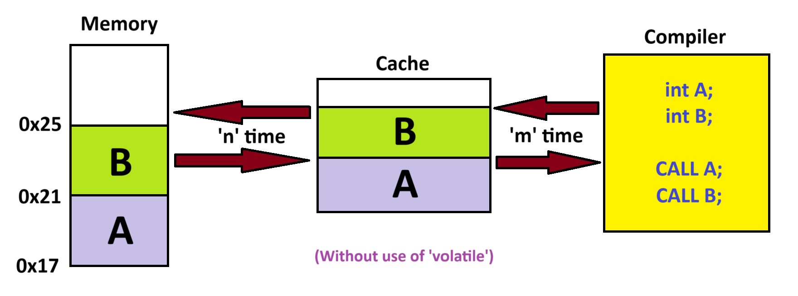
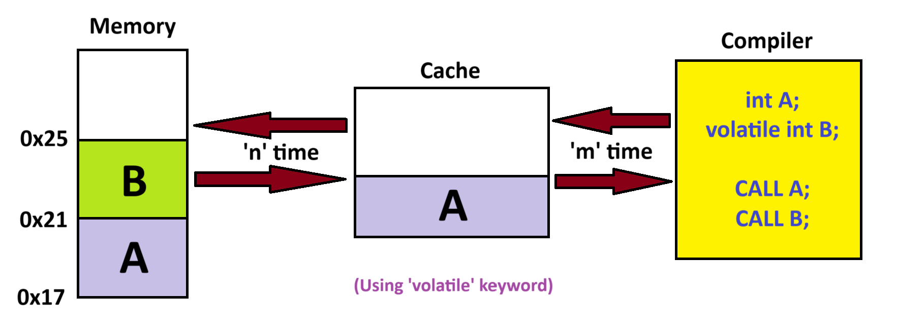
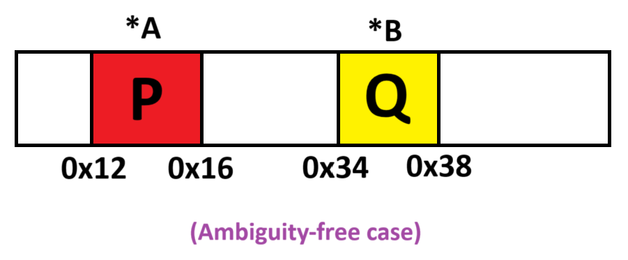
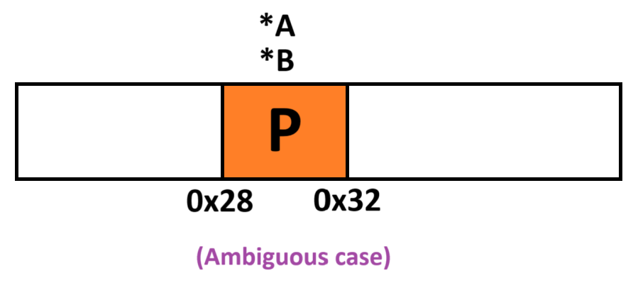

**<u>Chapter 12</u>: TYPE QUALIFIERS & CASTING**

**Topic – 1: Type Qualifiers**

**<u>Introduction</u>**

- Keywords used to modify **property** of variables.

- There are 3 main type qualifiers – **const**, **volatile**,
  **restrict**.

**<u>Constant</u>**

- Used to define any kind of variable as **read-only** (**constant**).

***const int PI = 3.14;***

- Still, we can change value of a **constant variable** like **PI** here
  using a **pointer**.

***const int PI = 3.14;***

***int \*ptr = (int \*)&PI;***

***\*ptr = 8.51***

**<u>Volatile</u>**

- To understand how **volatile** keyword works, we need to know about
  how data are stored in **memory**.

- So, we use keyword **volatile** to tell compiler **not** to apply
  **optimization** to certain variables.

- Now suppose some change made at the **memory address** of **B**
  through **interrupt**.

- This change **won’t** be noticed by compiler as it refers to **cache**
  only for accessing variables.

- And it takes time **'m'** to be accessed.

- As we have declared variable **B** as **volatile**, the compiler will
  access **B** through **memory address** & not **cache**.

- Also note that this takes **time** **(m + n)** to be **accessed** as
  **no** optimization is applied.

- Though, **A** will be accessed through cache being **non-volatile**.

***volatile int x = 5;***

***volatile int \*ptr = (volatile int \*) 0x4000; // or &x instead of
0x4000***

- Volatile are often used in places like **embedded systems** & **OS
  kernels** etc.

- When we want to tell the compiler that a variable can change under
  certain **external events** like **change at memory address**,
  **interrupt** or any **hardware changes**.

- This is necessary as compiler **doesn’t** always considers all
  hardware conditions.

**<u>Restrict</u>**

- Keyword **restrict** is again used for **optimization** purposes.

- It is however used along **pointer variables**.

- It makes sure that for all the mentioned **restrict** pointers, they
  **don’t** point to **overlapping memory**.

***void add(int \*restrict a, int \*restrict b)***

***{***

***/\* Some codes \*/***

***}***

**<u>Restrict Example</u>**

- Say we pass two **pointers** **A** & **B** pointing to **variable**
  **P** to our function.

- Now let’s say instead both **A** & **B** point to **P**.

**Topic – 2: Casting**

**<u>Implicit Type Casting</u>**

- These are **automatically converted** by compiler when found.

***/\* Integer to float \*/***

***int x = 5;***

***float y = x + 3.5; // y = 8.5***

***/\* Character to integer \*/***

***char a = 'A';***

***int x = a; // x = 65 (ASCII value)***

***/\* Boolean to integer (for C++) \*/***

***bool flag = true;***

***int res = flag + 10; // res = 1 + 10 = 11***

- Other examples include – **int** to **double**, **unsigned** to
  **signed** & **short** to **long** etc.

**<u>Note</u>!**

**🡪 Terms like short & long comes under category of precision
keywords.**

**<u>Explicit Casting</u>**

- Now you know what it is.

- **Explicit casting** is **safer** as we inform compiler what we are
  doing.

- Examples will be same as all we did in **implicit type casting** but
  with **safety**.

**<u>Tips</u>!**

**🡪 It is advised to use explicit casting wherever possible, as there is
no difference in overhead for both types of casting.**

***/\* Float to integer \*/***

***float PI = 3.14;***

***int x = (int) PI; // x = 3***

***/\* Integer to ASCII \*/***

***int ascii = 65;***

***char c = (char) ascii; // ASCII 65 = 'A'***

***/\* Pointer cast conversion \*/***

***int x = 7;***

***void \*ptr = &x; // We don’t do any explicit casting for (void \*)***

***int \*ptr2 = (int \*) ptr; // Points to 'x' and is of type integer***

**<u>Note</u>!**

**🡪 We can do conversions between regular numeric data types & precision
numeric data types too.**
