<u>Chapter 6</u>: GENERIC

**<u>C/C++ Libraries</u>**

- The **object files** work as **intermediate** between a program and
  library.

- **<u>Dependency walker</u>:** A tool used for troubleshooting
  incompatibleness of ***.dll*** files.

- Generally, **static files** create **larger** binary files & thus
  occupies **more space**.

- In whole library process, ***gcc*** is used for **C** files &
  ***g++*** is used for **C++** files.

- Windows uses ***.obj*** extension for **object files**.

- Linking is done for running an **executable** which uses library(s).

- We can remove the including statement importing the library at **final
  stage** of project.

**<u>Static Linking & Static Libraries</u>**

Creating (developer’s job):-

- **<u>Step 1</u>:** Create a **source file** containing
  **implementations** of the library:

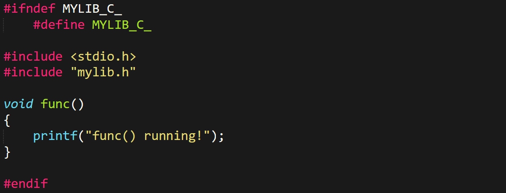

***\*We can create such multiple files\****

- **<u>Step 2</u>:** Create a **header file** with only **function
  definitions**:

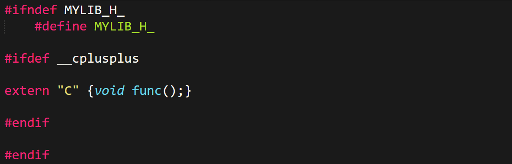

- **<u>Step 3</u>:** **Compile** library file(s) into **object files**:

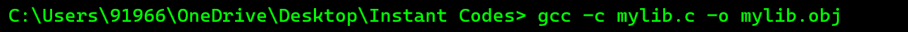

***\*Gotta do this one by one for each .c file\****

- **<u>Step 4</u>:** Create **static libraries**:

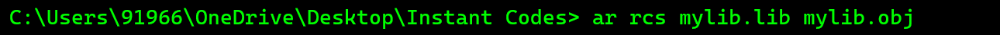

***\*For multiple .obj files, add all file names in the command in
line\****

Linking (user’s job):-

- **<u>Step 1</u>:** Create a **user program** importing our library:

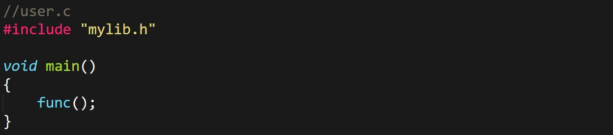

- **<u>Step 2</u>:** **Compile** the user program into an **object
  file**:

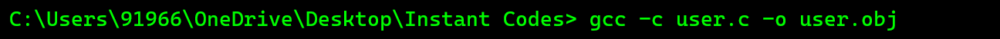

- **<u>Step 3</u>:** **Linking** user program to **static library**:

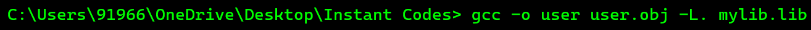

***\*This creates an executable of user program which can be run\****

**<u>Things to Take Under Consideration</u>**

- It’s a good practice to add this to **ensure compatibility** of user’s
  **C/C++ version**.

- Use ***extern "C"*** for **functions** and **variables** (in **header
  files** only).

- But **don’t** use them for **class** or its **members**.

Project specific:-

- During testing phase, include with ***.c/.cpp*** file.

- Then after completing the project, **before linking** make them
  ***.h/.hpp***.

**<u>Dynamic/Shared Files & Linking</u>**

Creating:-

- **<u>Step 1</u>:** Create a **C/C++** file that contains
  **implementations** of the library:

***\*We can create such multiple files\****

- **<u>Step 2</u>:** Create a **header file** with only **function
  definitions**:

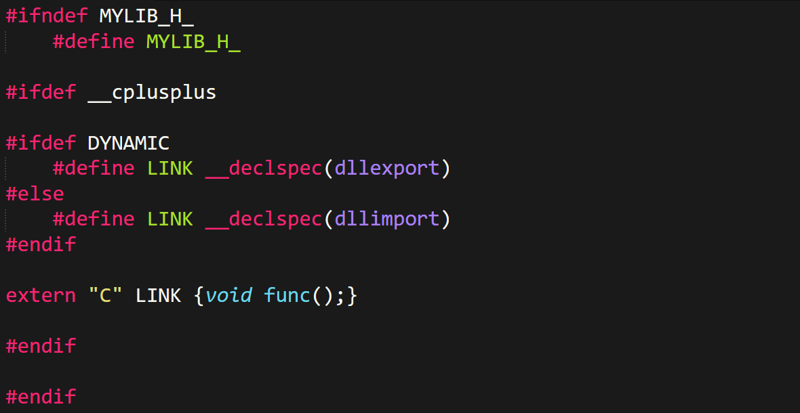

- **<u>Step 3</u>:** **Compile** library file(s) into **object files**:

***\*Gotta do this one by one for each .c file\****

- **<u>Step 4</u>:** Create **dynamic/shared** libraries:

***\*For multiple .obj files, add all file names in the command in
line\****

Linking (user’s job):-

- **<u>Step 1</u>:** Create a **user program** importing our library:

- **<u>Step 2</u>:** Compile the **user program** into an **object
  file**:

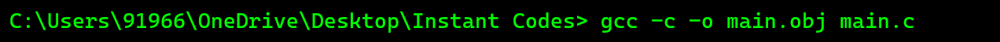

- **<u>Step 3</u>:** **Linking** **user program** to **dynamic
  library**:

***\*This creates an executable of user program which can be run\****

**<u>Library Structure</u>**

Header file:-

- Guard **macro**.

- ***\_\_cplusplus***

- ***\_\_declspec(dllexport/dllimport)*** \[if **dynamic**\].

- Required standard **header files**.

- Namespaces.

- ***extern*** keyword.

- Declaration of **functions**, **structures** and **global variables**
  (if any).

- Declaration of class’s **public** members.

- Declaration & **definition** of class’s **private** members.

Source file:-

- Guard **macro**.

- Inclusion of **header file**.

- **Implementation** of declarations in header file.

- **Scope resolution operator** (***::***) for namespace references.

User program:-

- Inclusion of **source file**.

**<u>Dynamic Class Objects</u>**

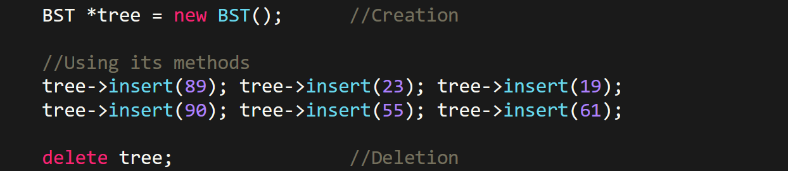

- **Destructors** of ***dynamic class objects*** are **not** called
  automatically when the program ends.

**<u>Multithreading</u>**

Creation & join():-

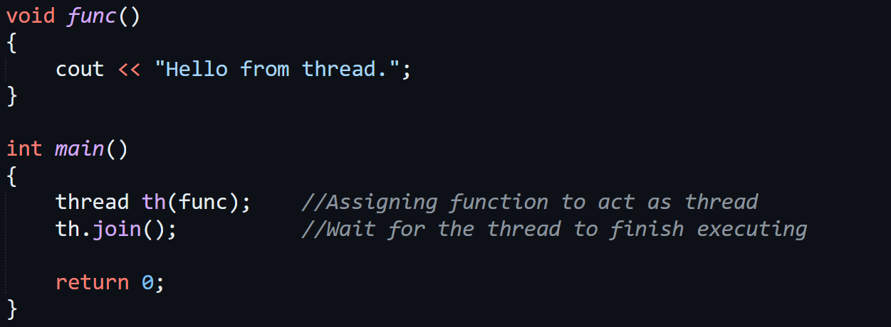

Thread ID:-

**<u>Smart Pointers</u>**

- ***Pointer*** is the **owner** & ***dynamic variable*** is **owned**.

- **<u>Unique pointers</u>:** Only **one** pointer can own a variable.

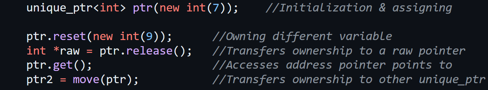

- **<u>Shared pointers</u>:** Ownership of a variable is shared among
  **multiple** pointers.

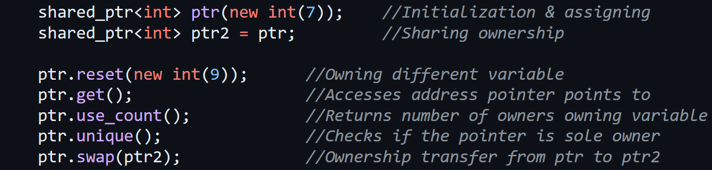

- **<u>Weak pointers</u>:** Share reference to a ***shared pointer***
  but **doesn’t** participate in ownership of a variable.

- So, a ***weak pointer*** **can’t** manipulate value of the variable it
  is referring to through ***shared pointer***.

- Instead, it just **watches & tracks** the lifetime of an object
  pointed by ***shared pointer***.

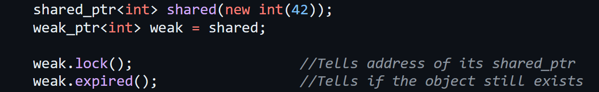
