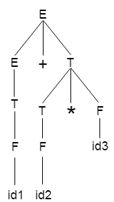

# $\fbox{Chapter 2: BASIC PARSING}$

## **Topic - 1: Parser**

### <u>Introduction</u>

- A parser takes output of lexical analyzer i.e. sequence of tokes & forms a parse tree out of it.

$$ \framebox[4cm][c]{Lexical Analyzer}\xrightarrow{Sequence\;of\;tokens}\framebox[4cm][c]{Parser}\xrightarrow{Parse\;tree} $$

### <u>Top-Down Parsing</u>

- Top-down parsing is also known as recursive/predictive parsing.
- In this approach, the parsing starts from the start symbol & converted into the given input symbol.
- For example, starting from start symbol $S$ & then producing $abba$ from it.
- This derivation can be represented through the parse tree.

### <u>Bottom-Up Parsing</u>

- Bottom-up parsing is also known as **shift reduce parsing**.
- Here, we construct the parse tree from an input string, contrast to top-down parsing.
- The input string is reverse tracked to find its origin.

#### Types of bottom-up parsing:

1. Shift-reduce parsing
2. Operator precedence parsing
3. Table driven LR parsing

## **Topic - 2: Shift Reduce Parsing**

### <u>Introduction</u>

- As we saw earlier, shift reduce parsing is reverse derivation of a string to start symbol.
- It is named as shift reducing because it is shifted & then reduced.

### <u>Steps</u>

1. Shift action, current input symbol is pushed into stack.
2. Reduction, symbol is replaced by non-terminal.

### <u>Example</u>

#### Production rules:

$$ S\;\rightarrow\;S\;+\;S $$
$$ S\;\rightarrow\;S\;-\;S $$
$$ S\;\rightarrow\;(S) $$
$$ S\;\rightarrow\;a $$

#### Input string:

$$ a_{1}\;-\;(a_{2}\;+\;a_{3}) $$

#### Table:

| Stack Content | Input String      | Actions             |
| ------------- | ----------------- | ------------------- |
| $\$$          | $a_1-(a_2+a_3)\$$ | Shift $a_1$         |
| $\$a_1$       | $-(a_2+a_3)\$$    | Reduce $a$ to $S$   |
| $\$S$         | $-(a_2+a_3)\$$    | Shift $-$           |
| $\$S-$        | $(a_2+a_3)$       | Shift $($           |
| $\$S-($       | $a_2+a_3)$        | Shift $a_2$         |
| $\$S-(a_2$    | $+a_3)$           | Reduce $a_2$ to $S$ |
| $\$-(S$       | $+a_3)$           | Shift $+$           |
| ...           | ...               | ...                 |
| $\$S$         | $\$$              | Accept              |

## **Topic - 3: Operator Precedence Parsing**

### <u>Introduction</u>

- **<u>Operator precedence parsing</u>:** A type of parsing used in operator precedence grammar (OPG).
- A grammar is OPG when there are no $\epsilon$ on production R.H.S & no non-terminals are adjacent.

### <u>Operator Precedence Relations</u>

1. $a⋗b$ means $a$ has higher precedence over $b$.
2. $a ⋖ b$ is opposite of the previous relation.
3. $a ≐ b$ means both have equal precedence.

### <u>Precedence Relation Table</u>

| Symbol | $+$ | $*$ | $($ | $)$ | $id$ | $\$$ |
| ------ | --- | --- | --- | --- | ---- | ---- |
| $+$    | $⋗$ | $⋖$ | $⋖$ | $⋗$ | $⋖$  | $⋗$  |
| $*$    | $⋗$ | $⋗$ | $⋖$ | $⋗$ | $⋖$  | $⋗$  |
| $($    | $⋖$ | $⋖$ | $⋖$ | $⋖$ | $⋖$  | $X$  |
| $)$    | $⋗$ | $⋗$ | $X$ | $⋗$ | $X$  | $⋗$  |
| $id$   | $⋗$ | $⋗$ | $X$ | $⋗$ | $X$  | $⋗$  |
| $\$$   | $⋖$ | $⋖$ | $⋖$ | $X$ | $⋖$  | $X$  |

### <u>Parsing Procedure</u>

1. Put $\$$ on both ends of the input string.
2. Search for rightmost $⋗$ from right, obviously.
3. Then search for leftmost $⋖$ from left.

>**<u>NOTE</u>:**
>Everything coming between $⋖$ and $⋗$ is called handle.

### <u>Example</u>

#### Grammar:

$$ E\;\rightarrow\;E\;+\;T\;|\;T $$
$$ T\;\rightarrow\;T\;*\;F\;|\;F $$
$$ F\;\rightarrow\;id $$

#### Input string:

$$ w\;=\;id\;+\;id\;*\;id $$

#### Derived parse tree:

#### Operator precedence table:

| Symbol | $E$ | $T$ | $F$ | $id$ | $+$ | $*$ | $\$$ |
| ------ | --- | --- | --- | ---- | --- | --- | ---- |
| $E$    | $X$ | $X$ | $X$ | $X$  | $≐$ | $X$ | $⋗$  |
| $T$    | $X$ | $X$ | $X$ | $X$  | $⋗$ | $≐$ | $⋗$  |
| $F$    | $X$ | $X$ | $X$ | $X$  | $⋗$ | $⋗$ | $⋗$  |
| $id$   | $X$ | $X$ | $X$ | $X$  | $⋗$ | $⋗$ | $⋗$  |
| $+$    | $X$ | $≐$ | $⋖$ | $⋖$  | $X$ | $X$ | $X$  |
| $*$    | $X$ | $X$ | $≐$ | $⋖$  | $X$ | $X$ | $X$  |
| $\$$   | $⋖$ | $⋖$ | $⋖$ | $⋖$  | $X$ | $X$ | $X$  |

#### Parsing:

$$ \$\;<\;id_1\;>\;+\;id_2\;*\;id_3\;\$ $$
$$ \$\;<\;F\;>\;+\;id_2\;*\;id_3\;\$ $$
$$ \$\;<\;T\;>\;+\;id_2\;*\;id_3\;\$ $$
$$ \$\;<\;E\;=\;+\;<\;id_2\;>\;*\;id_3\;\$ $$
$$ \$\;<\;E\;=\;+\;<\;F\;>\;*\;id_3\;\$ $$
$$ \$\;<\;E\;=\;+\;<\;T\;=\;*\;<\;id_3\;>\;\$ $$
$$ \$\;<\;E\;=\;+\;<\;T\;=\;*\;=\;F\;>\;\$ $$
$$ \$\;<\;E\;=\;+\;=\;T\;>\;\$ $$
$$ \$\;<\;E\;>\;\$ $$
$$ Accept $$

---
