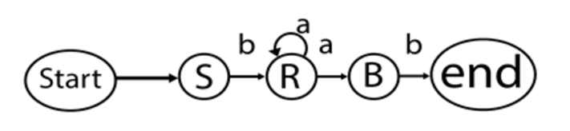

# <u>Chapter 1</u>: INTRODUCTION


## **Topic – 1: Compiler Introduction**

### <u>Introduction</u>

- **<u>Compiler</u>:** A translator that converts high-level language into machine language.
- High-level language is often referred as HLL & low-level language as LLL.
- **<u>Object program</u>:** Low-level language, like assembly.

$$ \xrightarrow{Source \; Prograrm} \framebox[3cm][c]{Compiler} \; \xrightarrow{Object \; Program} $$
$$ \xrightarrow{Object \; Prograrm} \framebox[3cm][c]{Assembler} \; \xrightarrow{Target \; Program} $$


### <u>Expected Topics To Be Covered</u>

- Introduction
- Grammar
- Parsing
- Syntax directed translation
- Symbol table
- Course optimization
- Code generation


## **Topic – 2: Compiler Phases**

### <u>Introduction</u>

$$ \framebox[8cm][c]{1) Source Program} $$
$$ \downarrow $$
$$ \framebox[8cm][c]{2) Lexical Analyzer} $$
$$ \downarrow $$
$$ \framebox[8cm][c]{3) Syntax Analyzer} $$
$$ \downarrow $$
$$ \framebox[8cm][c]{4) Semantic Analyzer} $$
$$ \downarrow $$
$$ \framebox[8cm][c]{5) Intermediate Code Generator} $$
$$ \downarrow $$
$$ \framebox[8cm][c]{6) Code Optimization} $$
$$ \downarrow $$
$$ \framebox[8cm][c]{7) Code Generator} $$
$$ \downarrow $$
$$ \framebox[8cm][c]{8) Target Program} $$


### <u>Lexical Analysis</u>

- Analyses source program character-by-character.
- Converts program into meaningful ***lexemes***.
- **Lexemes** are represented in form of tokens.

$$ Sum \; := \; (Old \; sum) \; + \; (Rate*50) $$
$$ \downarrow $$
$$ \framebox[7cm][c]{Lexical Analyzer} $$
$$ \downarrow $$
$$ id1 \; = \; id2 \; + \; (id3*id4) $$


### <u>Syntax Analysis</u>

- Takes tokens (lexemes) as input.
- Converts it into a parse tree.
- Then parser checks if the syntax is written the right way or not.


### <u>Semantic Analysis</u>

- In this phase, it checks if parse tree follows language rules or not.
- Then it tracks all involved identifiers, their types & the expression.


### <u>Intermediate Code Generation</u>

- Code which is later converted into final machine code.

$$ \downarrow $$
$$ \framebox[7cm][c]{Intermediate Code Generator} $$
$$ \downarrow$$
$$ temp1 \; := \; inttoreal(50) $$
$$ temp2 \; := \; id3*temp1 $$
$$ temp3 \; := \; id2*temp2 $$
$$ id1 \; := \; temp3 $$


### <u>Code Optimization (*Optional)</u>

- Converting intermediate code in a form that will run faster & take less space.
- Like removing unnecessary lines, arranging code lines in an order etc.

$$ \downarrow $$
$$ \framebox[7cm][c]{Code Optimization} $$
$$ \downarrow $$
$$ temp1 \; := \; id3*50.0 $$
$$ id1 \; := \; id2 \; + \; temp1 $$


### <u>Code Generation</u>

- Takes the optimized intermediate code or just intermediate code as input.
- Converts that into processor’s machine code.

$$ \downarrow $$
$$ \framebox[7cm][c]{Code Generation} $$
$$ \downarrow $$
$$ MOVF \; id3, \; R2 $$
$$ MULF \; \#50.0, \; R2 $$
$$ MOVF \; id2, \; R2 $$
$$ ADDF \; R2, \; R1 $$
$$ MOVF \; R1, \; id1 $$


## **Topic - 3: Compiler Passes**

### <u>Introduction</u>

- **<u>Pass</u>:** Complete traversal of the source program.

#### Two types of passes:

- Multi-pass compiler
- One-pass compiler


### <u>Multi-Pass Compiler</u>

- Traverses source program multiple times.

#### First pass:

1. Compiler reads source program.
2. Scans it.
3. Extracts the tokens.
4. Stores the output.

#### Second pass:

1. Compiler reads the output.
2. Builds syntactical tree.
3. Perform syntactical analysis.
4. Stores the produced tree as output.

#### Third pass:

1. Compiler reads previous output.
2. Checks the correctness of tree.
3. Produces annotated tree syntax as output.

>**<u>NOTE</u>:**
>This keeps going on until we get the target program.


### <u>One-Pass Compiler</u>

- One-pass compiler source program into machine code in one cycle only.
- It does all that we discussed in multi-pass compiler but line-by-line.


## **Topic - 4: Bootstrapping**

### <u>Introduction</u>

- Bootstrapping is used for creating self-hosting compiler.
- **<u>Self-hosting compiler</u>:** Compiler which can compile its own source code.
- It is the supporting language in which compiler is made.


### <u>Languages Involved In Compiler</u>

- Source language
- Target language
- Implementation language


### <u>T-Diagram</u>

- Compiler is represented by $^{S}C_{I}^{T}$.
- $S$ is source language.
- $T$ is target language.
- $I$ is implementation language.


### <u>T-Diagram Example</u>

Let's say we have to produce a language $L$ using language $A$.

#### Step 1:

- First we create compiler $^{S}C_{A}^{A}$ where $S$ is a subset of source language.


- Say $S$ is a component of GCC compiler for C & $A$ is x86 Assembly.
- Basically we are creating a component $S$ of C using x86 Assembly, which is translating to x86 Assembly at last, being the base language.

#### Step 2:

- Then we create another compiler $^{L}C_{A}^{S}$.


- Here, consider $L$ as programming language C for sometime.
- In $^{L}C_{A}^{S}$, we are creating a compiler for C using x86 Assembly which is being translated to subset $S$ at last.

>**<u>NOTE</u>:**
>Remember that subset $S$ was created using x86 Assembly.

#### Step 3:

- Now we compile 2nd compiler using 1st one.


- This final diagram is the representation of bootstrapping.


## **Topic - 5: Finite State Machine (FSM)**

- FSMs are used to determine patterns.
- For example, DFA or NFA etc.


## **Topic - 6: Regular Expression (RE)**

### <u>Operations On RE</u>

The operations shown below are with respect to two RE called $L$ & $M$.
#### Union:

- Union of $L$ and $M$ will also be a regular expression.

$$ L\;\cup\;M\;=\;{ s\;|\;s\;is\;in\;L\;or\;M} $$

#### Intersection:

- Intersection of $L$ and $M$ will also be a regular expression.

$$ L\;\cap\;M\;=\;{st\;|\;s\;is\;in\;L\;and\;t\;is\;in\;M} $$

#### Kleene closure:

- Kleene closure of $L$ i.e. $L^{*}$ will also be a regular language.

>**<u>NOTE</u>:**
>Remember that DFA could be optimized for better performance.


## **Topic - 7: LEX**

### <u>Introduction</u>

- **<u>LEX</u>:** A tool or program that generates lexical analyzer.
- In future we will see how LEX is used with YACC parser generator.
- Lexical analyzer is used for extracting tokens from the input source code.


### <u>Functioning Of LEX</u>

1. Firstly, lexical analyzer receives the source program.
2. Then this source program is converted into a LEX program, say $lex.1$ here.
3. Now LEX runs that $lex.1$ program & produces a intermediate program, say $lex.yy.c$ using C here.
4. Finally, C compiler runs $lex.yy.c$ & produces object program $a.out$.
5. Now this object program $a.out$ is used in converting an input into lexemes (tokens).

$$ \xrightarrow{LEX\;source\;program\;(lex.1)}\framebox[5cm][c]{LEX Compiler}\xrightarrow{C\;Program\;(lex.yy.c)} $$
$$ \xrightarrow{C\;Program\;(lex.yy.c)}\framebox[5cm][c]{C Compiler}\xrightarrow{Object\;Program\;(a.out)} $$
$$ \xrightarrow{Input\;stream}\framebox[5cm][c]{Object\;Program}\xrightarrow{Sequence\;of\;tokens} $$

>**<u>NOTE</u>:**
>The last line of diagram means that object program is executed to convert input stream into lexemes.


### <u>LEX File Format</u>

- LEX files are divided into three sections with `%%` delimiters.

```
{definitions}
%%
{rules}
%%
{user subroutines}
```

- Rules are written in form of $p_{1}\{action_{1}\}\;p_{2}\{action_{2}\}\;...\;p_{n}\{action_{n}\}$.
- $p_{i}$ is the regular expression.
- $action_{i}$ is the action to be performed when a pattern from $p_{i}$ matches a lexeme, generally using finite automata.
- **<u>User subroutines</u>:** Auxiliary (intermediate) processes $action_{i}$ uses.
- These subroutines might work with lexical analyzer but can be compiled separately, having its own independent code.
- Subroutines are independent of the compiler.


## **Topic - 8: Formal Grammar**

### <u>Introduction</u>

- **<u>Formal grammar</u>:** Set of rules to know if a string is written in right manner or not.
- It is represented by $G$.

>**<u>NOTE</u>:**
>Remember the **"production rule"** thing?


### <u>Formula</u>

$$ G\;=\;<V,\;N,\;P,\;S> $$

- $V$ is finite set of terminal symbols.
- $N$ is finite set of non-terminal symbols.
- $P$ is set of production rules.
- $S$ is start symbol.


### <u>Example</u>

#### Given:

$$ V\;=\;\{a,\;b\} $$
$$ N\;=\;\{S,\;R,\;B\} $$

#### Production rules:

$$ S\;=\;bR $$
$$ R\;=\;aR $$
$$ R\;=\;aB $$
$$ B\;=\;b $$

#### Conclusion:

- The production rules described above gives string with pattern $ba^{n}ab$.




## **Topic - Backus Naur Form (BNF)**

### <u>Introduction</u>

- Standard & formal way to represent CFG.


### <u>Representation</u>

$$ Left\;side\;\rightarrow\;definition $$

- The BNF contains at least one non-terminal symbol.


### <u>Example</u>

$$ S\;\rightarrow\;aSa $$
$$ S\;\rightarrow\;bSb $$
$$ S\;\rightarrow\;c $$

#### Refined:

$$ S\;\rightarrow\;aSa\;|\;bSb\;|\;c $$
