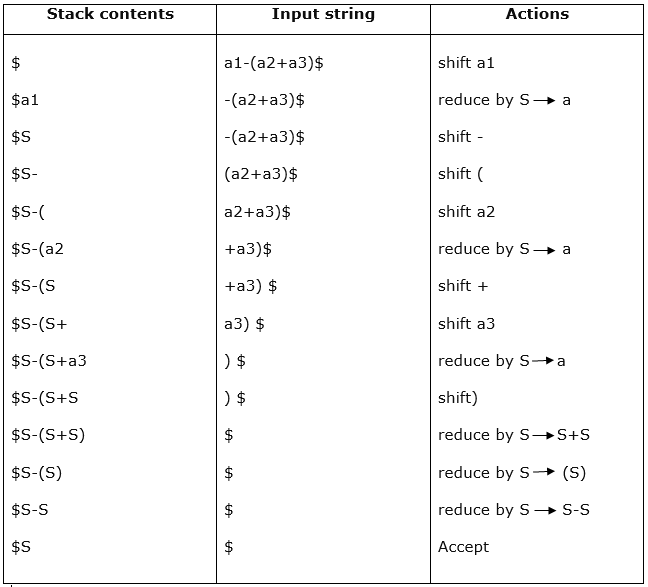

# $\fbox{Chapter 2: BASIC PARSING}$

## **Topic - 1: Parser**

### <u>Introduction</u>

- A parser takes output of lexical analyzer i.e. sequence of tokes & forms a parse tree out of it.

$$ \framebox[4cm][c]{Lexical Analyzer}\xrightarrow{Sequence\;of\;tokens}\framebox[4cm][c]{Parser}\xrightarrow{Parse\;tree} $$

### <u>Top-Down Parsing</u>

- Top-down parsing is also known as recursive/predictive parsing.
- In this approach, the parsing starts from the start symbol & converted into the given input symbol.
- For example, starting from start symbol $S$ & then producing $abba$ from it.
- This derivation can be represented through the parse tree.

### <u>Bottom-Up Parsing</u>

- Bottom-up parsing is also known as **shift reduce parsing**.
- Here, we construct the parse tree from an input string, contrast to top-down parsing.
- The input string is reverse tracked to find its origin.

#### Types of bottom-up parsing:

1. Shift-reduce parsing
2. Operator precedence parsing
3. Table driven LR parsing

## **Topic - 2: Shift Reduce Parsing**

### <u>Introduction</u>

- As we saw earlier, shift reduce parsing is reverse derivation of a string to start symbol.
- It is named as shift reducing because it is shifted & then reduced.

### <u>Steps</u>

1. Shift action, current input symbol is pushed into stack.
2. Reduction, symbol is replaced by non-terminal.

### <u>Example</u>

#### Production rules:

$$ S\;\rightarrow\;S\;+\;S $$
$$ S\;\rightarrow\;S\;-\;S $$
$$ S\;\rightarrow\;(S) $$
$$ S\;\rightarrow\;a $$

#### Input string:

$$ a_{1}\;-\;(a_{2}\;+\;a_{3}) $$

#### Table:

