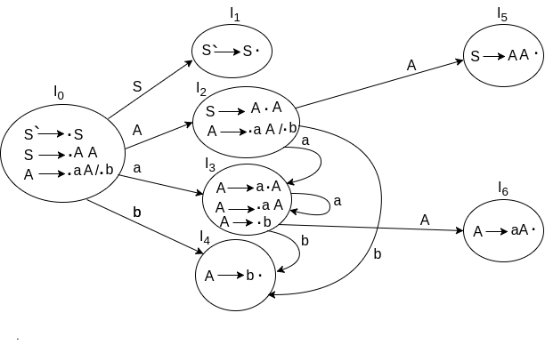

# $\fbox{Chapter 3: PREDICTIVE PARSERS}$

## **Topic - 1: LR Parser**

### <u>Introduction</u>

- LR parsing is a type of bottom-up parsing.
- Here, L stands for left-to-right parsing of the input.
- R stands for reversing a rightmost derivation.
- K represents the number of symbols in the lookahead.
- **<u>Lookahead</u>:** A buffer containing some characters which come after the current character in string.

### <u>Types Of LR Parsing</u>

- LR(0) parsing
- SLR parsing
- CLR parsing
- LALR parsing

### <u>LR Algorithm</u>

- LR algorithms uses stack, input, output & parsing table.
- The rules these components use are same as the shift reduce parsing table.

### <u>LR(1) Parsing Steps</u>

1. A CFG is crafted for the given input.
2. The CFG is validated for not having any ambiguity.
3. An augmented production is added to our CFG.
4. Construct parsing table for LR(1).

#### Augmented grammar:

- **<u>Augmented grammar</u>:** A terminal having start symbol on the right side.

$$ S'\;\rightarrow\;S$$

- It is used to mark end of parsing, as when no reverse derivation is remaining for $S$, we reduce it to $S'$.

## **Topic - 2: Canonical Collection Of LR(0) Items**

### <u>Introduction</u>

- LR(0) is the first symbol on the right side of the production.
- It is represented by a dot.
- It is used in telling us how many input symbols has been parsed.

### <u>Example</u>

#### Given $G$:

$$ S\;\rightarrow\;AA $$
$$ A\;\rightarrow\;aA\;|\;B $$

#### After inserting LR(0):

$$ S'\;\rightarrow\;.S $$
$$ S\;\rightarrow\;.AA $$
$$ A\;\rightarrow\;.aA $$
$$ A\;\rightarrow\;.b $$

#### Transition diagram:

- During transition to a certain state, the dot moves to left of next character.
- This shows us how many characters have been parsed.
- See in diagram above how all possible transitions are mapped from each CFG state.
