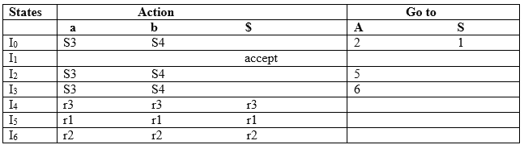
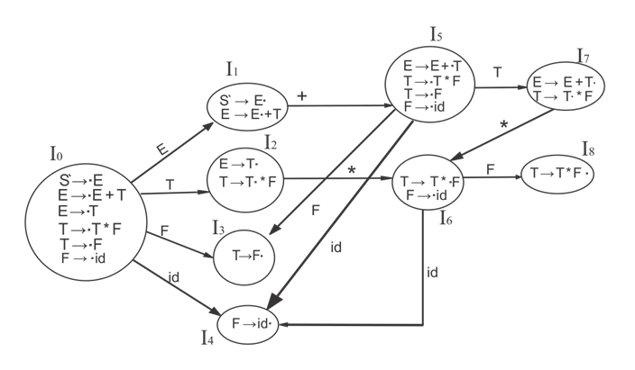
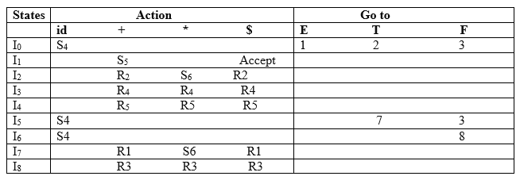
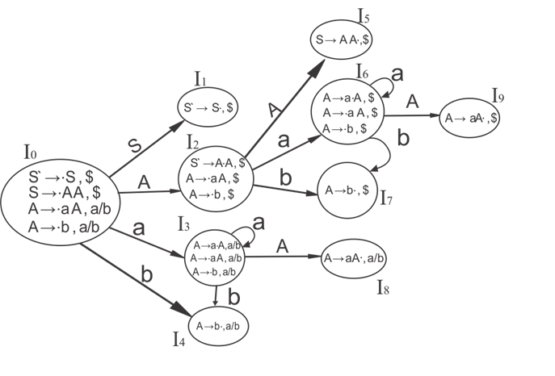
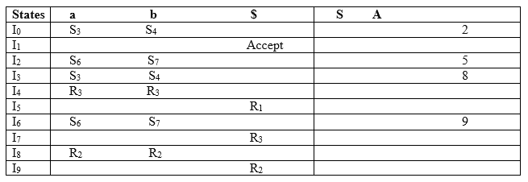
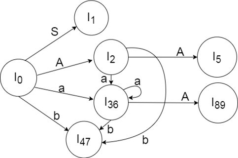

# $\fbox{Chapter 3: PREDICTIVE PARSERS}$

## **Topic - 1: LR Parser**

### <u>Introduction</u>

- LR parsing is a type of bottom-up parsing.
- Here, L stands for left-to-right parsing of the input.
- R stands for reversing a rightmost derivation.
- K represents the number of symbols in the lookahead.
- **<u>Lookahead</u>:** A buffer containing some characters which come after the current character in string.

### <u>Types Of LR Parsing</u>

- LR(0) parsing
- SLR parsing
- CLR parsing
- LALR parsing

### <u>LR Algorithm</u>

- LR algorithms uses stack, input, output & parsing table.
- The rules these components use are same as the shift reduce parsing table.

### <u>LR(1) Parsing Steps</u>

1. A CFG is crafted for the given input.
2. The CFG is validated for not having any ambiguity.
3. An augmented production is added to our CFG.
4. Construct parsing table for LR(1).

#### Augmented grammar:

- **<u>Augmented grammar</u>:** A terminal having start symbol on the right side.

$$ S'\;\rightarrow\;S$$

- It is used to mark end of parsing, as when no reverse derivation is remaining for $S$, we reduce it to $S'$.

## **Topic - 2: Canonical Collection Of LR(0) Items**

### <u>Introduction</u>

- LR(0) is the first symbol on the right side of the production.
- It is represented by a dot.
- It is used in telling us how many input symbols has been parsed.

### <u>Example</u>

#### Given $G$:

$$ S\;\rightarrow\;AA $$
$$ A\;\rightarrow\;aA\;|\;B $$

#### After inserting LR(0):

$$ S'\;\rightarrow\;.S $$
$$ S\;\rightarrow\;.AA $$
$$ A\;\rightarrow\;.aA $$
$$ A\;\rightarrow\;.b $$

#### State diagram:

- During transition to a certain state, the dot moves to left of next character.
- This shows us how many characters have been parsed.
- See in diagram above how all possible transitions are mapped from each CFG state.

#### Transition table:

- This table tells the transition, where **Action** is non-terminals & **Go to** contains terminal symbols.
- $S$ can be replaced with $I$ too, as those are same states as in diagram.

## **Topic - 3: SLR(1) Parsing**

### <u>Introduction</u>

- Similar to LR(0) parser with one difference.
- This difference is in the way we construct the DFA & transition table.

### <u>Example</u>

#### Production rules:

$$ S\;\rightarrow\;E $$
$$ E\;\rightarrow\;E\;+\;T\;|\;T $$
$$ T\;\rightarrow\;T\;*\;F\;|\;F $$
$$ F\;\rightarrow\;id $$

#### After dot insertion:

$$ S\;\rightarrow\;.E $$
$$ E\;\rightarrow\;.E\;+\;T $$
$$ E\;\rightarrow\;.T $$
$$ T\;\rightarrow\;.T\;*\;F $$
$$ T\;\rightarrow\;.F $$
$$ F\;\rightarrow\;.id $$

#### State diagram:

- Notice how our transitions are.
- We also add production rules which may transform later on as per the given symbol.

#### Transition table:

- Similar to how we did in LR(0) parser with one difference.
- Instead of non-terminals, we have operators here.

## **Topic - 4: CLR(1) Parsing**

### <u>Introduction</u>

- **<u>CLR</u>:** Canonical lookahead
- CLR(1) parsing table is build using canonical collection of LR(1) items.
- CLR(1) has comparatively more states than SLR(1).

### <u>Steps Involved</u>

1. Write CFG for given string.
2. Check & remove ambiguity from grammar.
3. Add augmented production to grammar.
4. Add $\$$ (lookahead) to augmented & start production.
5. Create canonical collection of LR(0) items.
6. Draw DFA.
7. Construct CLR(1) parser.

>**<u>NOTE</u>:**
>$\$$ represents that no non-terminal symbol is there on right side of the current terminal.

### <u>Example</u>

#### Given:

$$ S\;\rightarrow\;AA $$
$$ A\;\rightarrow\;aA $$
$$ A\;\rightarrow\;b $$

#### Modified:

$$ S'\;\rightarrow\;.S,\;\$ $$
$$ S\;\rightarrow\;.AA,\;\$ $$
$$ A\;\rightarrow\;.aA,\;a/b $$
$$ A\;\rightarrow\;.b,\;a/b $$

#### DFA:

- Actually it is easier than one thinks, just look for the patterns.
- Our goal is to construct DFA where each end state has the dot right to last symbol of each rule.

#### Parsing table:

## **Topic - 5: LALR(1) Parsing**

### <u>Introduction</u>

- **<u>LALR</u>:** Lookahead LR
- Here also we use canonical collection of LR(1) items.
- A dot is added before $\$$ too.
- And DFA states are given state numbers instead of writing whole conical collection.

#### For example:

