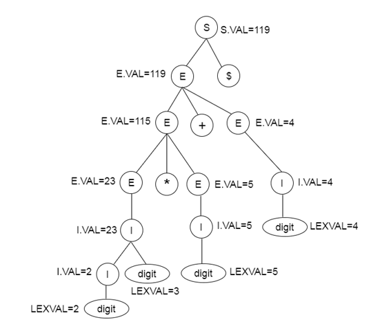

# $\fbox{Chapter 4: SYNTAX DIRECTED TRANSLATION}$

## **Topic - 1: Syntax Directed Translation (SDT)**

### <u>Introduction</u>

$$ Grammar\;+\;Semantic\;rule\;=\;SDT $$

- Non-terminals might have some attributes.
- In semantic rules, attribute is often called VAL.
- Value of an attribute can be anything, starting from a string or number to a memory address too.
- And these semantic rules define how translation is done from source code to the lower-level code.

### <u>Example</u>

$$ E\;\rightarrow\;E\;+\;T $$

- Equation above can be also written with semantic rules as:

$$ E.val\;:=\;E.val\;+\;T.val $$

## **Topic - 2: SDT Scheme**

### <u>Introduction</u>

- SDT scheme is a CFG.
- By it, we come to know the order in which semantic rules are arranged.
- Also, the semantic rules are embedded in the right side of the production.
- Its basically about how SDT are to be evaluated.

### <u>Example</u>

|         Production         |            Semantic Rules            |
| :------------------------: | :----------------------------------: |
|  $S\;\rightarrow\;E\;\$$   |        $\{\;print E.VAL\;\}$         |
|   $E\;\rightarrow\;(E)$    |      $\{\;E.VAL\;:=\;E.VAL\;\}$      |
|    $E\;\rightarrow\;I$     |      $\{\;E.VAL\;:=\;I.VAL\;\}$      |
| $I\;\rightarrow\;I\;digit$ | $\{\;I.VAL\;:=\;10*I.VAL+LEXVAL\;\}$ |

## **Topic - 3: Implementing SDT**

### <u>Introduction</u>

- SDT is implemented by constructing a parse tree from input.
- Then a left-to-right depth first order is performed.

### <u>Example</u>

| Production                 | Semantic Rules                               |
| -------------------------- | -------------------------------------------- |
| $S\;\rightarrow\;E\;\$$    | $\{\;printE.VAL\;\}$                         |
| $E\;\rightarrow\;E\;+\;E$  | $\{\;E.VAL\;:=\;E.VAL\;+\;E.VAL\;\}$         |
| $E\;\rightarrow\;E\;*\;E$  | $\{\;E.VAL\;:=\;E.VAL\;*\;E.VAL\;\}$         |
| $E\;\rightarrow\;(E)$      | $\{\;E.VAL\;:=\;E.VAL\;\}$                   |
| $E\;\rightarrow\;I$        | $\{\;E.VAL\;:=\;I.VAL\;\}$                   |
| $I\;\rightarrow\;I\;digit$ | $\{\;I.VAL\;:=\;10\;*\;I.VAL\;+\;LEXVAL\;\}$ |
| $I\;\rightarrow\;digit$    | $\{\;I.VAL\;:=\;LEXVAL\;\}$                  |

---
