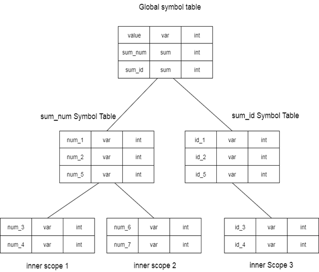

# $\fbox{Chapter 5: SYMBOL TABLE}$

## **Topic - 1: Basic Concepts**

### <u>Introduction</u>

- Symbol tables (ST) are used to store information about various identifiers.
- Used for checking what variables are declared, its scope etc.

### <u>Implementation</u>

#### Data structures use:

- Unordered list (for small amount of data)
- Linked list
- Hash table (most common)
- Binary search tree

### <u>Operations</u>

- **<u>Insert</u>:** This operation is used to push variable details to the table.
- **<u>Lookup</u>:** Used to initialize variable, check its attributes, check duplicates etc.

## **Topic - 2: Data Structures For ST**

### <u>Introduction</u>

- **<u>Global ST</u>:** A symbol table which can be accessed by all procedures & local ST.
- There can be nested reference to more symbol tables.

### <u>Example</u>

- For example, if a class contains methods which contains variables in them further, then nested reference to symbol tables might be as shown below.

- So, it can be stored in a hierarchical manner.
- Assume that in example image above, `sum_num` & `sum_id` are some functions/procedures with variables like `num_1` & `id_1` etc in them.

>**<u>NOTE</u>:**
>1. This hierarchical ST storage is done during semantic analysis.
>2. When a symbol is searched, it is searched in the current ST. If not found, it goes up to each parent for search.
>3. If a symbol isn't found even in parent symbol table, then its searched from the global ST.
