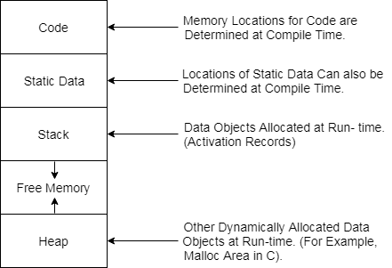

# $\fbox{Chapter 6: ADMINISTRATION}$

## **Topic - 1: Storage Organization**

### <u>Introduction</u>

- When execution of a program starts, it occupies a part of logical address space.
- OS maps logical addresses to physical addresses.

### <u>Subdivision Of Runtime Memory</u>

- Generated executable (code)
- Static data objects (static data)
- Dynamic data objects (heap)
- Automatic data objects (stack)

>**<u>NOTE</u>:**
>A machine byte consists of 4 bytes.

## **Topic - 2: Activation Record**

### <u>Introduction</u>

- **<u>Control stack</u>:** Runtime stack which tracks live/ongoing procedures.
- On assembly level, name of procedures are stacked to control stack when they become active & popped after being inactive.
- **<u>Activation record</u>:** Contains information that a running procedure will require to run.

### <u>Procedures</u>

- **<u>Return value</u>:** Returns a value to the procedure called.
- **<u>Actual parameters</u>:** Arguments to procedures.
- **<u>Control link</u>:** Pointer to activation record of the called procedure.
- **<u>Access link</u>:** Pointer to other activation records containing required data (non-local) there.
- **<u>Local data</u>:** Contains local data.
- **<u>Temporaries</u>:** Contains temporary cache data when evaluating expressions.
