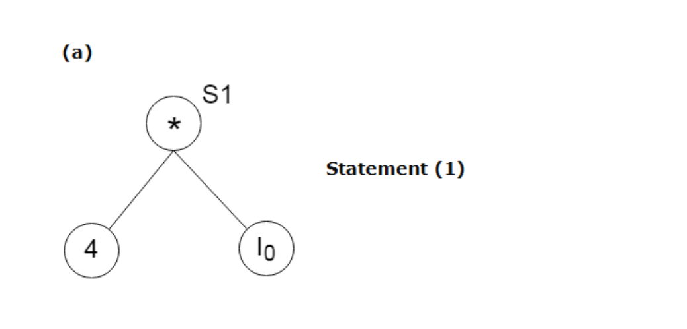
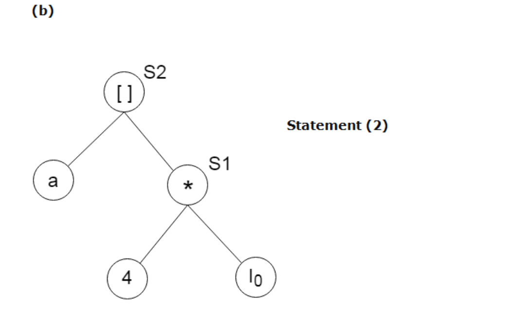
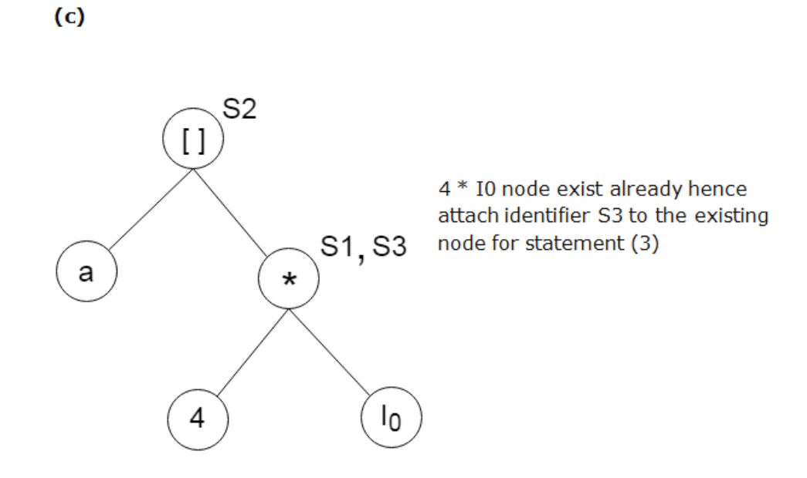
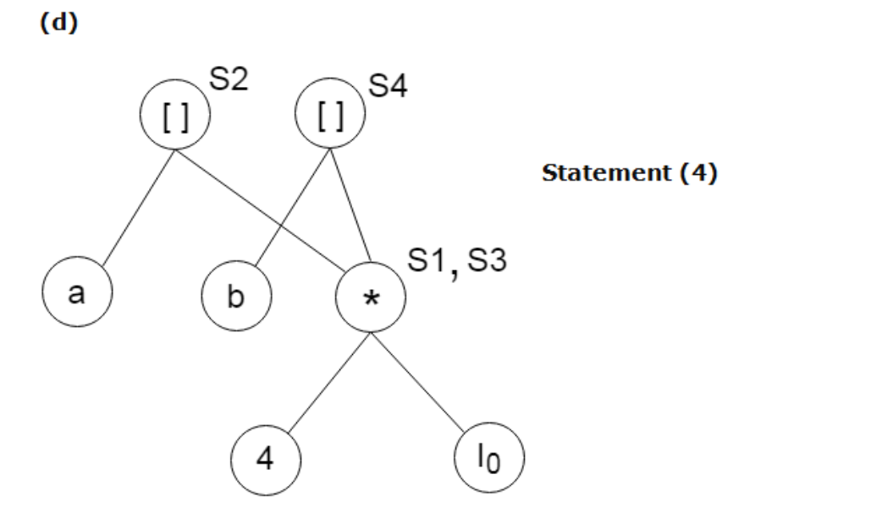
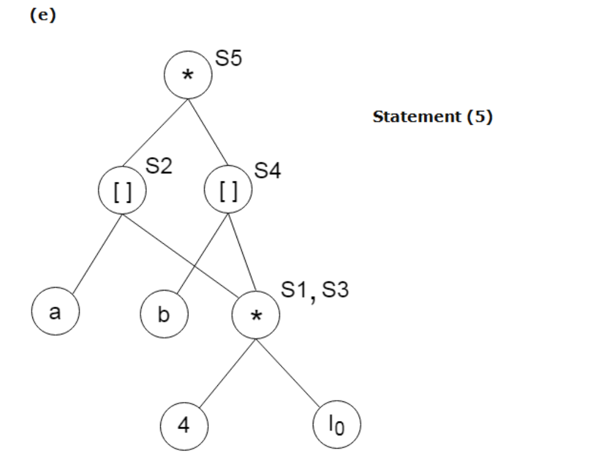
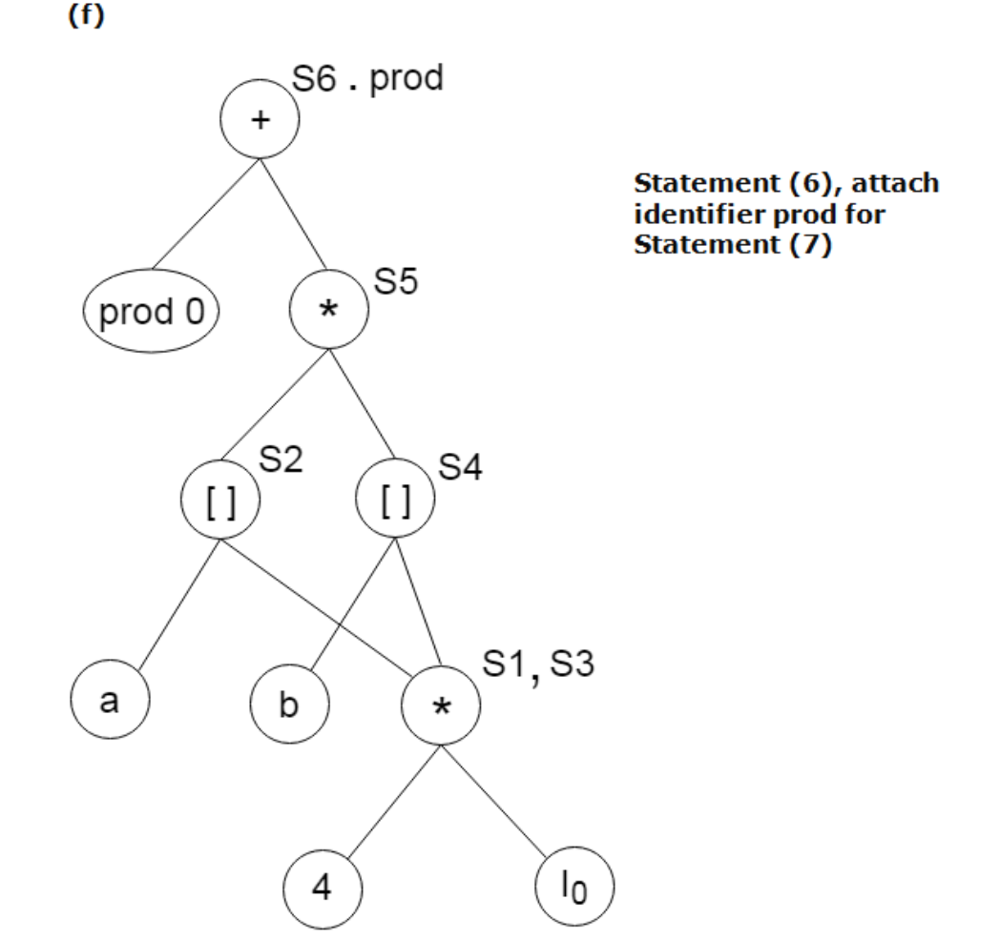
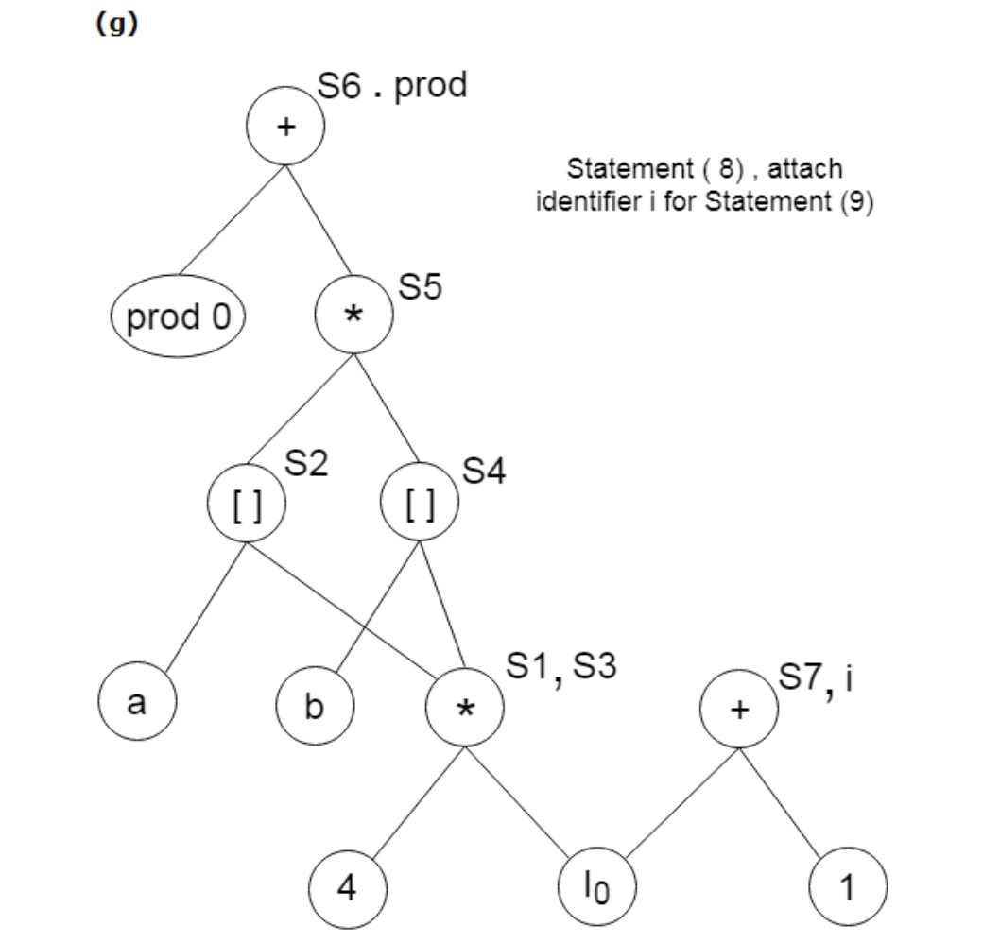
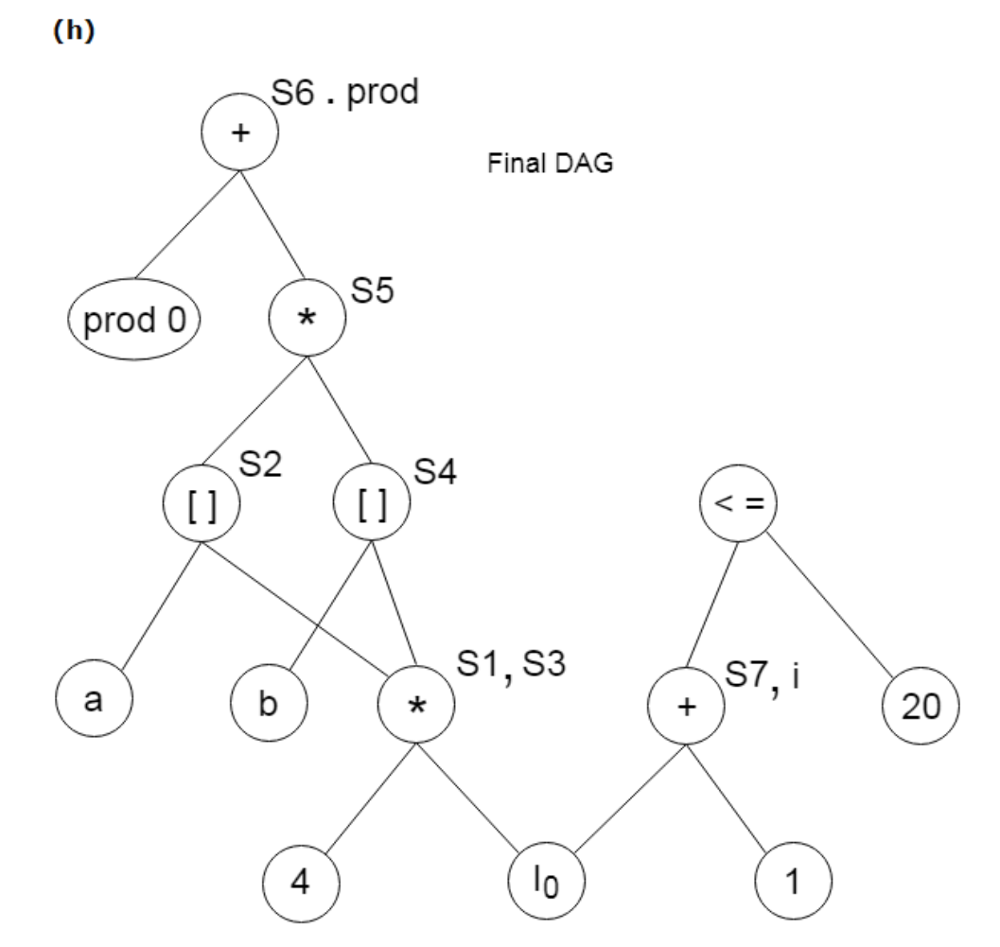
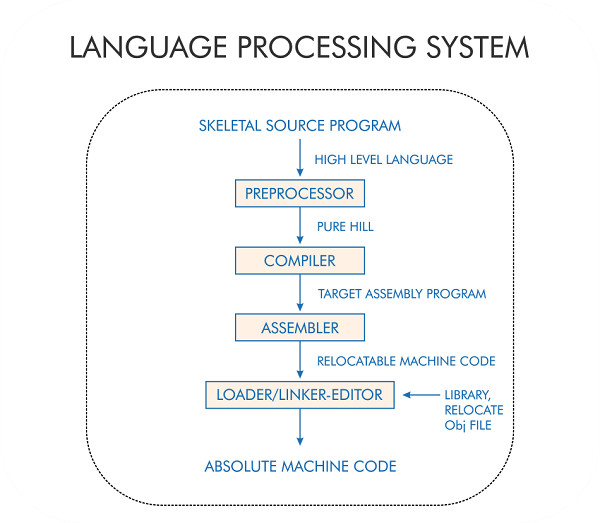

# $\fbox{Chapter 9: CODE OPTIMIZATION}$


## **Topic - 1: Machine-Independent Optimization**

### <u>Introduction</u>

- In machine-independent optimization, we optimize the intermediate code to get a naturally optimized target code.
- But we optimize only those codes here which doesn't involve memory locations or CPU registers.
- These changes might make it difficult to track back how the program was actually written.

#### Improvable bottlenecks:

- Using constants instead of variables
- Replacing copies of variables with constants (if unchanged).
- Replacing repeated expressions with their evaluated values.


### <u>Ways To Optimize Code</u>

1. Compile-time evaluation
2. Variable propagation
3. Dead code elimination
4. Code motion
5. Induction-variable elimination
6. Strength reduction


### <u>Variable Propagation</u>

- Some expression might have different variables among each other, but they might have same value.
- We replace them with one of those variable name.

#### Unoptimized:

```c
c = a*b;
x = a;

d = x*b+4;
e = a+6;
f = x/9;
g = a-3*x;
```

#### Optimized:

```c
c = a*b;
x = a;

d = a*b+4;
e = a+6;
f = a/9;
g = a-3*a;
```


### <u>Code Motion</u>

- Code motion optimization is used for bringing loop-irrelevant statements out of the loop to avoid multiple same evaluation.
- This technique is used specifically for loops.

#### Unoptimized:

```c
j = 10;

while (i<j) {value = 7; j++;}
```

#### Optimized:

```c
j = 10;
value = 7;

while (i<j) {j++;}
```


#### <u>Induction-Variable Elimination</u>

- **<u>Induction variable</u>:** A variable whose value in loop changes in predictable manner.
- This technique too is used specifically for loops.

```c
/* Unpredictable */

while (i<5)
{
	arr[i] = i*2;
}


/* Predictable */

while (i<5)
{
	arr[i] = i*2;
	i++;
}
```


### <u>Strength Reduction</u>

- Again, for loops only.
- In strength reduction, we replace expensive operations with cheaper ones.
- Expensive operations like multiplication & division cost more computation cost than addition & subtraction.
- And exponentiation is even more expensive than multiplication & division.

#### Unoptimized:

```c
for (int i=0; i<10; i++)
{
	int x = i*5;    // Multiplication on each iteration.
	arr[i] = x;
}
```

#### Optimized:

```c
int x = 0;

for (int i=0; i<10; i++)
{
	arr[i] = x;
	x += 5;        // Cheaper alternative.
}
```


## **Topic - 2: DAG Representation**

### <u>Introduction</u>

- **<u>DAG</u>:** Directed Acyclic Graph
- DAG data structure is used for breaking an expression into sub-expressions.
- So, it represents a clear picture of how expressions are computed dynamically.
- These are optimized as they use minimal required nodes.

#### Structure grouping:

1. **Leaf nodes -** Identifiers like variables or constants etc.
2. **Interior nodes -** At non-leaf nodes, we get operator symbols & the expression identifier(s).


### <u>Example</u>

#### Expression set:

```c
S1 = 4 * i;          // (a)
S2 = a[S1];          // (b)
S3 = 4 * i;          // (c)
S4 = b[S3];          // (d)
S5 = s2 * S4;        // (e)
S6 = prod + S5;      // (f)
prod = S6;
S7 = i + 1;          // (g)
i = S7;

if (i<=20) {goto(i);}    // (h)
```

#### Step-by-step construction:

1. `S1 = 4 * i;`



2. `S2 = a[S1];`



3. `S3 = 4 * i;`



4. `S4 = b[S3];`



5. `S5 = s2 * S4;`



6. `S6 = prod + S5;`



7. `S7 = i + 1;`



8. `if (i<=20) {goto(i);}`



>**<u>NOTE</u>:**
>1. Operands on left & right are written on left & right respectively.
>2. Expressions involving only `=` operator doesn't affect the DAG.
>3. Other than `=` operator, all other operators must be in DAG.


## **Topic - 3: Data Flow Analysis**

### <u>Global Data Flow Analysis</u>

- For optimizing code, some information about current block need to be passed to the next block in flow graph.
- Not entire code can be optimized by reading it just once, due to presence of both local & global variables.

>**<u>NOTE</u>:**
>Compilers are faster than interpreter despite going through the code multiple times because the code is loaded into RAM for being read.


### <u>Eliminating Useless Assignments</u>

```c
a = 1;
b = 2;
c = 3;        // Useless statement...

if (...) x = a + 5;
else x = b + 4;

c = x + 1;    // ...due to this.
```

- We can also evaluate the expression for further more optimization.


## **Topic - 4: Phases Of Lexical Analysis**

### <u>Introduction</u>

- Preprocessor directives are worked on first, before compilation starts.




### <u>Compilation</u>

- A compiler lists all the errors & warnings at once, unlike interpreters.
- Error handler & symbol table manager are implemented at each stage of a compiler.
- **<u>Analysis stage</u>:** Includes lexical analyzer, syntax analyzer, semantic analyzer & intermediate code generation.
- **<u>Synthesis stage</u>:** Includes code optimization & target code generation.
- Machine dependent & language independent.
- It's not necessary to build a compiler from scratch, as we can do retargeting.
- **<u>Retargeting</u>:** Borrowing another compiler's intermediate code generator for making a compiler.
- Symbol tables are used in each phase for referring to the identifier causing trouble & displaying error accordingly.


### <u>Lexical Analysis</u>

- Lexical analyzer scans the input code character-by-character.
- And that is read left-to-right.
- Also it removes unrequired characters.
- Then the lexemes are passed to the syntax analyzer.


- **<u>Token</u>:** You know what a token is, but remember that it can't be broken down for representing something.
- **<u>Lexeme</u>:** A sequence of characters that represent a token.
- **<u>Patterns</u>:** Set of rules that scanner follows to read matches of tokens.


### <u>Input Buffering</u>

- **<u>Input buffering</u>:** Loading contents in disk being read to RAM.
- **<u>One-buffer scheme</u>:** Using two pointers to read buffer, where one pointer traverses & stores tokens until delimiter is encountered, whereas another one tracks trouble point.


- Its disadvantage is that if using static buffer, the string might be longer than the buffer.
- So previous data in buffer might be required to be deleted.
- We use DFA & regular expressions very often for parsing.


### <u>Lexical Operations</u>

- Sometimes the lexical analyzer couldn't recognize a lexeme & thus applies some techniques to know programmer's intention at error point.
- There are a certain methods to know that as given below.

#### Guessing lexical token:

- Deleting characters from left/right or both.
- Exchanging two characters.
- Adding characters to either side of the token.
- Changing certain characters.

>**<u>NOTE</u>:**
>These errors are repaired in "panic mode".
