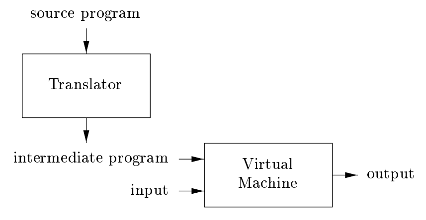
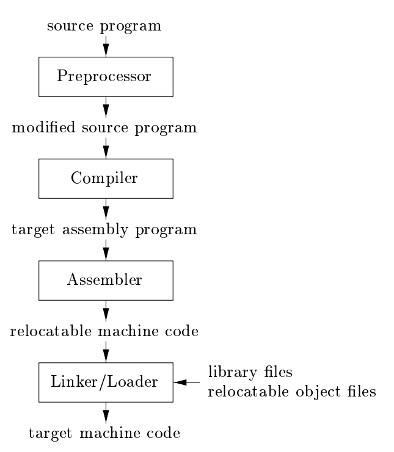
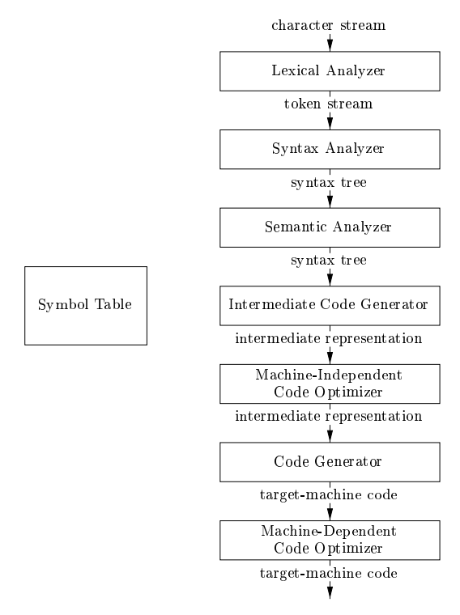

# <u>Chapter 1</u>: INTRODUCTION


## **Topic – 1: Language Processors**

- **<u>Source language</u>:** Language which is **read first** by the
  compiler.
- **<u>Target language</u>: Final language** the source language is
  converted into.
- Interpreters **directly** produce outputs without any **intermediate
  target program**.
- **Machine language** produced by **target program** in **compilers**
  are faster than **interpreters** in mapping inputs to outputs.
- **Java** combines **compilation** & **interpretation** as shown below.



- **Java** source programs are compiled into **intermediate form**
  called **bytecode**.
- **Bytecode** is then interpreted by **virtual machine**.
- **Bytecodes** compiled on one machine can be **interpreted** in
  another.
- **Just-in-time** compilation fastens Java program execution by
  compiling **bytecodes** further to **machine language** during
  **compilation** itself.



- **<u>Preprocessor</u>:** Collects the source program.
- **<u>Macros</u>:** Short programs
- Compiler often converts **modified source program** to assembly
  program, as their output is easier to debug.
- Programs if compiled in **pieces** by compiler, their machine codes
  are linked using **linker** along with relevant **objects** &
  **library files**.
- Linker resolves **clashing memory addresses issue** among the compiled
  file, like one file pointing to location pointed by another file.
- **<u>Loader</u>:** Reserves memory space for **executable object
  files** for execution.

> **<u>Note</u>!**
> HLL stands for high-level language.
> Similarly, LLL means low-level language.
> A compiler that translates a HLL into another HLL is known as
source-to-source translator.


## **Topic – 2: Structure Of Compiler**

### <u>Analysis</u>

- **Source program** to **target program** mapping involves
  ***analysis*** & ***synthesis***.
- Analysis stage creates an **intermediate program** using the
  pre-defined grammatical structure.
- Analysis is also known as **front end** of the compiler.
- It also checks if **source program** is syntactically & semantically
  **correct** or **not**.
- If **not**, provides **appropriate message** to user for correcting
  it.
- Also, it stores **information** from **source program** in form of
  **symbol table**.
- These information are then passed to **synthesis** part.
- Basically, **analysis** is all about **checking the syntax** & storing
  necessary data before passing data for **target program**.


### <u>Synthesis</u>

- Also known as **back end** of the compiler.
- It converts the **intermediate program** & information in **symbol
  table** into target program.


### <u>Phases In Compiler</u>



- It’s a more **descriptive** representation of phases.
- In real, **multiple phases** may be grouped under **one phase**.
- And the phases among the groups might **not** be explicitly made, they
  might exist **by default**.
- For example, if **C** is used for making a **compiler**, then it **by
  default** covers some of the phases in the diagram.
- The ***machine-independent optimization*** stage is optional.


## **Topic – 3: Phases Of Compiler**

### <u>Lexical Analysis</u>

- **1<sup>st</sup>** **phase** of compiler.
- Also known as ***scanning***.
- **Lexical analyzer** reads & groups the characters in **source
  program** into meaningful sequences.
- These sequences are known as ***lexemes***.
- A token is generated for each **lexeme** in following form.

```
<token_name, attribute_value>
```
