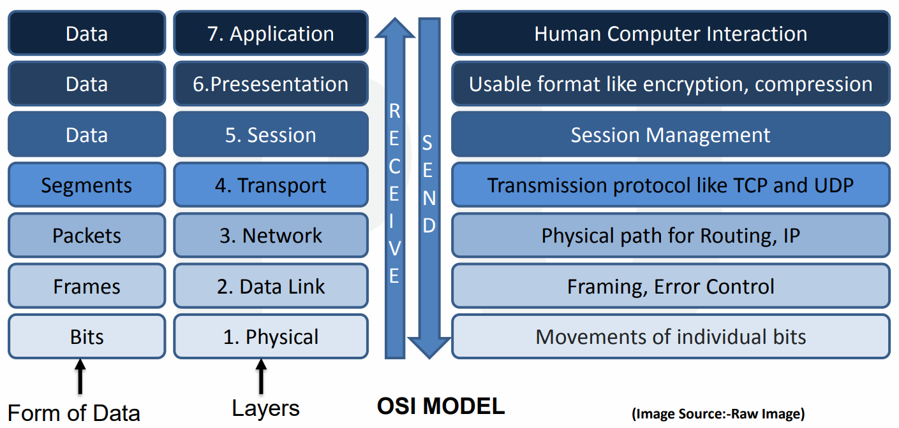
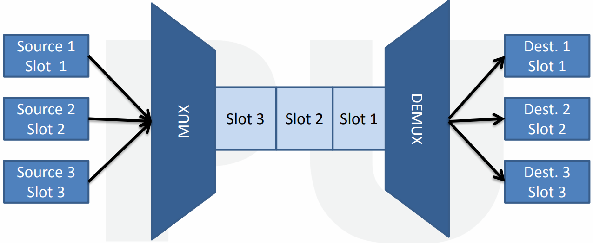

# $\fbox{Chapter 1: COMMUNICATION COMPONENTS}$

## **Topic - 1: Basic Concepts**

### <u>Introduction</u>

- **Data** is sometimes also called as **input**.
- **<u>Information</u>:** Processed form of data.
- **<u>Data communication</u>:** Exchange of data b/w two devices via transmission medium.

### <u>Data Communication Components</u>

- Sender
- Receiver
- Medium
- **Wired examples -** Twisted pair wire, coaxial cable, fiber-optic cable etc.
- **Unwired examples -** Laser waves, radio waves etc.
- Message
- **<u>Protocol</u>:** Set of rules during data communication.
- Two devices must have same protocols in order to communicate.
- Otherwise, they can connect but can’t interact.

### <u>Data Flow</u>

- **<u>Simplex</u>:** Mainframe (transmitter) to station (receiver) unidirectional communication.
- **<u>Half-duplex</u>:** Station to station bidirectional communication, but if one is transmitting then at that time the other one can only receive.
- **<u>Full-duplex</u>:** Station to station bidirectional communication & both can receive or transmit at the same time.

## **Topic - 2: Computer Network**

### <u>Introduction</u>

- **<u>Network</u>:** A system of computers connected to each other.
- **<u>System</u>:** A real or virtually isolated space.
- It is done primarily for sharing of information.
- Internet is one kind of network.

### <u>Advantages</u>

- Internet access
- Entertainment
- **<u>Flexible access</u>:** Accessing files through any computer in common network.
- Concurrent accesses

## **Topic - 3: Topology**

### <u>Introduction</u>

- **<u>Topology</u>:** Geometric representation of how the computers are connected to each other.
- **Types of topologies -** Bus, mesh, star, ring, hybrid etc.

### <u>Bus Topology</u>

- **<u>Backbone cable</u>:** See the horizontal line in figure.
- **<u>Tap</u>:** A three way connecting device linking drop lines to main cable.
- There is limit to length of both drop line & main cable.

#### Advantages:

- Simple installation
- Less cable requirement

#### Disadvantages:

- Difficulty detecting faults.
- Not scalable due to limit.

### <u>Star Topology</u>

- **<u>Central device</u>:** Device to which all other devices are connected.
- No direct communication among devices.
- Here, central device is a hub.

#### Advantages:

- Less costly
- Easy installation
- Less cables required
- If one connection fails then others will remain unaffected.
- Easy detecting faults

#### Disadvantages:

- If hub fails, then whole system goes down.
- Hub consumes a lot of energy.
- Hub also requires frequent maintenance.

### <u>Ring Topology</u>

- Each device has **two** point-to-point connections.
- In ring topology, we use a repeater.
- **<u>Repeater</u>:** A device which forwards the data to next adjacent device if it is not meant for it.

#### Advantages:

- Easy installation
- Scalability

#### Disadvantages:

- If one device fails then data won’t move forward.
- Data trafficking (being circular)

### <u>Mesh Topology</u>

- Many-to-many style connection.
- **<u>Committed connection</u>:** Mesh b/w two devices.

$$ Total\;mesh\;connections\;=\;\frac{n(n-1)}{2} $$

#### Advantages:

- No network trafficking
- Stable/durable
- Safe
- Easy fault detection

#### Disadvantages:

- Complex
- Massive number of I/O ports
- Expensive scalability

### <u>Hybrid Topology</u>

- Combination of multiple topologies.

#### Advantages:

- Covers shortcomings
- Scalability

#### Disadvantages:

- Difficulty detecting faults
- Difficult setup
- Expansive

## **Topic - 4: Protocols**

- Required for secured communication.
- **FTP** is used for file sharing.
- **SMTP** is used by email.
- **Telnet** is used for virtual terminals.
- **<u>Virtual terminal</u>:** Web-based app allowing online money transaction.

## **Topic - 5: OSI Model**

### <u>Introduction</u>

- **<u>OSI model</u>:** Open Source Interconnection Model
- Contains 7 layers.
- Defines how data is transferred from one computer to another.
- Data is passed using **NIC**.
- **<u>NIC</u>:** Network interface card.
- Was introduced (1984) by ISO.
- **<u>ISO</u>:** International Organization for Standardization.

### <u>7 Layers</u>

### <u>Physical Layer</u>

- Movement of bits from one hop (device) to the next.
- **<u>Hop</u>:** Node
- **<u>Frame</u>:** Sequence of bits.
- Physical layer converts frames into signals.

### <u>Data Link Layer</u>

- Does physical addressing & framing (packeting).
- **<u>Physical addressing</u>:** Assigns MAC addresses to data packets (both sender & receiver).
- **<u>Framing</u>:** Dividing data into frames.
- Physical link is possible due to presence of NICs.

### <u>Network Layer</u>

- Sends & receives data segments through logical addressing.
- **<u>Logical address</u>:** Assigns IP addresses to data packets (both sender & receiver).

### <u>Transport Layer</u>

- Ensures that data packets are sent & received properly.
- Uses transmission protocols.
- Again error is controlled here.

### <u>Session Layer</u>

- Ensures **security** via authorization & authentication.
- Firewall works at this level.

### <u>Presentation Layer</u>

- It does 3 things, that are translation, encryption & compression of data.

### <u>Application Layer</u>

- Protocols are defined at this layer.

## **Topic - 5: Transmission Media**

### <u>Introduction</u>

- Media is plural of medium.
- **It is of two types -** Guided & unguided transmission medium.
- Uses EM signals to send data.
- Carries bit information in through LAN.
- In copper-based network, bits are electrical signals.
- In fiber-based network, bits are light pulses.

### <u>Causes of Transmission Impairment</u>

- **<u>Attenuation</u>:** Continuous loss of energy when signal is travelling.
- **<u>Distortion</u>:** Signals going in different directions.
- **<u>Noise</u>:** Unwanted noise is produced when data is transmitted.

### <u>Twisted Pair Cable</u>

- Cheap
- Easy to mount.
- Lightweight
- Frequency range is $[0,\;3.5\;KHz]$

#### Unshielded twisted pair:

- **Category 1 -** Used in telephone lines (low-speed).
- **Category 2 -** Upto 4Mbps
- **Category 3 -** Upto 16Mbps
- **Category 4 -** Upto 20Mbps (long range)
- **Category 5 -** Upto 200Mbps
- **<u>Advantages</u>:** High speed LAN, same as twisted pair.
- **<u>Disadvantages</u>:** Used for short distances, attenuation etc.

#### Shielded twisted pair:

- In this, mesh covers wires allowing high rate of transmission.
- **<u>Advantages</u>:** Easy installation, higher transmission rate etc.
- **<u>Disadvantages</u>:** Expensive, higher attenuation etc.

### <u>Coaxial Cable</u>

- Used in television chord.
- Frequency is higher than twisted cable.

- Middle core transmits data & shield prevents EM interference.

### <u>Fiber Optic</u>

- Core transmits data via **electrical signals** & cladding via light pulses.
- The plastic jacket prevents extreme temperatures & EM interference.
- It is faster than copper wires.

### <u>Unguided Transmission Medium</u>

- Data are transmitted in form of **EM waves**.
- **It can travel in 3 ways -** Ground propagation, sky propagration & line-of sight propagation.
- **<u>Line-of-sight propagation</u>:** Sender to receiver direct path.

### <u>Radio Waves</u>

- Emitted to free space in all directions (omni-directional).
- Frequency range is $[1\;kHz,\;3\;kHz]$
- Receiving & sending antenna need not to be aligned.
- For example, FM radio etc.

### <u>Microwaves</u>

- Antennas must be aligned precisely.
- Works on line-of-sight.
- Unidirectional
- Curvature of earth might be a barrier sometimes to it.

### <u>Infrared</u>

- Frequency range is $[300\;GHz,\;400\;THz]$
- Infrared also works on line-of-sight.
- Can’t penetrate walls & is affected by sunlight.
- Thus used in short range communications.

## **Topic - 6: Types Of Computer Network**

### <u>Introduction</u>

- **Types of CN -** PAN, LAN, MAN & WAN
- **Types of LAN -** Wired & wireless

### <u>Types of wireless LAN</u>

- **<u>Peer-to-peer (ad-hoc) mode</u>:** Devices can communicate with each other.
- **<u>Infrastructure mode</u>:** Devices communicate through a central node.

### <u>Virtual LAN (VLAN)</u>

- In this, devices that are part of **separate** wired LAN networks can be connected together.
- Network configuration is done through software called VLAN controller.

### <u>Metropolitan Area Network (MAN)</u>

- Average transmission speed.
- Also used to set up interconnection among multiple LANs.

### <u>Wide Area Network</u>

- Speed is lower than MAN.
- Sets interconnection among multiple LANs or MANs.
- It can even set hybrid interconnections of LAN & WAN.

### <u>Differences Between Various CNs</u>

- Definition
- Ownership
- Speed
- Delay
- Congestion
- Fault tolerance
- Maintenance

### <u>Bandwidth Utilization Techniques</u>

- **<u>Bandwidth</u>:** Capacity to transfer data in bits per second (Bps).

## **Topic - 7: Networking Techniques**

### <u>Techniques</u>

- Multiplexing
- Without multiplexing

### <u>Multiplexing</u>

- Coaxial cables & optical fibers send one signal at a time, resulting in wastage of bandwidth.
- Multiplexing solves this issue by sending multiple signals at a time.
- Or rather multiple signals into one.
- Signals come from multiple sources & travel through one channel as one signal.
- Then they dissemble (demux) to reach multiple destinations at last.
- Multiplexing is also known as **muxing**.

#### Types of multiplexing:

- Frequency division multiplexing
- Wavelength division multiplexing
- Time division multiplexing

### <u>Frequency Division Multiplexing (FDM)</u>

- **Receivers** **multiplex** frequencies & transmitters demultiplex frequencies.
- Frequencies are combined, then separated using muxing & demuxing devices.
- It uses electrical signals.
- **<u>Advantages</u>:** No synchronization required b/w transmitter & receiver.
- **<u>Synchronization</u>:** Devices working at same speed.
- **<u>Disadvantages</u>:** Large bandwidth channel is required.

#### Applications of FDM:

- FM & AM radio.
- First generation cellular telephones.
- Television broadcasting.

### <u>Wavelength Division Multiplexing (WDM)</u>

- Similar to FDM.
- It is however an analog technique & uses optical signals.
- It is the most effective & popular technique used.
- Optical signals of different wavelengths & colours are combined & separated.
- **<u>Advantages</u>:** Simultaneous bidirectional transmission, low cost, reduced signal loss.

### <u>Time Division Multiplexing (TDM)</u>

- Signals for different destinations are sent one-by-one.
- Different time slots are allocated to users at different destinations.
- The time interval is so less however that no user notices the delay.

### <u>Spread Spectrum Technology (SST)</u>

#### Problems with wireless system:

- **<u>Interference</u>:** When one signal is transmitted near another.
- **<u>Interception</u>:** Someone can access confidential information.

#### Solution:

- Broadening the narrow band signal.
- Spreading signal’s frequency.

#### Types of SST:

- Frequency hoping spread spectrum (FHSS)
- Direct sequence spread spectrum (DSSS)

---
