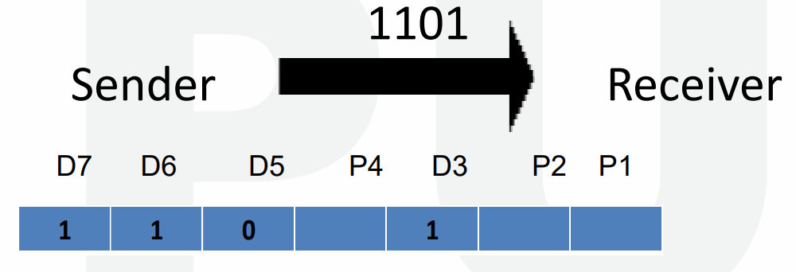

# $\fbox{Chapter: DATA LINK LAYER}$

### <u>Error Detection & Correction</u>

#### Data link layer:

- Each frame must be distinguishable from each other.
- Data is between header & trailer.
- **<u>Header</u>:** A code which helps in transmitting data to next node.
- **<u>Trailer</u>:** A code used for error detection & correction.

#### Protocols at data link layer:

- Byte oriented protocol
- Bit oriented protocol

#### Sample frame of data link layer:

- **<u>Flag</u>:** A fixed pattern used for indicating starting & ending of a flag.
- Header contains MAC address of source & destination + control flow info.

### <u>Byte Oriented Protocol</u>

- This protocol reads data in terms of bytes.
- In this, data contains certain control patterns & thus extra bytes are stuffed into it in order to avoid conflict.
- We call these stuffed data as ESC.
- **<u>ESC</u>:** Extra stuffed characters.
- If ESC is found in data, then additional ESCs are stuffed. So that when ESC-Flag or ESC-ESC pattern is noticed, receiving device can understand that it is part of data.

### <u>Bit Oriented Protocol</u>

- When code $0111\;1110$ appears, it is mistaken as a flag.
- So after each 5th $1$, a $0$ is stuffed which is removed at receiver’s end.

### <u>Types of Errors</u>

- **<u>Single bit error</u>:** ***\*As the name says.\****
- **<u>Burst error</u>:** Errors in which more than two bits are changed.

### <u>Error Correction</u>

- For correcting the error, some extra bits of data are sent.

### <u>Detection v/s Correction</u>

| Detection                                                        | Correction                                                                       |
| ---------------------------------------------------------------- | -------------------------------------------------------------------------------- |
| Not much difficult.                                              | Is difficult.                                                                    |
| Just detects if error exists or not, magnitude is not a concern. | Gotta know the size & location of the error with some mathematical calculations. |

### <u>Error Correction Methods</u>

- Forward error correction
- Retransmission
- XORing

### <u>Forward Error Correction Method</u>

- Receiver guesses the correct data seeing the redundant bits.
- **<u>Redundant bits</u>:** Bits inserted into original data in order to avoid errors.
- This method is used generally in wireless transmission cases due to high burst error length.
- Refer to the example below to understand better.

$$ Data\;=\;0011\;=\;0\;0\;1\;1 $$

- After adding redundant bits:

$$ Data\;=\;000\;000\;111\;111 $$

- So, more $0$s in a pack of 3 (pack size may vary) denotes $0$.
- And similarly, more $1$s in a pack denotes value as $1$.
- Let’s say that $000\;000\;111\;111$ becomes $001\;000\;111\;111$.
- Third letter of first pack is changed as an error.
- But because majority values in pack are $0$, it is considered $0$.
- Hence, $001\;000\;111\;111\;=\;0\;0\;1\;1\;=\;0011$.

### <u>Retransmission Method</u>

- This method is used when error length is less.
- Receiver detects if an error is occurring or not.
- If yes, then requests the transmitter for resending the data.
- When the data is found error free, the process is terminated.

### <u>Redundancy Codes</u>

#### Types of redundancy coding schemes:

- Block coding
- Convolution coding

### <u>XORing</u>

- This is done by bitwise XOR operation between 2 consecutive transmissions of same data.
- Refer to example below to know better.

$$ Data\;1\;=\;0010,\;Data\;2\;=\;0010 $$

- All $0$ bits means no error.

$$ (Data 1)\;XOR\;(Data 2)\;=\;0000 $$
$$ Data\;1\;=\;1011,\;Data\;2\;=\;1001 $$

- Even one $1$ found means error.

$$ (Data 1)\;XOR\;(Data\;2)\;=\;0010 $$

### <u>Block Coding</u>

- The code is divided into group of $k-bits$.
- **<u>Data words</u>:** ***\*k above\****
- And then redundancy bits are added to each group, so:

$$ n\;=\;k\;+\;r $$

- **<u>Code word</u>: *\*n above\****
- Can’t detect error of more than $2$ bits.

- For example, refer to table below.

- Let’s say that $k=2$, $n=3$ as shown above in the table.
- For $01 \rightarrow 011$, $01$ is detected and thus is passed successfully.
- But if it is $000$ instead, the error is of more than $2-bits$ making it undetectable.
- It is undetected because $000$ exists in the table for another value.
- Another example shown below.

- In this, user receives a corrupted codeword instead $01011$.
- Then user manually matches it with each codeword from table, finding the difference being of $2-bits$.
- Whereas the match with second codeword is of $1-bit$ difference.
- And comes to know that in which codeword the error was.

### <u>Linear Block Codes</u>

- Subset of block codes.
- In this, when we calculate XOR of two valid codewords, we get another valid codeword.

### <u>Parity Check Code</u>

- A type of simple block code.

- Hence, number of digits in codeword is one more than data-word.

$$ n\;=\;k\;+\;1 $$

- Value of syndrome is $0$ if $1$s in codeword are even (including parity bit).
- And for odd $1$s it is $1$.
- The parity bit is chosen the same way.

### <u>Cyclic Redundancy Check (CRC)</u>

- Method used to check if any accidental change is made to signal during transmission.
- This error occurs in communication channel.
- There is a generator polynomial on sender’s and receiver’s side, telling how data was transmitted.
- For example, refer to it below.

$$ Message\;received:\;1010000 $$

- Given generator polynomial: $x^{3}\;+\;1$.

$$ x^{3}\;+\;1 $$
$$ =\;x^{3}\;+\;x^{0} $$
$$ =\;1.x^{3}\;+\;1.x^{0} $$
$$ =\;1.x^{3}\;+\;0.x^{2}\;+\;0.x^{1}\;+\;1.x^{0} $$
$$ =\;CRC\;(1001) $$

- CRC is of $4-bits$.
- So, append $4\;-\;1\;=\;3$ zeroes in end of our received message.
- $@$ means XOR.

### <u>Checksum</u>

- Data is divided into equal number of bits.
- When before being sent, are segments are complemented by $1$ and added, and then their sum is complemented.
- This gives us checksum, which is sent along the data segments.
- After the receiver receives them, same procedure is applied to decode them.
- If it is zero, only then accepted.

### <u>Haming Code</u>

#### Sender’s end:

- No limit on the length of data to be checked.
- Used for detecting & correcting single bit errors only.
- **<u>Parity bits</u>:** All bit positions with serial number equal to power of $2$.
- **<u>Data bits</u>:** Bit positions not equal to power of $2$.

- For $P_{1}$: $1-bit$ is checked, $1-bit$ is skipped, ***\*repeat\**** ($1$,$3$,$5$,$7$)
- For $P_{2}$: $2-bit$ is checked, $2-bit$ is skipped, ***\*repeat\**** ($2$,$3$,$6$,$7$)
- For $P_{4}$: $4-bit$ is checked, $4-bit$ is skipped, ***\*repeat\**** ($4$,$5$,$6$,$7$)

#### Receiver’s end:

- If value of all parity bits at receiver’s end is zero, then its free of error.
- Else it is not.

#### Correction:

1. Parity bits are written together in series.

2. This combination is converted into decimal value.
3. Then the bit at serial number equal to decimal number obtained, is inverted.

### <u>Flow & Error Control</u>

- Data link layer ensures flow & error control.
- **<u>Flow control</u>:** Controlling amount of unacknowledged data to be sent by sender.
- Error at data link layer is controlled by retransmission of data.
- Protocols at this level are implemented using programming languages.

- **<u>Noiseless channel</u>:** Channel through which, no data are corrupted while travelling.
- **<u>Noisy channel</u>:** ***\*Now you know\****
- **<u>ARQ</u>:** Automatic repeat request

### <u>Noiseless: Simplex Protocol</u>

- Different data frames are sent parallelly, bit by bit, as separate events.
- And definitely, these frames take time to reach to the receiver.

### <u>Noisy: Stop and Wait ARQ</u>

- Error correction is done by keeping a copy of the frame, which is
  sent when the acknowledgement time expires.

- These frames being sent are given serial numbers.

- Acknowledgement is given frame by frame & next frame is sent only
  after the acknowledgment of previous frame.

- Frame is resent even when the acknowledgment fails to reach
  the sender.

- After getting the acknowledgement, the copy of frame is deleted.

- Bandwidth of channel in “Stop and Wait ARQ” is around 1 Mbps.

- 1 bit of data takes around 20 milliseconds to be sent.

### <u>Noisy: Sliding Window Protocols (ARQ)</u>

- Same as stop and wait but sender can send multiple frames at a
  time.

- Also known as windowing.

- This protocol is also used in TCP.

- These messages however passed through buffers.

- Sender has a buffer called sending window & receiver has a
  buffer called receiving window.

- **<u>Modulo-N</u>:** All preceding whole numbers to a given number
  N.

- **<u>Window size</u>:** The number of frames a sending or
  receiving window can store.

- These frames stored in buffers are given sequence numbers as per
  modulo-N in binaries, N is the number of frames.

- Or simply saying, they are given sequence numbers just like
  indexes in programming.

For example:

#### Types:

### <u>Sliding Window Protocol: Go Back N (ARQ)</u>

- In Go Back N protocol; if even a single frame is corrupted
  or lost, then all frames are resent.

- The sending frame in it is N, whereas receiving frame is
  1.

- It also works on the time expiration principle.

### <u>Sliding Window Protocol: Selective Repeat (ARQ)</u>

- In this, the size of sender and receiver window are same.

- **<u>Sliding window size</u>:** Number of frames that could be sent
  at a time.

- If a corrupt frame is received, then frames are not
  discarded immediately.

- Rather a negative acknowledgement is sent when a frame mismatches.

- And then that particular frame is resent immediately, without
  waiting for the expiration time.

---