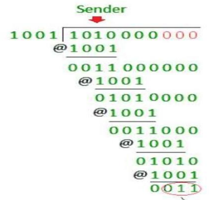

**DATA LINK LAYER & MEDIUM ACCESS SUB-LAYER**

**<u>Error Detection & Correction</u>**

Data link layer:-

- Each frame must be **distinguishable** from each other.

- Data is between header & trailer.

- **<u>Header</u>:** A code which helps in transmitting data to next
  node.

- **<u>Trailer</u>:** A code used for error detection & correction.

Protocols at data link layer:-

- Byte oriented protocol

- Bit oriented protocol

Sample frame of data link layer:-

- **<u>Flag</u>:** A fixed pattern used for indicating starting & ending
  of a flag.

- Header contains **MAC address** of source & destination **+**
  **control flow info**.

**<u>Byte Oriented Protocol</u>**

- This protocol reads data in terms of **bytes**.

- In this, data contains certain **control patterns** & thus **extra
  bytes** are stuffed into it in order to avoid conflict.

- We call these stuffed data as **ESC**.

- **<u>ESC</u>:** Extra stuffed characters.

- If ESC is found in data, then **additional ESCs** are stuffed. So that
  when **ESC-Flag** or **ESC-ESC** pattern is noticed, receiving device
  can understand that it is part of data.

**<u>Bit Oriented Protocol</u>**

- When code **0111 1110** appears, it is **mistaken** as a **flag**.

- So after each **5th** 1, a **0** is stuffed which is
  removed at receiver’s end.

**<u>Types of Errors</u>**

- **<u>Single bit error</u>:** ***\*As the name says.\****

- **<u>Burst error</u>:** Errors in which more than two bits are
  changed.

**<u>Error Correction</u>**

- For correcting the error, some extra bits of data are sent.

**<u>Detection v/s Correction</u>**

| **Detection** | **Correction** |
|----|----|
| **Not much difficult.** | **Is difficult.** |
| **Just detects if error exists or not, magnitude is not a concern.** | **Gotta know the size & location of the error with some mathematical calculations.** |

**<u>Error Correction Methods</u>**

- Forward error correction

- Retransmission

- XORing

**<u>Forward Error Correction Method</u>**

- Receiver guesses the correct data seeing the **redundant bits**.

- **<u>Redundant bits</u>:** Bits inserted into original data in order
  to avoid errors.

- This method is used generally in wireless transmission cases due to
  high burst error length.

- **For example:**

**Data = 0011 = 0 0 1 1**

**After adding redundant bits, data = 000 000 111 111**

- So, more **0s** in a pack of **3** (pack size may vary) denotes **0**.

- And similarly, more **1s** in a pack denotes value as **1**.

**Let’s say that 000 000 111 111 becomes 001 000 111 111**

**Third letter of first pack is changed as an error.**

**But because majority values in pack are 0, it is considered 0.**

**Hence, 001 000 111 111 = 0 0 1 1 = 0011**

**<u>Retransmission Method</u>**

- This method is used when **error length** is less.

- Receiver detects if an error is occurring or not.

- If yes, then **requests** the transmitter for resending the data.

- When the data is found error free, the process is terminated.

**<u>Redundancy Codes</u>**

Types of redundancy coding schemes:-

- Block coding

- Convolution coding

**<u>XORing</u>**

- This is done by **bitwise XOR** operation between 2 consecutive
  transmissions of same data.

- **For example:**

**Data 1 = 0010, Data 2 = 0010**

**Now, (Data 1) XOR (Data 2) = 0000 \[All 0 bits means no error\]**

**Data 1 = 1011, Data 2 = 1001**

**Now, (Data 1) XOR (Data 2) = 0010 \[Even one 1 found means error\]**

**<u>Block Coding</u>**

- The code is divided into group of **k-bits**.

- **<u>Data words</u>:** ***\*k above\****

- And then redundancy bits are added to each group, so **n = k + r**

- **<u>Code word</u>: *\*n above\****

- **Can’t** detect error of more than **2 bits**.

- **For example:**

**Let’s say that k=2, n=3 as shown above in the table.**

**For 01 -\> 011, 01 is detected and thus is passed successfully.**

**But if it is 000 instead, the error is of more than 2-bits making it
undetectable.**

**It is undetected because 000 exists in the table for another value.**

- **Another example:**

**In this, user receives a corrupted codeword instead 01011.**

**Then user manually matches it with each codeword from table, finding
the difference being of 2-bits.**

**Whereas the match with second codeword is of 1-bit difference.**

**And comes to know that in which codeword the error was.**

**<u>Linear Block Codes</u>**

- Subset of **block codes**.

- In this, when we calculate **XOR** of two valid codewords, we get
  another valid codeword.

**<u>Parity Check Code</u>**

- A type of **simple block code**.

- Hence, number of digits in **codeword** is one more than **dataword**.

**n = k + 1**

- Value of **syndrome** is **0** if **1s** in codeword are even
  (including **parity bit**).

- And for **odd 1s** it is **1**.

- The parity bit is chosen the same way.

**<u>Cyclic Redundancy Check (CRC)</u>**

- Method used to check if any **accidental change** is made to
  **signal** during transmission.

- This error occurs in **communication channel**.

- There is a **generator polynomial** on sender’s and receiver’s side,
  telling **how** data was transmitted.

- **Example:**

**Message received: 1010000**

**Given generator polynomial: x3 + 1**

**x3 + 1 = x3 + x0 = 1.x3 +
1.x0 = 1.x3 + 0.x2 + 0.x1 +
1.x0 = CRC (1001)**

**CRC is of 4-bits.**

**So, append 4 - 1 = 3 zeroes in end of our received message.**

**@ means XOR:**

**<u>Checksum</u>**

- Data is divided into **equal** number of bits.

- When before being sent, are segments are **complemented by 1** and
  **added**, and then their **sum is complemented**.

- This gives us **checksum**, which is sent along the data segments.

- After the receiver receives them, **same procedure** is applied to
  decode them.

- If it is zero, only then **accepted**.

**<u>Haming Code</u>**

Sender’s end:-

- No limit on the **length** of data to be checked.

- Used for detecting & correcting **single bit errors** only.

- **<u>Parity bits</u>:** All bit positions with serial number equal to
  **power of 2**.

- **<u>Data bits</u>:** Bit positions **not** equal to power of 2.

- For **P1**: **1-bit** is checked, **1-bit** is skipped,
  ***\*repeat\**** (**1,3,5,7**)

- For **P2**: **2-bit** is checked, **2-bit** is skipped,
  ***\*repeat\**** (**2,3,6,7**)

- For **P4**: **4-bit** is checked, **4-bit** is skipped,
  ***\*repeat\**** (**4,5,6,7**)

Receiver’s end:-

- If value of all parity bits at receiver’s end is **zero**, then its
  **free of error**.

- Else it is **not**.

Correction:-

- **<u>Step 1</u>:** Parity bits are written together in series.

- **<u>Step 2</u>:** This combination is **converted** into **decimal
  value**.

- **<u>Step 3</u>:** Then the bit at serial number equal to decimal
  number obtained, is **inverted**.

**<u>Flow & Error Control</u>**

- **Data link layer** ensures flow & error control.

- **<u>Flow control</u>:** Controlling amount of **unacknowledged data**
  to be sent by sender.

- Error at data link layer is controlled by **retransmission of data**.

- Protocols at this level are implemented using **programming
  languages**.

- **<u>Noiseless channel</u>:** Channel through which, **no data are
  corrupted** while travelling.

- **<u>Noisy channel</u>:** ***\*Now you know\****

- **<u>ARQ</u>:** Automatic repeat request

**<u>Noiseless: Simplex Protocol</u>**

- Different data frames are sent **parallelly**, bit by bit, as
  **separate events**.

- And definitely, these frames **take time** to reach to the receiver.

**<u>Noisy: Stop and Wait ARQ</u>**

- Error correction is done by **keeping a copy of the frame**, which is
  sent when the acknowledgement time **expires**.

- These frames being sent are given **serial numbers**.

- Acknowledgement is given frame by frame & next frame is sent only
  after the **acknowledgment** of **previous frame**.

- Frame is **resent** even when the **acknowledgment fails** to reach
  the sender.

- After getting the acknowledgement, the copy of frame is **deleted**.

- Bandwidth of channel in **“Stop and Wait ARQ”** is around **1 Mbps**.

- 1 bit of data takes around **20 milliseconds** to be sent.

**<u>Noisy: Sliding Window Protocols (ARQ)</u>**

- Same as **stop and wait** but sender can send **multiple frames** at a
  time.

- Also known as **windowing**.

- This protocol is also used in **TCP**.

- These messages however passed through **buffers**.

- **Sender** has a buffer called **sending window** & **receiver** has a
  buffer called **receiving window**.

- **<u>Modulo-N</u>:** All **preceding** whole numbers to a given number
  **N**.

- **<u>Window size</u>:** The **number of frames** a sending or
  receiving window **can store**.

- These frames stored in buffers are given **sequence numbers** as per
  **modulo-N** in binaries, **N** is the **number of frames**.

- Or simply saying, they are given sequence numbers just like
  **indexes** in programming.

**For example:**

Types:-

**<u>Sliding Window Protocol: Go Back N (ARQ)</u>**

- In **Go Back N** protocol; if **even a single** frame is **corrupted
  or lost**, then **all** frames are resent.

- The **sending frame** in it is **N**, whereas **receiving frame** is
  **1**.

- It also works on the **time expiration** principle.

**<u>Sliding Window Protocol: Selective Repeat (ARQ)</u>**

- In this, the size of **sender** and **receiver window** are **same**.

- **<u>Sliding window size</u>:** Number of frames that could be sent
  **at a time**.

- If a **corrupt frame** is received, then frames are **not**
  **discarded** immediately.

- Rather a **negative acknowledgement** is sent when a frame mismatches.

- And then that **particular frame** is **resent** immediately, without
  waiting for the expiration time.

**<u>Piggybacking</u>**

- A technique in which data can flow **bidirectionally**.

- Unlike previous techniques with a **dedicated sender & receiver**.

- Acknowledgement (**ACK**) & negative acknowledgement (**NAK**) are
  transmitted along.

- **Separate frames** containing ACK or NAK are sent.

- These frames are of few bits & called **acknowledgement field**.

- **<u>Station</u>:** Points which can receive and send data.

Working principles:-

- If a station has to send both **data and acknowledgement**, then the
  acknowledgement is sent **along the data**.

- This acknowledgement contains the **serial number of the frame** with
  it.

- If there is **only an acknowledgement** to be sent, then it waits for
  some time to see if any data frame is about to be sent.

- If yes, then it **piggybacks** (packs/stuffs) **the acknowledgement**
  with it.

- Else it sends a **separate** acknowledgement frame.

- If its **only data frame** to be sent, then this data frame is
  **piggybacked** with **last acknowledgement**; which is discarded by
  the receiving station.

- Or alternatively, it is **piggybacked** with an acknowledgement saying
  **no acknowledgement**.

**<u>Multiple Access Protocols (MAP)</u>**

- **Data link layer** is responsible for ensuring **data transmission**
  between two nodes.

Main functions of MAP are:-

- Data link control

- Multiple access control

**<u>Data Link Control</u>**

- Ensures **reliable** transmission of data.

- Uses techniques like **framing**, **error control** & **flow
  control**.

**<u>Multiple Access Control</u>**

- **<u>Link</u>:** Channel

- If there is a **dedicated link** between two nodes, then data link
  layer is **enough**.

- Otherwise a link is **concurrently used** by multiple nodes.

- **Multiple access control** is required to avoid **signal collision**
  in a common link.

- And it also avoids **mismatched data delivery**.

Types of network links:-

- **<u>Point-to-point link</u>:** A sender at one end & a receiver at
  another end.

- **<u>Broadcast link</u>:** Multiple senders and receivers are linked
  to **common broadcast** channel.

- Word **broadcast** because the frame transmitted by any sender is
  received by **all receivers**, as a copy.

**<u>Random Access Protocols (RAP)</u>**

- In this protocol, there is **no priority based** **arrangement** of
  nodes for sending data.

- All nodes are given **equal priority**.

- However, data transmission depends on whether a medium is **busy** or
  **idle**.

- There is **no fixed time** for sending data.

- There is also **no fixed sequence** of stations for sending data.

Examples of RAP:-

- Pure ALOHA

- Slotted ALOHA

- CSMA, CSMA/CD, CSMA/CA

**<u>Pure ALOHA Protocol</u>**

- **Throughput** on **pure ALOH**A is maximized when frame length are
  **similar**.

**Throughput = S = G\*(e-2G)**

- Throughput is maximum at **G = ½**

- **Pure ALOHA** allows senders to send data **whenever** **they have
  them**.

- If a **collision** happens, the sender resends data after sometime
  (**random time**).

- **<u>Contention system</u>:** Systems with **common channel** & thus
  **vulnerable** to conflicts.

- Concurrent attempt to access the medium can lead to **distorted
  signals**.

- **Overlapping bits** of two separate frames have capability to
  **destroy** each other.

**<u>Slotted Aloha Protocol</u>**

- Created to overcome **pure Aloha’s** shortcomings.

- Time is divided into **slots**.

- Different slots are given to different **stations**.

- When their number comes, they send a frame during their respective
  slots.

- If any station **misses** the transmission, then it has to **wait**
  for next round of its slot.

- As we can see, complete overlap of bits **won’t** cause **collision**.

**Throughput = S = G\*(e-G)**

- Throughput is maximum at **G = 1**.

**<u>CSMA/CD</u>**

- **<u>CSMA/CS</u>:** CSMA with **collision detection**.

- When a shared channel is **idle**, two stations may begin transmitting
  data **simultaneously**.

- When this happens, these two stations will **detect collision**
  immediately.

- And when collision is detected by **CSMA/CD** protocol, a **jamming
  signal** is sent to **abort** transmission.

- Aborting transmission at such situation saves both **time** and
  **bandwidth**.

- **<u>Bandwidth</u>:** Transmission energy.

**<u>CSMA/CA</u>**

- In this variant of CSMA, a station receives signal sent to it
  **despite collision detection**.

- When there is **no collision**, a station receives the signal sent to
  it.

- But when there is a collision, the station receives signals from
  **both the senders**.

- In **wired networks**, the detection is **easy** because a **lot of
  energy** is emitted in it.

- However, the detection becomes **difficult** in **wireless network**.

- Thus, **CSMA/CA** in wireless network **avoids collision**, rather
  than detecting it.
