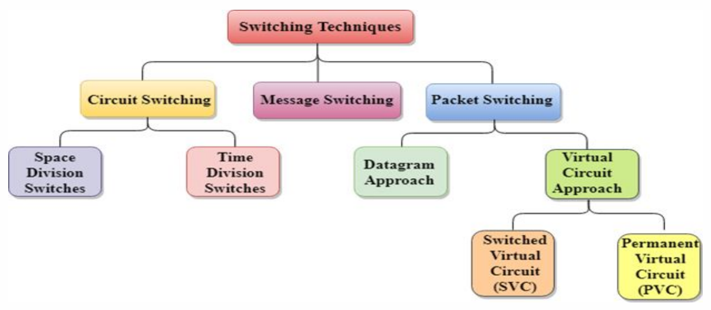

# $\fbox{Chapter: NETWORK LAYER}$

## **Topic - Switching Techniques**

### <u>Introduction</u>

- In large networks, the sender to receiver path may not be direct.
- **<u>Switching technique</u>:** A technique for deciding best route for data transmission.
- It enables one-to-one communication among systems.

### <u>Circuit Switching</u>

- This technique is used for creating a dedicated path between sender & receiver.
- And this path exists until the connection between them is terminated.
- Telephones work on the same principle.

#### Advantages:

- Reliable
- Fixed bandwidth

#### Disadvantages:

- It takes a long time to be established.
- Expensive

### <u>Message Switching</u>

- In this switching technique, whole data is transmitted at once.
- But they are passed from connected nodes to reach the destination.
- Data are stored & forwarded from those nodes.
- Also known as store and forward network.

#### Advantages:

- Efficient
- Low bandwidth requirement.
- Less chances of traffic congestion; as data are not continuously transmitted, but stored in intermediate nodes.
- Priority based network.

#### Disadvantages:

- Insufficient storage for storing multiple data.
- Transfer delay due to many storing sessions.

### <u>Packet Switching</u>

- In this method, data are split into small pieces & then transmitted.
- Different pieces may take separate route to destination.
- After reaching the destination, they are arranged in the required order; using a unique identity number that they were given.
- If any piece of data is missing or corrupted, the sender resends the data.
- Else it receives an acknowledgement.

#### Advantages:

- Cost effective
- Reliable
- No traffic congestion

#### Disadvantages:

- High delay
- Low quality
- Expensive
- High overhead

## **Topic - 2: Addressing & Internet Protocol**

### <u>Logical Addressing</u>

- **<u>IPv4 Address</u>:** 32-bit IP address.
- Two devices connected to internet can’t have same address at the same time.

$$ Example\;Binary:\;01110101\;10010101\;00011101\;00000010 $$
$$ Decimal:\;117.149.29.2 $$

### <u>Classful Addressing</u>

#### IP address sub-classes:

- ***\*Notice that its byte above, not bit***
- **<u>Network ID</u>:** Represents number of networks.
- **<u>Host ID</u>:** Represents number of hosts.

### <u>Classes</u>

#### Class A:

- Used in networks with large number of hosts
- First bit is always $0$.

#### Class B:

- Used networks with small to large number of hosts.
- First bit is always $0$.
- Second bit is always $1$.

#### Class C:

- Used in networks with small number of hosts.
- First bit is always $1$.
- Second bit is always $1$.
- Third bit is always $0$.

#### Class D:

- Reserved for multicasting addresses.
- **<u>Multicasting addresses</u>:** A logical address for a group of hosts.
- It doesn’t support subnetting.
- **<u>Subnet</u>:** Part of the network path.
- First bit is always $1$.
- Second bit is always $1$.
- Third bit is always $1$.
- Fourth bit is always $0$.

#### Class E:

- Used for research purposes by developers, consumers can’t access it.
- It doesn’t support subnetting.
- First bit is always $1$.
- Second bit is always $1$.
- Third bit is always $1$.
- Fourth bit is always $1$.

### <u>Why Use IPv6</u>?

- It supports subnetting.
- It supports supernetting.
- **<u>Supernetting</u>:** Collection of multiple class Cs to create even larger network.
- Works with less internet resources, tackling resource depletion issues.

### <u>Classless Addressing</u>

- Addresses are kept in blocks but without any classes.
- When an entity has to connect to the internet, a block is given to it as per its size.
- Despite solutions like classful & classless addressing, DHCP address depletion still remains a big issue.
- **<u>DHCP</u>:** Dynamic host configuration protocol, which automatically assigns IP address to users connected to the internet. Without manual configuration.

### <u>IPv6</u>

- It is $128$-bits long.
- **<u>Hexadecimal colon notation</u>:** $128$-bit is divided into eight parts in this notation.
- Means each part represents $16$-bits i.e. $2$ bytes.
- And $2$-byte data can be represented with four hexadecimal digits.
- Thus, there are total of $32$ hexadecimal digits.
- Each $4$-digited hexadecimal number is separated by colon (`:`).
- **<u>Address space</u>:** Number of addresses possible (like IPv6 can take $2^{128}$ addresses).
- **<u>Unicast address</u>:** Unique address used to send data to a particular computer.

>**<u>NOTE</u>:**
>MAC address just identified a computer uniquely.

- **<u>Multicast address</u>:** An address used to deliver data to each host in a group connected to common network.

>**<u>NOTE</u>:**
>Host & clients are different.

- **<u>Reserved addresses</u>:** These addresses are used by various protocols for ensuring proper working of internet.
- They start with eight zeroes ($00000000$).

### <u>IPv4 Header</u>

- IP receives data from 4th layer of OSI model.
- Then divides the data into various packets.
- Then it encapsulates those data & adds its own header information on it.
- This header contains various routing & addressing information.

#### Short comings:

- Doesn’t solve the address depletion issue.
- High transmission delay, making it unsuitable for real-time audio & video streaming.
- Doesn’t provide security facilities like encryption & authentication.

### <u>IPv6 Header</u>

- Each packet consists of base header & payload.
- Base header contains the same header information & occupies $40$ bytes.
- Payload contains extension for header & data.
- And it can occupy upto $65,535$ bytes of information.

### <u>Transition From IPv4 to IPv6</u>

#### Three transition strategies:

- Dual stack
- Tunneling
- NAT protocol translation

#### Dual stack:

- Router uses both IPv4 & IPv6 configuration.
- And both point & work to their respective network clouds/spaces.

#### Tunneling:

- A better solution.
- User’s data can pass through non-supported IP address & reach its destination.

#### NAT protocol translation:

- NAT-PT means ***network address translation – protocol translation***.
- In this, the NAT enabled device routes the data to the network cloud as per the IP version it used.

## **Topic - 3: Popular Protocols**

### <u>Address Resolution Protocol (ARP)</u>

- When communicating, a host requires MAC address of the destination device.
- And this device must be connected to the same network channel.
- MAC address is also known as ***layer-2 address***.
- If NIC is changed due to some fault, it results in change of MAC address.
- So, in order to communicate on internet again; the IP address needs to be refreshed.

#### Broadcasting conversation using ARP:

- **<u>Address routing protocol (ARP)</u>:** Allows packet to contain host’s IP address.
- To initiate a broadcast message, the device checks who has its IP address in the same network, requesting for conversation using ***ARP***.
- Then the devices having it reply back with ARP.
- Then sender broadcasts the message to their MAC addresses using ARP.
- ARP is transmitted along with data package when communicating.
- Then for the rest of the conversation, devices use their own IP address to send & receiver’s MAC address to receive the data.

- These MAC to IP mappings of both sender & receiver is saved as cache.
- And this is only when they communicate for the first time.
- Rest of the time, they don’t require each other’s IP or MAC addresses.
- These conversations can be done using ARP cache, produced after first conversation.

### <u>Dynamic Host Configuration Protocol (DHCP)</u>

***\*Also discussed earlier***

- Can be used in both local & enterprise servers, irrespective of network size.
- DHCP is a default protocol used by most networking devices; including routers.
- DHCP is also known as ***RFC*** (***request for comment***).

### <u>Bootstrap Protocol (BOOTP)</u>

- Used by a client for obtaining IP address of a server.
- Earlier it was made to save a computer’s network connections before booting up.
- One BOOTP server can serve as host on multiple subnets.

## **Topic - 4: Data Packet Actions**

### <u>Delivery</u>

- **<u>Direct delivery</u>:** The network shared by the sending & receiving hosts is same.
- **<u>Indirect delivery</u>:** The packet goes router to router until it reaches the destination host.

### <u>Forwarding</u>

- **<u>Forwarding</u>:** Placing a packet on the route leading to its destination.
- This is done by checking various destinations on a table.
- But this method is impossible these days due to large number of entities, making it difficult to make each entry on the table.

### <u>Routing</u>

- **<u>Routing</u>:** Selection of path for transferring packets from sender to destination.
- Routing is done by router.
- Router decides path as per the information on packet’s header & forwarding table.

#### Types of routing:

- Static routing
- Default routing
- Dynamic routing

#### Routing tables:

- **<u>Static routing table</u>:** Contains manual information entries.
- **<u>Dynamic routing table</u>:** Automatically updated when a change occurs in the internet.

#### Intra and inter domain routing:

- **<u>Autonomous system (AS)</u>:** Group of networks & routers under single authority.
- **<u>Intra-domain routing</u>:** Routing inside the autonomous system.
- **<u>Inter-domain routing</u>:** Routing between many autonomous systems.

## **Topic - 5: Routing Protocols**

### <u>Types of Routing Protocols</u>

### <u>Distance Vector Routing (DVR)</u>

- In this type of routing, the cheapest route between two nodes; is the shortest route too.
- Each node maintains a ***routing table*** telling shortest route to other nodes from it.
- This table has a column called cost, which is less is nearby nodes.
- So, data travels through the shortest route from node to node, saving time.
- This continuous short path traversal is known as **next-hop routing**.

#### Issues with DVR:

- Sometimes when travelling from node to node, the packet is lost.
- Then the distance between the current node & next node becomes infinity on table.

>**<u>NOTE</u>:**
>Colour white means current node, grey is distance & yellow is next
  node.

### <u>Link State Routing</u>

- In this, the nodes contain all information about the topology/structure in their table.
- This information includes nearby connections, cost, type of connection etc.
- And thus, it uses **Dijkstra’s algorithm** to build a separate routing table for the nodes.
- However, the calculations might be different for each node; because each node calculate on the basis of their individual perspective on links to other nodes.

### <u>Path Vector Routing</u>

- **Distance vector routing** & **link state routing** are only used for intradomain communication.
- This is because interdomain requires high scalability, which is absent in both of them.
- Both of these routing methods can’t be tracked when travelling large distances.
- **Distance vector routing** becomes unstable with multiple hops.
- **Link state routing** requires huge amount of information for calculating routing table.
- Thus, they create high overhead.
- And that’s when comes another routing protocol called **path vector routing**.
- **<u>BGP</u>:** A path vector protocol used for inter-domain communication.
- The nodes receive the distance vector instead of the router.
- This is done so that node can do routing calculations.

---
