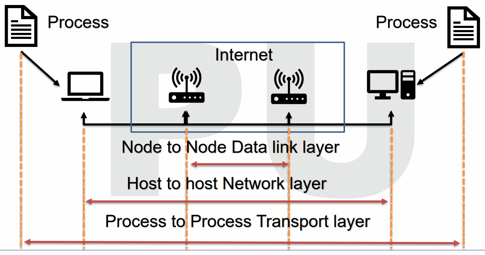
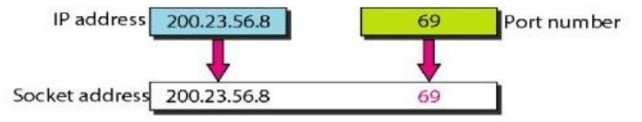
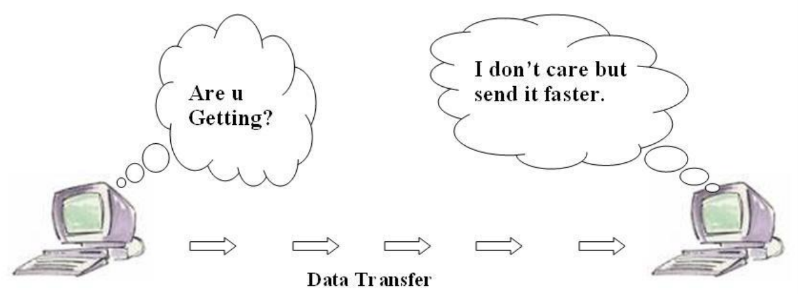
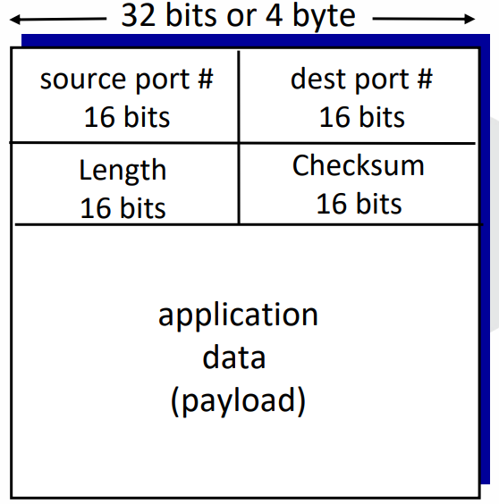
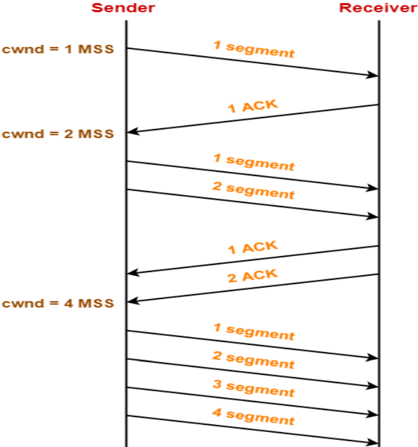
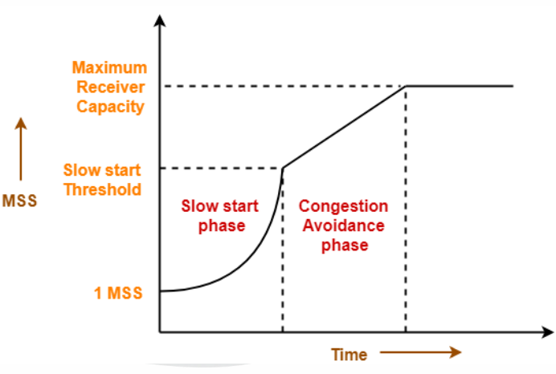
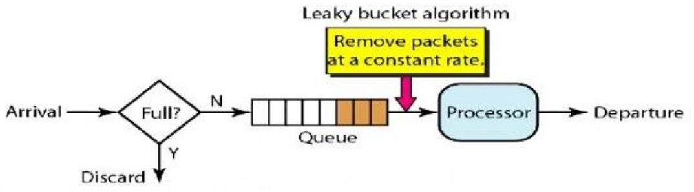
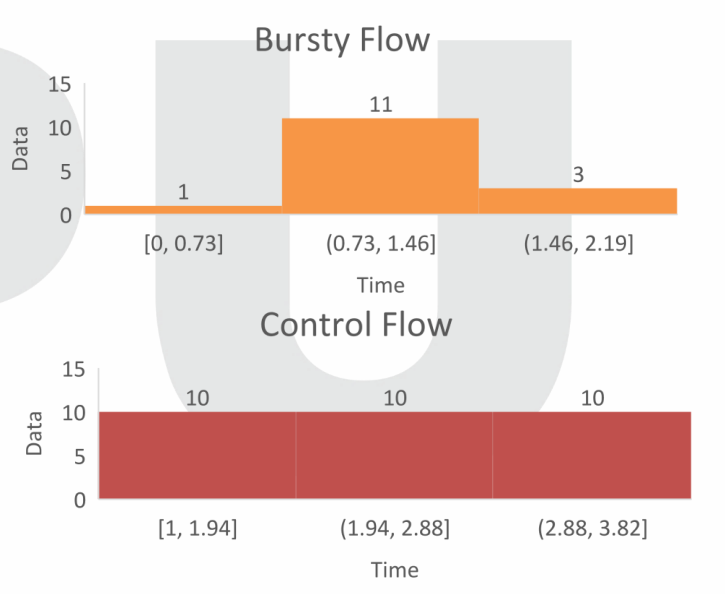
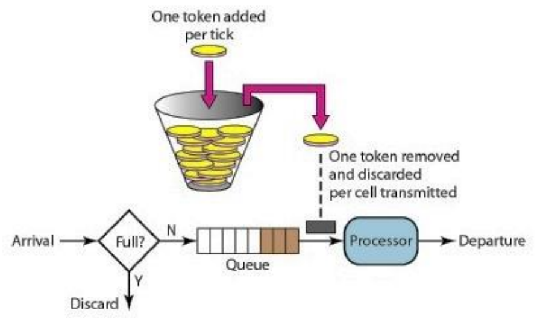

# $\fbox{Chapter 4: TRANSPORT LAYER}$

## **Topic - 1: Transport Layer Services**

### <u>Transport Layer Services & Protocol</u>

- It is responsible for reliable transportation of data.
- Transport layer is more abstracted (high-level) than network layer.
- Sender’s side – Breaks application messages into small pieces & passes them to network layer.
- Receiver’s side – Joins the pieces into message again & passes to session layer.
- For example: TCP, UDP etc.

### <u>Process to Process Communication</u>

- Data link layer is responsible for transmitting frames between two nodes.
- Network layer is responsible for delivering datagrams between two hosts.
- **<u>Datagram</u>:** Head, tail & main data as a whole.
- Each process in application layer has to communicate with another process continuously.
- Transport layer breaks these processes down into small pieces.

## **Topic - 2: Client-Server Paradigm**

### <u>Introduction</u>

- A local host (***client***) uses a server to communicate resources.

#### Requirements for communication:

- Local host
- Local process
- Remote host
- Remote process

## **Topic - 3: Addressing**

### <u>Introduction</u>

- We require MAC address for sending data at data link layer.
- But it is required only when the communication is not point-to-point.
- No point-to-point means that data has to traverse across multiple nodes while communication.
- Other than MAC address, the source address is also required.
- **<u>Source address</u>:** Contains information that helps in traversing of data to next node.
- In addressing, IP address is used for identifying the destination host uniquely among other hosts connected to the same network.
- While MAC address also identifies all hosts uniquely, IP address also ensures that they are connected to common network.
- **<u>Port number</u>:** Helps identifying all applications uniquely on same network.

### <u>Socket Addresses</u>

- **<u>Socket address</u>:** Combination of IP address & port number.

- And socket address identifies individual client process uniquely.
- **<u>Address socket address</u>:** Uniquely defines a server process.

## **Topic - 4: User Datagram Protocol (UDP)**

### <u>Introduction</u>

- UDP is a transport layer protocol.
- Application’s process passes the data to network layer after compression.
- This compression is done using multiplexer on sender’s side.
- Then extraction is done using demultiplexer on receiver’s side.
- In UDP, neither receiver sends acknowledgement nor sender waits for it.

### <u>UDP Segment Header</u>

- Connection is not established first.
- Small header size.
- No congestion control, UDPs blast away as fast as possible.
- **<u>Source port</u>:** **16-bit** long port number of source.
- **<u>Destination port</u>:** **16-bit** long port number of
  destination.

### <u>Checksum</u>

- Checksum is a **16-bit** long address.
- Used for detecting errors in transmitted segment.
- UDP contains header segment & checksum value.
- **<u>Checksum value</u>:** Sum of 1’s complement of all contents of segment.
- Sender calculates checksum value & assigns it to checksum value field in UDP.
- Receiver recalculates checksum value & cross checks it with the sender’s checksum.
- This cross checking is done through XORing with where error free value must be $0$.
- Cross checking them tells if there is any error or not.

### <u>Applications of UDP</u>

- **<u>Domain name services (DNS)</u>:** Converts human readable domain names into IP addresses.
- **<u>Simple network management protocol (SNMP)</u>:** Used for monitoring and managing devices connected to network.
- **<u>Trivial file transfer protocol (TFTP)</u>:** Protocol used for transferring files between client and server.
- **<u>Routing information protocol (RIP)</u>:** Used for dynamically communicating about routing information.
- **<u>Kerberos</u>:** A protocol used for aiding client-server applications for authentication of users & also provides various other security functionalities.

## **Topic - 5: TCP/IP Protocol**

### <u>Introduction</u>

- TCP/IP are collection of protocols that connect computers to internet.
- It defines most of internet structures & functions; including packaging, addressing, sending & collecting etc.

### <u>Characteristics Of TCP/IP</u>

- **<u>Share data transfer</u>:** The ability to build large networks & make reliable transfer of data.
- Reliable, as it retrieves lost & misplaced data.
- Uses multiplexing.

### <u>Applications</u>

- **<u>Simple mail transfer protocol (SMTP)</u>:** Used for transferring email from one email address to another.
- **<u>File transfer protocol (FTP)</u>:** Used for sending large sized files.
- **<u>Dynamic host configure protocols (DHCP)</u>:** Assigns IP address.
- **<u>Telnet</u>:** Enables text communication via a terminal application.
- **<u>Hyper text transfer protocol (HTTP)</u>:** Used for transferring web pages.
- **Domain name service (DNS)**
- **<u>Simple network time protocol (SNTP)</u>:** Enables network devices to access time of day.

### <u>Stream Control Transfer Protocol (SCTP)</u>

- A safe transport protocol; running parallel to unsafe one, like IP.
- Using checksums & other error checking methods, it ensures error free & non-duplicate message transfers.
- It has inherited many features of TCP including congestion management & lost packet detection etc.

## **Topic - 6: Congestion Management**

### <u>Congestion Control</u>

- Congestion happens when a huge amount of data is fed to a device, the device not being able to process it.
- **<u>Windows mechanism</u>:** Congestion management method used by TCP.
- In windows mechanism, a time limit is set on the sender to send data.
- This avoids a device from being fed excessive data.
- Steps TCP takes for congestion control - Slow start, congestion avoidance & congestion detection.

#### Slow start:

- A congestion window size is given at first, measured in unit called MSS.
- At starting it is set to MSS.
- Then when the sender receives an acknowledgement, it expands the window exponentially by increasing $2$’s power ($2$ MSS here).
- Then $4$ MSS, then $8$ MSS and so on.

### <u>Congestion Avoidance</u>

- After the phase of slow start ends, phase of congestion avoidance starts.
- Here, the congestion window rises linearly.
- For each acknowledgement, congestion window size is raised by $1$.

### <u>Congestion Detection</u>

#### Case 1 - Detection on time out:

- Time outs before receiving acknowledgement.
- Chances are that the congestion is serious.
- Rate of congestion threshold is exponentially decreased until it becomes $1$ MSS.

#### Case 2 - Detection on duplicate acknowledgements:

- Probability of message not being reached is less.
- Still there might be chances for it.
- Reduce the duration of congestion by half & window congestion too.

## **Topic - 7: Quality Of Services (QoS)**

### <u>Introduction</u>

- **QoS** is a set of traffic control mechanisms that act on the basis of network performance or the network requirements of the operator.
- It takes calculated steps to enhance network performance.
- For QoS, low performance generally means high packet delay & high number of packet loss.

#### Applications:

- Video & audio conferencing/streaming.
- Hard real-time database management.

#### What QoS improves:

- Delay
- Delay variation (jitter/flickering)
- Throughput
- Error rate

#### Types of QoS solutions:

- Stateless solutions
- Stateful solutions

### <u>Stateless Solutions</u>

- Doesn’t provide a very efficient control over traffic.
- But is highly scalable and resilient to possible internal damages.
- However, its unreliable of results.

### <u>Stateful Solutions</u>

- Provides high control over traffic.
- Not much flexible or resilient for internal damages.
- Highly reliable of results.
- It also maintains the smoothness in flow of information.

### <u>QoS Improvement Techniques</u>

- Any method that can improve service efficiency.
- ***Traffic shaping*** is one such method.
- **<u>Traffic shaping</u>:** Regulating congestion volume & rate of flow of information.

#### Proper traffic forming method:

- Leaky bucket
- Token bucket

## **Topic - 8: Data Flow Management Techniques**

### <u>Leaky Bucket</u>

- This method is named this because it behaves similar to how buckets behave during leakage.
- A bucket with a hole spills water at the same rate, whether more water is added to it or not & at whatever rate.
- Similarly, in this method the flow of data remains smooth & undisturbed by the number and rate of input being fed.
- High number of inputs are processed & then pushed in a stable flow.
- It basically converts a bursty flow into controlled flow.

### <u>Token Bucket</u>

- Stricter than leaky bucket.
- If a host stays idle for too long, then resources in its bucket (queue) are emptied.
- Thus, it becomes null.
- But this method enables a host to store tokens for future use.
- **<u>Tokens</u>:** $N$ credits provided per system clock’s tick.
- These tokens are used by the host when their chance comes for data transmission.
- One must have enough tokens for being able to send data.
- If not, then it has to wait until it has enough tokens.
- This token system regulates the traffic by fixing limited data flow across networks.

---
