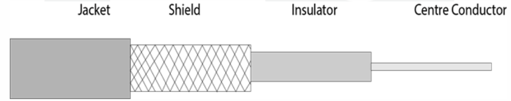
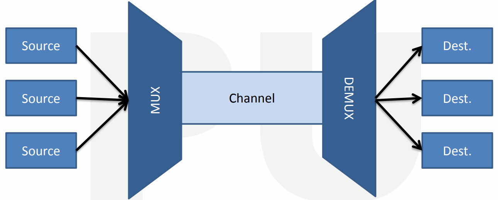
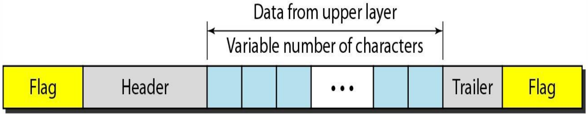
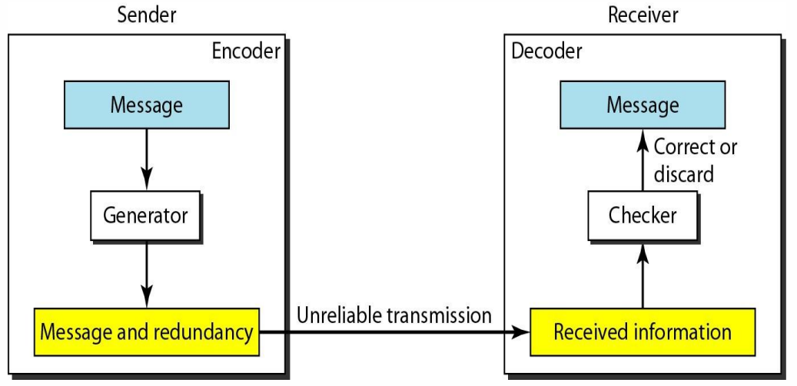
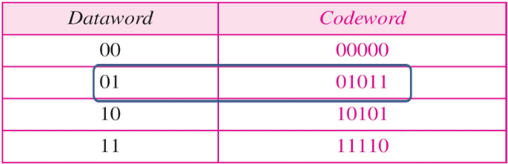

**APPLICATION LAYER**

**<u>Application Layer Functions</u>**

- Provides **user interface**.

- Provides all facilities we need like **login**, **logout** & **file
  transfer**.

- Also provides **error handling** & **recovery systems**.

**<u>Protocols Used by Application Layer</u>**

**<u>Distribution of DNS Name Space</u>**

**<u>Zones & Domains</u>**

- **<u>Primary server</u>:** **Main** **storage** place for information
  on websites.

- **<u>Secondary server</u>:** Serves as a **backup** by replicating
  information from the **primary server**.

- **<u>Zone transfer</u>:** Transfer of information from **primary** to
  **secondary server**.

**<u>Types of Domains</u>**

- **<u>Inverse domain</u>:** Converts **domain names** to **IP
  addresses**, opposite of DNS.

- **<u>Generic domain</u>:** Domains which are **not specific** to any
  country (***.com***, ***.org***).

- **<u>Country domain</u>:** Domains which are **specific** to
  countries.

**<u>Dynamic DNS (DDNS)</u>**

- It means automatically updating ***name server*** which stores **names
  of domains**.

- It can also update **hostname** & **addresses** etc of that domain.

- **IP addresses** changes frequently & are thus **remapped**
  continuously in **DNS**.

- **DDNS** is used when an internet user **can’t** afford **static IP**
  address.

**<u>Telnet</u>**

- ***Telnet*** is a client-server **application program**.

- Provides an **abstraction** over the computing going on in
  **terminal**.

- Also, its **speed** gives an **illusion** to users of working directly
  with the internet.

**<u>Electronic Mail</u>**

- Known as **E-mail** in short.

- **Asynchronous** form of communication.

- It got many modern features, from **hyperlinks** to adding
  **attachments**.

- Uses **SMTP** protocol.

**<u>SMTP</u>**

- Enables sender to receiver **mail transfer** (server to server).

- Restricts mail’s **body** (**not** header) for being upto **7-bit
  ASCII code** (each character used in the body).

- If receiving server is **down**, then mail attempts to get transferred
  & waits at **sender’s server** until the **receiver server** is back
  to work.

- And **SMTP** is called by **TCP** when it notices that the nature of
  data is **mail**.

**<u>Mail Transfer Phases</u>**

- **<u>Phase 1</u>:** Connection between **MTA client** & **MTA server**
  is established.

- **<u>Phase 2</u>:** Message is **transferred**.

- **<u>Phase 3</u>:** Connection is **terminated**.

**<u>UAs & MTAs</u>**

- **<u>MTA</u>:** Mail transfer agent

<!-- -->

- Two users can communicate through **SMTP client** & **SMTP server**
  via internet.

- But user’s message has to pass through **UA** to reach **MTA** at
  sender’s side & pass through **MTA** to reach **UA** at receiver’s
  size.

- **<u>Relay MTA</u>:** The MTAs coming **between** MTA client & MTA
  server.

- **<u>Email gateway</u>:** A system **supporting** **transfer** of
  message through variety of systems.

**<u>Email Address</u>**

- **<u>Local part</u>:** Address to find in the mailbox.

**<u>Mail Address Protocols: POP3</u>**

- **POP3** stands for **post office protocol**.

- **POP3** can act when the sender is **connected to TCP** successfully.

- Server acts as a **buffer** **intermediate** between **sender** &
  **receiver**.

- Job of **POP3** is to **delete message** from server after
  **receiver** receives it.

POP3 phases:-

- **<u>Phase 1</u>:** The **username** & **password** provided by sender
  are **verified**.

- **<u>Phase 2</u>: Receiver** **receives** the message by sender.

- **<u>Phase 3</u>:** **POP3’s** session ends & message is **deleted**
  from server.

**<u>Mail Address Protocols: IMAP</u>**

- **<u>IMAP</u>:** Internet message access protocol

- Best example for **IMAP** is **Gmail**.

- By **default**, the messages sent are stored in **inbox** folder at
  the server.

- With use of **IMAP**, user gets the ability to **move a mail** from
  one folder to another.

- For example, we can store a particular mail in **starred** folder.

- Also, we can **search** messages by their **properties** in **search
  bar** due to this.

**<u>File Transfer Protocol (FTP)</u>**

- **FTP** requires two **TCP** connections to work.

- Uses ***port 21*** for **control connection** & ***port 20*** for
  **data connection**.

- **FTP** enables reliable **transfer of data** from client to server.

**<u>World Wide Web</u>**

- Used to **uniquely identify** each **URLs** as part of same
  information family.

- **Web pages** are made from **base HTML file** with various other
  **referenced objects**.

- These **reference objects** can be **image file**, **audio file** &
  **applet** etc.

- **<u>Applet</u>:** Applets are **plug-ins** & are generally written in
  **Java**.

- **<u>Plug-in</u>:** Small program that performs some tasks in a
  **large** program.

- And each of these **objects** are addressed uniquely by **URL**.

- **<u>URL</u>:** Uniform resource locator

**<u>Types of Web Documents</u>**

- **<u>Static document</u>:** Document is **stored** in web server &
  delivered when user requests its access.

- **<u>Dynamic document</u>:** Document’s **program is stored** in
  server & that program is executed when a user requests its access.

- **<u>Active document</u>:** Documents that are **executed locally** on
  server; because their properties **may change**. For example,
  **animations**.

**<u>Hyper Text Transfer Protocol (HTTP)</u>**

- Uses **TCP** on ***port 80*** (client initiates it).

- **HTTP** is implemented on **both** client & server programs.

- Defines **structure** of messages & also defines how clients and
  servers **communicate**.

- **Servers** can also **reject** requests made by **client**.

- HTTP **doesn’t** store any client information.

Types of HTTP connections:-

- Non-persistent HTTP

- Persistent HTTP

**<u>Simple Network Management Protocol (SNMP)</u>**

- Manages **internet devices** like routers, modem etc.

- Allows a manager to **monitor** these devices.

- **<u>Agent</u>:** **Managers** who send request to **network
  devices**.

- **<u>Network management system (NMS)</u>:** Enables running
  applications which are used in monitoring network devices.

- The **agent** and other **managers** communicate using **TCP/IP**.

**<u>Firewall</u>**

- A **threat protection system** between computers or groups of
  computers.

- It filters out potential threats that are visible.

- Used when one network tries accessing another.

- For example, **LAN** accessing data from **WAN** or a **LAN** tries
  accessing **another LAN**.

- ***Firewall*** can be a **hardware**, **software** or **combination**
  of both.

**<u>Hardware Firewall</u>**

- ***Firewall*** is connected between a ***modem*** & **computer**.

- **<u>Modem</u>:** Modulator-demodulator

- Also used with **broadband** ***routers*** to secure its connections.

- **Expensive** & **hard to configure**.

- **<u>Configure</u>:** Setup/install

- **Ex:** Cisco Pix & Netscreen etc.

**<u>Software Firewall</u>**

- Can protect **only single** computer.

- Need to be installed in individual computers for protecting all.

- Are **cheaper**.

- **Ex:** Norton Internet Security & McAfee Internet Security etc.

**<u>Bluetooth</u>**

- Are **short-ranged** & **secured**.

- Uses a radio technology called ***frequency-hopping spread
  technology***.

- Data transfer rate is around **1 Mbps**.

- Developed & licensed by **Bluetooth SIG**.

- **<u>Bluetooth SIG</u>:** Bluetooth special interest group.

- Easy configuration.

- Low power consumption.

- **Cheaper** prices.

- Supports ***Ad hoc*** networking.

- **<u>Ad hoc</u>:** Connectable to another device in range which is
  using **same network type**.

**<u>Piconet</u>**

- It is when multiple ***Bluetooth* devices** are sharing common network
  channel.

- Known as **basic unit** of ***Bluetooth* networking**.

- Uses **3-bit addressing** method.

- Devices are **synchronized** to connect & communicate.

- There can be **upto eight devices** connected with one of them being
  **master** & rest being **slaves**.

- Collision between multiple **piconets** is possible.

**<u>Scatternet</u>**

- Connection of **two piconets**.

- Device in one piconet may be treated as **slave** or **master** in
  another piconet, depending on the situation.

- Utilizes **bandwidth** in a complete manner.

**<u>Bluetooth Layers</u>**

- **<u>Radio frontend (RF)</u>:** Is receiver’s **radio wave
  sensitivity** level & arranges **channels**.

- **<u>Logical link control & adaptation protocol (L2CAP)</u>:** Used
  for transferring large data files to upper layers.

- **<u>Service discovery protocol (SDP)</u>:** Used by a ***Bluetooth*
  device** to access resource or use facility of another ***Bluetooth*
  device**.

- **<u>Link manager protocol (LMP)</u>:** Handles ***piconet*** &
  **security** configuration.

- **<u>Radio frequency communication (RFCOMM)</u>:** Used for
  transferring data from higher level to lower level.

- **<u>Object exchange protocol (OBEX)</u>:** Used for sharing data
  among ***Bluetooth* devices**.

**<u>Cryptography</u>**

- ***Cryptography*** is **conversion** of text into unreadable form.

- We call the **original text** as ***plaintext*** & its **encrypted
  form** as ***cipher text***.

- It is even used for **protecting** communication data.

Objectives of cryptography:-

- Integrity

- Authentication

***\*And all synonyms of authentication like confidentiality etc…\****
