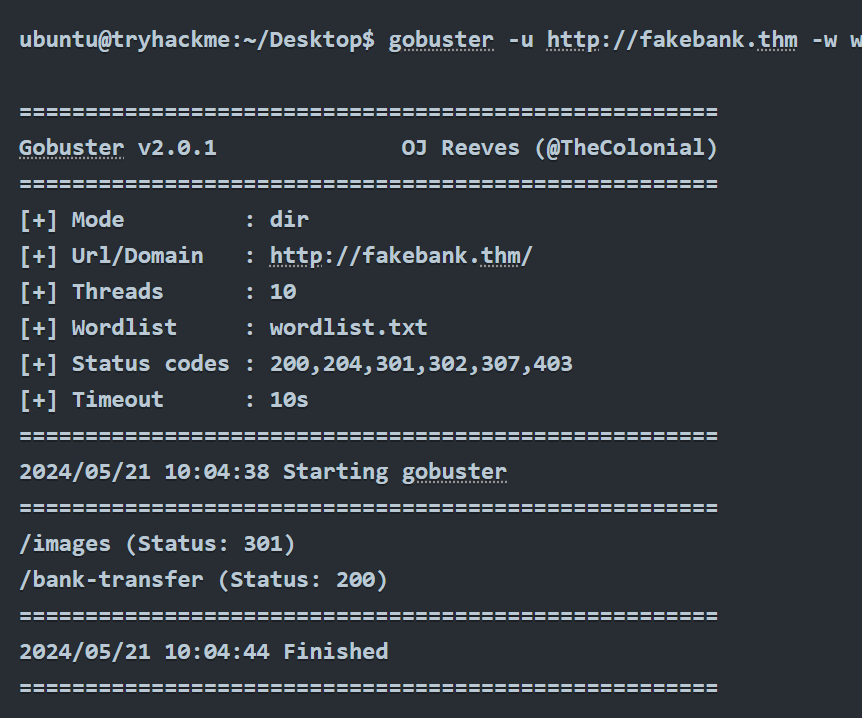
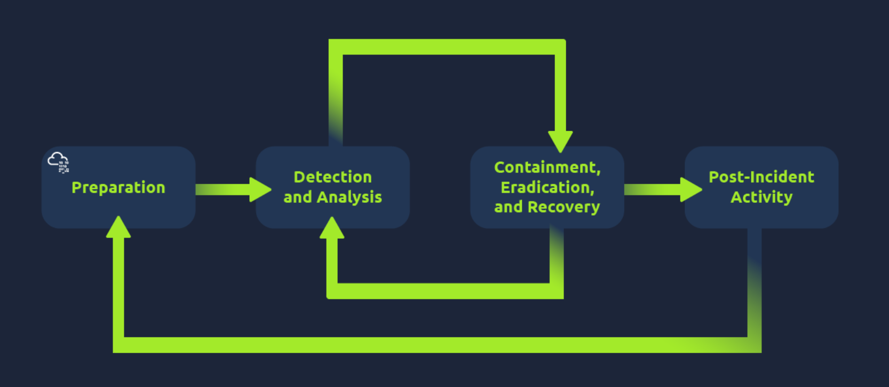
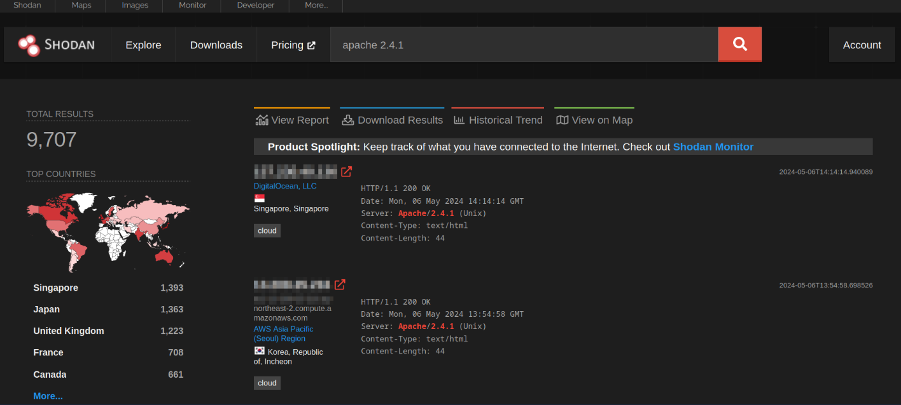
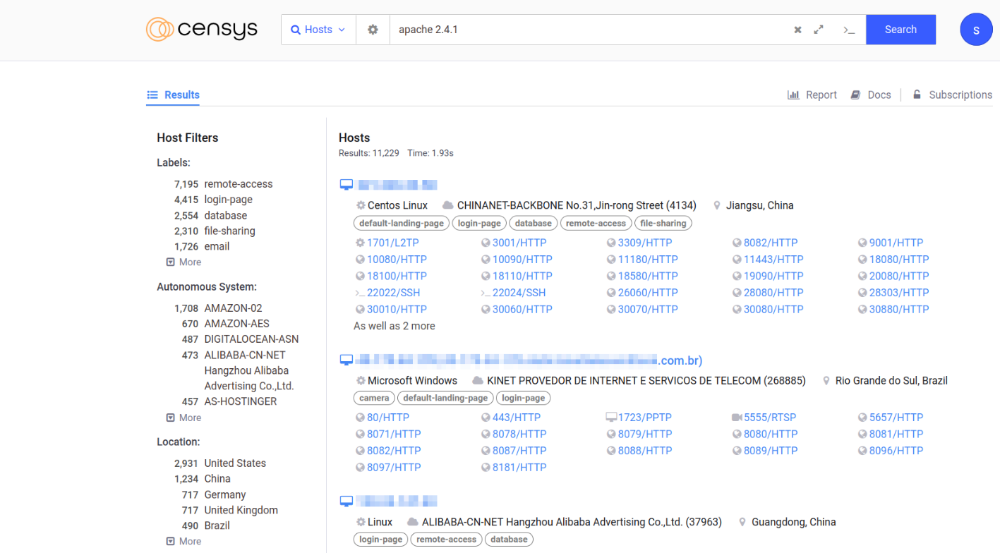
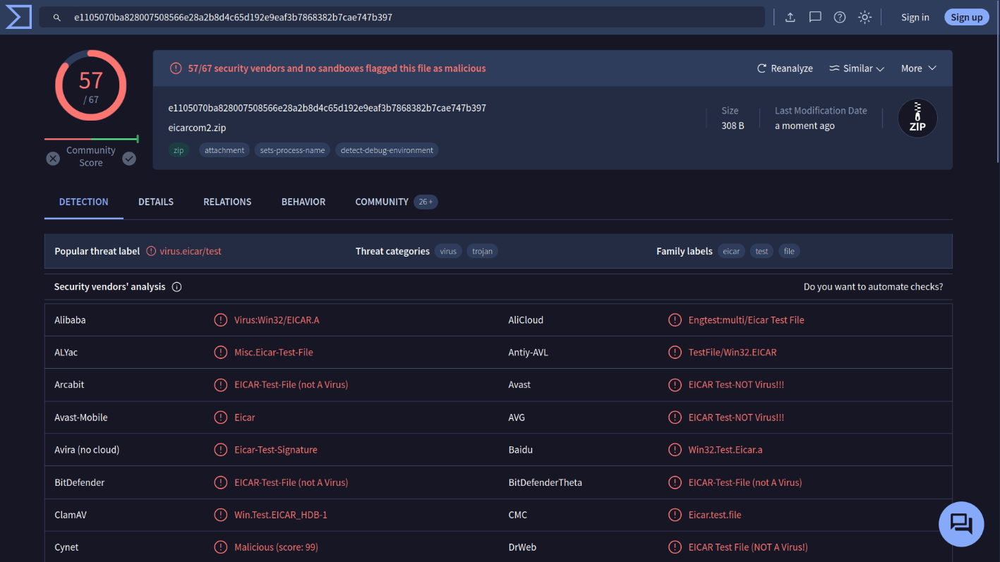
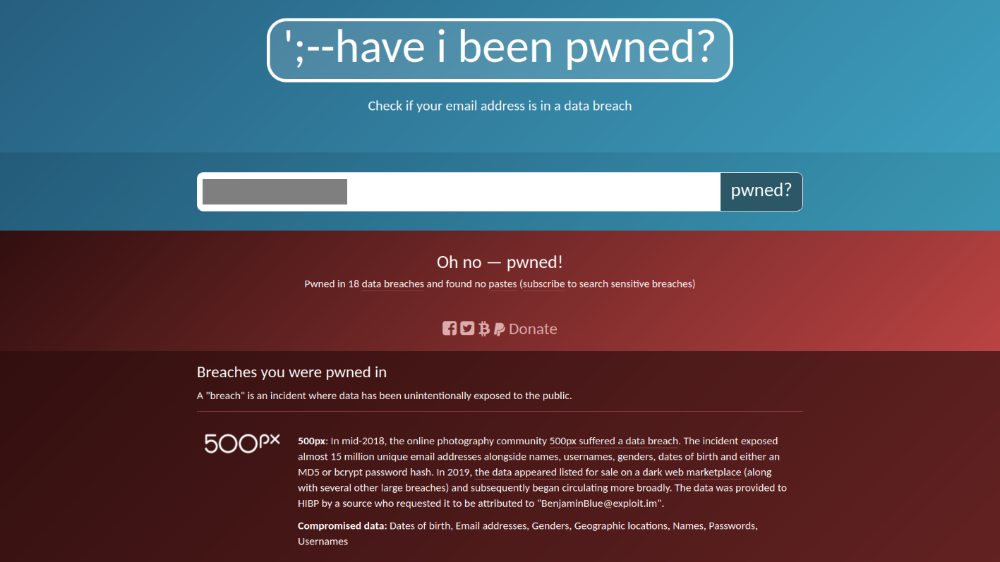
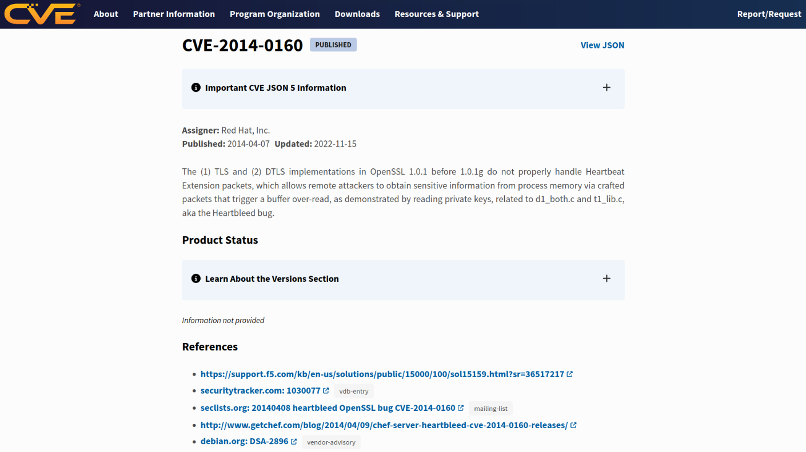
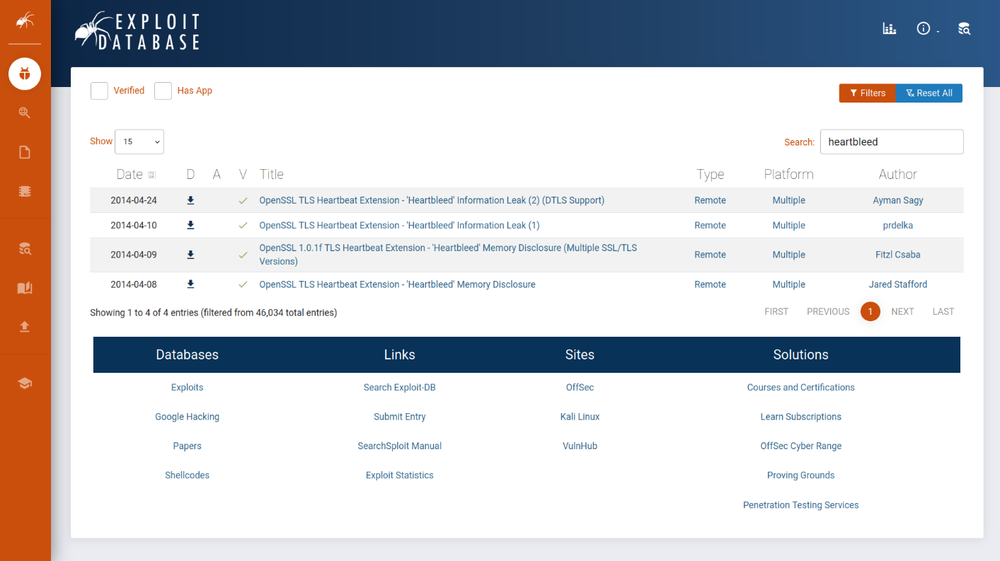

# $\fbox{Chapter 1: CYBER SECURITY BASICS}$


## **Topic - 1: Offensive Security Intro**

### <u>Introduction</u>

- Hacking into systems to understand hacker mind.


### <u>Hacking First Machine</u>

- **<u>Gobuster</u>:** CLI application used for finding hidden pages in websites (if any).

```sh
gobuster -u "http://fakebank.thm" -w wordlist.txt dir
```

- `-u` tells what website we're scanning.
- `-w` takes a list of words to find in website.



- Status `200` means, that name in list was found on website.
- We found a page called `/bank-transfer`.
- This can be accessed by just appending `/bank-transfer` to end of URL.

>**<u>NOTE</u>:**
>1. Consistency is the key.
>2. Daily practice at TryHackMe.


### <u>Careers In Cyber Security</u>

- **Penetration tester**
- **<u>Red teamer</u>:** Tries attacking an organization & gives feedback from enemy's perspective.
- **Security engineer**
- **Malware analyst**


## **Topic - 2: Defensive Security Info**

### <u>Introduction</u>

- Firewall & IPS are critical assets in cyber security.
- **<u>Firewall</u>:** Protects the system from unknown network.
- **<u>IPS</u>:** Intrusion Prevention System
- IPS blocks previously allowed networks if they match any attack signature.


### <u>Security Operations Center (SOC)</u>

- **<u>SOC</u>:** A team which monitors network systems for anomalies.

#### Responsibilities:

- Finding vulnerabilities & fixing it.
- Monitoring policy violation by any user.
- Blocking unauthorized activities.
- Detecting intrusion & mitigating it.


### <u>Threat Intelligence</u>

- **<u>Threat intelligence</u>:** Collecting information against potential threats & prepare for it.
- It is collected from network logs, public forums etc.
- Data processing is done to structure these details.
- Also the same data is analyzed to know motives of the attacker.


### <u>Digital Forensics</u>

- **<u>Digital forensics</u>:** Investigating cyber crime using knowledge of computer science.

#### Focus areas:

- Analyzing file system's image (low-level copy).
- Analyzing system memory's image.
- Tracing back attacker through network & system logs.


### <u>Incident Response</u>

- Whenever a cyber attack is noticed, a methodology is followed to tackle it.
- The goal is to reduce the damage to minimum & kill it in shortest possible time.

#### Steps taken:

1. Preparation
2. Detection & analysis
3. Containment, eradication & recovery
4. Post-incident activity




### <u>Malware Analysis</u>

- **<u>Malware</u>:** Malicious software
- Software here can also be files.

#### Types of malware:

- **<u>Virus</u>:** Piece of codes that later attaches itself to programs in host's computer. Can spread from one system to another.
- **<u>Trojan horse</u>:** Program which appears to be something but has malicious code underneath.
- **<u>Ransomware</u>:** Encrypts user programs & asks for ransom to decrypt those programs.

#### Types of malware analysis:

- **<u>Static analysis</u>:** Doesn't require the malware to be executed & requires strong knowledge of assembly language.
- **<u>Dynamic analysis</u>:** Required running the malware in a sandboxed environment & studying its behaviour.


### <u>Practical Example</u>

- **<u>SIEM</u>:** Security Information & Event Management
- SIEM gathers all security related information on a single dashboard.
- If it finds any suspicious activity, an alert is generated.


- There are some open-source database records used for reporting malicious IPs or check its reputation.
- For example, AbuseIPDB & Cisco Talos Intelligence etc.


## **Topic - 3: Search Skills**

### <u>Objectives Of This Topic</u>

- Evaluation of information sources
- Efficient use of search engines
- Specialized search engines
- Reading technical documentation
- Clever use of social media
- Checking news outlet


### <u>Source Evaluation Cautions</u>

- **Source -** The individual or organization must be reputed & experienced on the matter they talk about.
- **Evidence & reasoning -** Check if claims are backed by evidence & logical reasoning.
- **Objectivity & bias -** Check if the author/organization has presented everything impartially, considering multiple perspectives.
- **Corroboration & consistency -** Cross verify presented information from other reputed sources too.


### <u>Harnessing Google Power</u>

- `"exact phrase"` - Searching this way shows results with pages containing the exact mentioned phrase.
- `site:` - Used for limiting search to a particular domain, for example `site:tryhackme.com success stories`.
- `-` - Used for omitting search results with some phrases, for example `pyramids -tourism` or `-tourism pyramids`.
- `filetype:` - Used for finding specific kind of files, for example `filetype:ppt cyber security`.


### <u>Specialized Search Engines</u>

#### Shodan:

- [Shodan](https://www.shodan.io/) is used for searching devices connected to the internet.
- We can search for specific - types of servers, versions of servers, networking equipment, industrial control systems & IoT devices etc.



- **Shodan trends** can be used for historic insights, but with a subscription.
- Shodan has [query examples](https://www.shodan.io/search/examples) & [its trends](https://trends.shodan.io/) explained too.

#### Censys:

- While Shodan is more device-centric which are connected to the internet, [Censys](https://search.censys.io/) is more host-centric.
- Meaning its used for searching for hosts, websites & other internet assets.



- It is primarily used for auditing & finding suspicious assets over internet.

#### VirusTotal:

- [VirusTotal](https://www.virustotal.com/gui/home/upload) is an antivirus website.
- Provides service for scanning files & URLs using multiple anti-viruses.



- But these results always might not be accurate for some reasons.
- Often the community comments provide insight into that.

#### Have I Been Pwned:

- [HIBP (Have I Been Pwned)](https://haveibeenpwned.com/) tells if an email was breached.
- Tells about leaked private information & password.
- This is why keeping separate passwords across online platforms is important.
- Passwords are stored encrypted, but attackers use various techniques to recover them.




### <u>Common Vulnerabilities & Exposures</u>

- [Common vulnerabilities & exposures (CVE)](https://www.cve.org/) is dictionary of vulnerabilities.
- And is so for both hardware & software products.
- Each vulnerability is assigned a standardized CVE ID, starting with `CVE`.
- Alternatively, one can also look for vulnerabilities at [National Vulnerability Database](https://nvd.nist.gov/).




### <u>Exploit Database</u>

- We can search for various kind of exploits at [Exploit Database](https://www.exploit-db.com/).



- Then we can search for that vulnerability at CVE.
- For testing such vulnerabilities, search their CVE ID on GitHub to get relevant tools.


### <u>Technical Documentation</u>

- Looking up at a technical documentation is a very vital skill to acquire.

#### Linux manual pages:

- Most Linux & UNIX-like operating systems have manual for each command.
- As per the tutorial, there must be `man` command.
- For example, `man ip` to get manual about command `ip`.
- However, after checking I found that work is done with `help` command instead.
- And `man` doesn't work everywhere, requiring additional downloads.

#### Microsoft Windows:

- Microsoft has a whole [web page](https://learn.microsoft.com/en-us/) dedicated for technical documentation.
- One can search particular commands there to get more info on them.

#### Product documentation:

- Most product have technical documentation for their products, whether hardware or software.


### <u>Social Media</u>

- A good security engineer must be familiar with all major social media platforms.
- Not to use them necessarily, but know what it is like.

>**<u>WARNING</u>:**
>Don't link you real account, rather use temporal email for exploring a platform.

- It is important that people don't overshare their information on social media.
- This is because their passwords & security questions can be easily cracked.
- For example, *"which school you went as a kid?"*
- Moreover they can be tracked down when digging more with even little info.

>**<u>TIPS</u>:**
>Follow news outlets that provide cyber security news, to stay updated.

---
