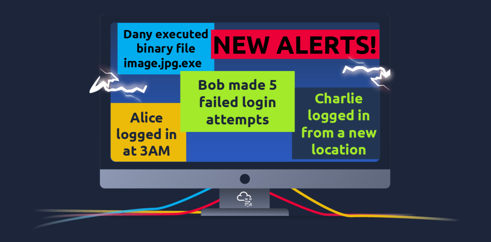

# $\fbox{Chapter 1: CYBER SECURITY BASICS}$


## **Topic - 1: Offensive Security Intro**

### <u>Introduction</u>

- Hacking into systems to understand hacker mind.


### <u>Hacking First Machine</u>

- **<u>Gobuster</u>:** CLI application used for finding hidden pages in websites (if any).

```sh
gobuster -u "http://fakebank.thm" -w wordlist.txt dir
```

- `-u` tells what website we're scanning.
- `-w` takes a list of words to find in website.


- Status `200` means, that name in list was found on website.
- We found a page called `/bank-transfer`.
- This can be accessed by just appending `/bank-transfer` to end of URL.

>**<u>NOTE</u>:**
>1. Consistency is the key.
>2. Daily practice at TryHackMe.


### <u>Careers In Cyber Security</u>

- **Penetration tester**
- **<u>Red teamer</u>:** Tries attacking an organization & gives feedback from enemy's perspective.
- **Security engineer**
- **Malware analyst**


## **Topic - 2: Defensive Security Info**

### <u>Introduction</u>

- Firewall & IPS are critical assets in cyber security.
- **<u>Firewall</u>:** Protects the system from unknown network.
- **<u>IPS</u>:** Intrusion Prevention System
- IPS blocks previously allowed networks if they match any attack signature.


### <u>Security Operations Center (SOC)</u>

- **<u>SOC</u>:** A team which monitors network systems for anomalies.

#### Responsibilities:

- Finding vulnerabilities & fixing it.
- Monitoring policy violation by any user.
- Blocking unauthorized activities.
- Detecting intrusion & mitigating it.


### <u>Threat Intelligence</u>

- **<u>Threat intelligence</u>:** Collecting information against potential threats & prepare for it.
- It is collected from network logs, public forums etc.
- Data processing is done to structure these details.
- Also the same data is analyzed to know motives of the attacker.


### <u>Digital Forensics</u>

- **<u>Digital forensics</u>:** Investigating cyber crime using knowledge of computer science.

#### Focus areas:

- Analyzing file system's image (low-level copy).
- Analyzing system memory's image.
- Tracing back attacker through network & system logs.


### <u>Incident Response</u>

- Whenever a cyber attack is noticed, a methodology is followed to tackle it.
- The goal is to reduce the damage to minimum & kill it in shortest possible time.

#### Steps taken:

1. Preparation
2. Detection & analysis
3. Containment, eradication & recovery
4. Post-incident activity


### <u>Malware Analysis</u>

- **<u>Malware</u>:** Malicious software
- Software here can also be files.

#### Types of malware:

- **<u>Virus</u>:** Piece of codes that later attaches itself to programs in host's computer. Can spread from one system to another.
- **<u>Trojan horse</u>:** Program which appears to be something but has malicious code underneath.
- **<u>Ransomware</u>:** Encrypts user programs & asks for ransom to decrypt those programs.

#### Types of malware analysis:

- **<u>Static analysis</u>:** Doesn't require the malware to be executed & requires strong knowledge of assembly language.
- **<u>Dynamic analysis</u>:** Required running the malware in a sandboxed environment & studying its behaviour.


### <u>Practical Example</u>

- **<u>SIEM</u>:** Security Information & Event Management
- SIEM gathers all security related information on a single dashboard.
- If it finds any suspicious activity, an alert is generated.



- There are some open-source database records used for reporting malicious IPs or check its reputation.
- For example, AbuseIPDB & Cisco Talos Intelligence etc.
