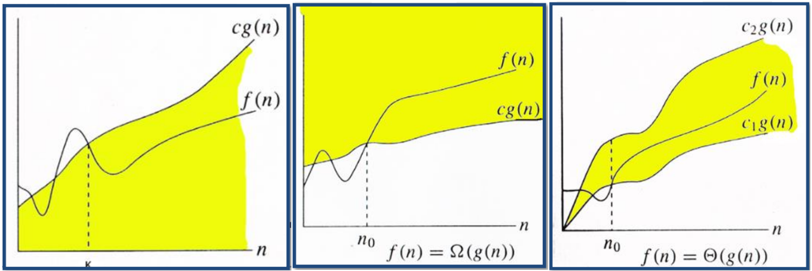

# $\fbox{Chapter 2: ASYMPTOTIC NOTATIONS}$

### <u>Introduction to Big O</u>

- Simplified analysis of an algorithm’s efficiency.
- Machine independent.
- Used for calculating time & space complexity.

### <u>Big O General Rules</u>

- Ignores constants.
- For example, $5n\;\rightarrow\;O(n)$.
- Certain terms dominate others.

$$ O(1)\;<\;O(log(n))\;<\;O(n)\;<\;O(n\;log(n))\;<\;O(n^{2})\;<\;O(2^{n})\;<\;O(n!) $$

### <u>Time Complexity Terms</u>

- $O(1)$ – Constant time
- $O(log(n))$ – Logarithmic time
- $O(n)$ – Linear time
- $O(n\;log(n))$ – Quasilinear time
- $O(n^{2})$ – Quadratic time
- $O(2^{n})$ – Exponential time
- $O(n!)$ – Factorial time

### <u>Big O Graph</u>

- Also called upper bound.

$$ 0\;\le\;f(n)\;\le\;cg(n) $$

### <u>Ω Notation</u>

- Also called big omega and lower bound.

$$ 0\;\le\;cg(n)\;\le\;f(n) $$

### <u>θ Notation</u>

- Also called theta notation.
- Curve $f(n)$ is sandwiched between curve $c_{1}g(n)$ and $c_{2}g(n)$.

$$ 0\;\le\;c_{1}g(n)\;\le\;f(n)\;\le\;c_{2}g(n) $$

### <u>General Information</u>

- We write $f(n)$ as $notation(g(n))$ when equation is satisfied with a notation.
- Above, notation can be $O$ or $\Omega$ or $\Theta$ etc.
- $f(n)$ always intersects with $c$ line(s) at some point.

#### Other notations:

 - Small O: $o$
 - Small omega: $\omega$

### <u>Graphs of Various Notations</u>

- First one is $O$
- Second one is $\Omega$
- Third one is $\Theta$

---
