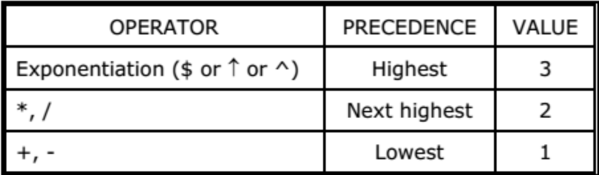
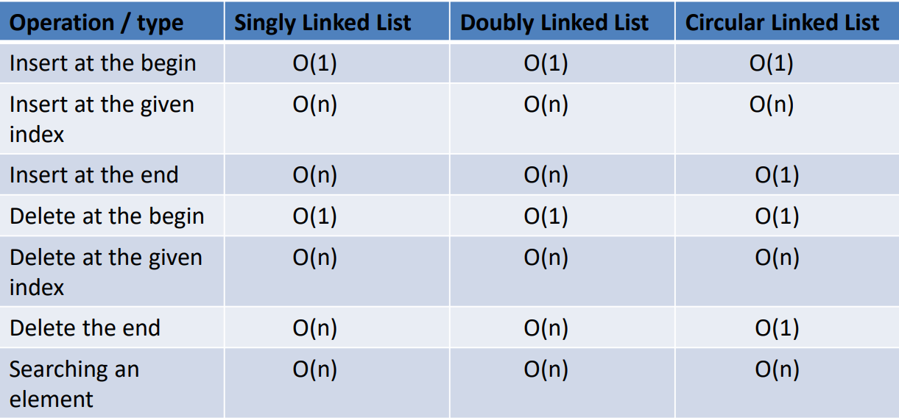
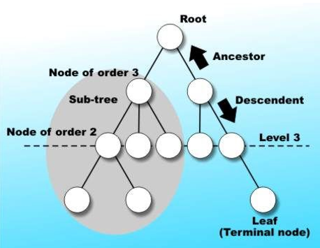

**TREES**

**<u>Introduction</u>**

- Are **hierarchical** in nature.

- Defined as set of **one or more** nodes.

**<u>Structure</u>**

- Root + Sub tree = Tree

- Parent-child relation

- Nodes sharing same parents are **siblings**.

- **<u>Internal node</u>:** Node with at least one child.

- **<u>Leaf node</u>:** Node without children.

**<u>Binary Tree</u>**

- Children – left & right

- **<u>Usecase</u>:** Application

- **<u>Two types</u>:-**

  - **Full binary tree:**

    - Each node has exactly two child, except leaf nodes.

  - **Complete binary tree:**

    - Each level is filled, except last level.

    - Last level can be filled from left to right only.

- **<u>Perfect binary tree</u>:** Both full and complete.

- **<u>Degenerate (skewed) binary tree</u>:** Each parent with exactly
  one child (basically linked list).

**<u>Applications of Binary Tree</u>**

- Syntaxes in compilers

- Natural language processors

**<u>Array Representation of Binary Trees</u>**

- **Formulae:**

  - If parent is at index **i**, then

    - **Left** child is at index **2i**

    - **Right** child at index **2i + 1**

**<u>Linked List Representation of Binary Tree</u>**

**<u>Traversal</u>**

- **<u>Inorder (LNR)</u>:** Left to right traversal (BST ascending
  order).

- **<u>Preorder (NLR)</u>:**
  

- **<u>Postorder (LRN)</u>:** 

- **<u>Level order traversal (breadth-first traversal)</u>:** Travelling
  level by level.

Red & Black Tree

- Self-balancing tree.

- Properties:

  - Black root.

  - Red nodes can’t have red children.

  - Number of black nodes must same in each root to leaf path.

- Uses rotations and colour changes.

- Height complexity: O(log n)
